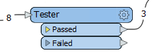
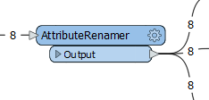
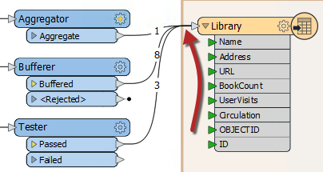

# Transformers in Parallel #
A ***stream*** is a flow of data represented by connections in the workspace. A key concept in FME is the ability to have multiple parallel streams within a workspace.

## Multiple Streams ##
Multiple streams are useful when a user needs to process the same data but in many different ways. A workspace author can turn one stream into several, or combine several streams of data into one, as required:

Here an author is creating three data streams, each of which is processed separately then combined back into a single stream.

## Creating Multiple Streams ##
Creating multiple data streams can occur in a number of ways. Sometimes a transformer with multiple output ports (a Tester transformer is a good illustration of this) will divide (or filter) data with several possible output streams:

Here data is divided into two streams, one of which is not connected to anything.

Additionally, a full stream of data can be duplicated by simply making multiple connections out of a single output port. In effect it creates a set of data for each connection:

Here FME reads 8 features but, because there are multiple connections, creates multiple copies of the data.

## Bringing Together Multiple Streams ##
When multiple streams are connected to the same input port, no merging takes place. The data is simply accumulated into a single stream. This is often called a *union*.

Here, three streams of data converge into a writer feature type:

No merging takes place; the data simply accumulates into 12 distinct features in the output dataset. Think of it as three pipes of water emptying into a single container.

To carry out actual merging of data requires a specific transformer such as the FeatureMerger or FeatureJoiner.
