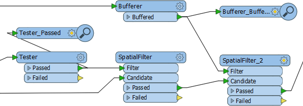
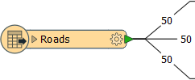
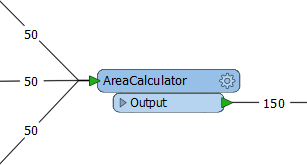

# Transformers used in Parallel #
FME Workbench permits multiple data streams, each of which passes through its own set of transformers.

 
## Multiple Streams ##
A key concept in FME is the ability to have multiple processing streams within a workflow:

The user can combine these streams of data into one, or split one stream into several.

---

<!--Updated Section--> 

<table style="border-spacing: 0px">
<tr>
<td style="vertical-align:middle;background-color:darkorange;border: 2px solid darkorange">
<i class="fa fa-bolt fa-lg fa-pull-left fa-fw" style="color:white;padding-right: 12px;vertical-align:text-top"></i>
.1 UPDATE
</td>
</tr>

<tr>
<td style="border: 1px solid darkorange">

The Bufferer and SpatialFilter transformers in the above screenshot gained &lt;Rejected&gt; ports in FME 2016.1

</td>
</tr>
</table>

---

<!--Tip Section--> 

<table style="border-spacing: 0px">
<tr>
<td style="vertical-align:middle;background-color:darkorange;border: 2px solid darkorange">
<i class="fa fa-info-circle fa-lg fa-pull-left fa-fw" style="color:white;padding-right: 12px;vertical-align:text-top"></i>
TIP
</td>
</tr>

<tr>
<td style="border: 1px solid darkorange">

Similar terms to 'stream' that people use are 'flows,' 'pipes,' or 'pipelines.'

</td>
</tr>
</table>

---

## Creating Multiple Streams ##
Splitting data can occur in a number of ways. Sometimes a transformer with multiple output ports (a Tester transformer is a good illustration of this) will divide data into several output streams.

Additionally, a full stream of data can be duplicated by simply making multiple connections out of a single output port. In effect it creates a set of data for each connection.

Here, 50 road features are being read but, because there are multiple connections from the feature type, multiple copies of the data are being created.

Multiple streams are useful when a user needs to process the same data, but in a number of different ways.

## Bringing Together Multiple Streams ##
When multiple streams are brought into the same input port no merging takes place. The data is simply accumulated into a single stream. This is often called a "Union".

Here, three streams of 50 features each, converge upon a single AreaCalculator:

Notice how no merging has taken place; the data simply accumulates into 150 output features.

To carry out actual merging of data requires a specific transformer such as the FeatureMerger.

---

<!--Updated Section--> 

<table style="border-spacing: 0px">
<tr>
<td style="vertical-align:middle;background-color:darkorange;border: 2px solid darkorange">
<i class="fa fa-bolt fa-lg fa-pull-left fa-fw" style="color:white;padding-right: 12px;vertical-align:text-top"></i>
.1 UPDATE
</td>
</tr>

<tr>
<td style="border: 1px solid darkorange">

The AreaCalculator transformer in the above screenshot gained a &lt;Rejected&gt; port in FME 2016.1

</td>
</tr>
</table>