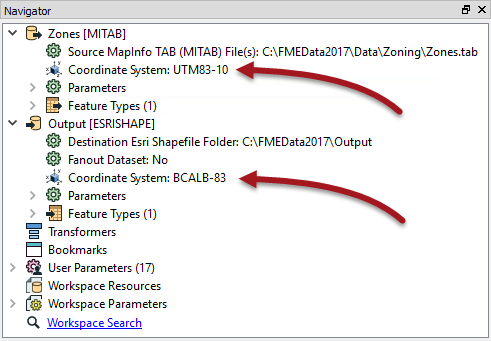
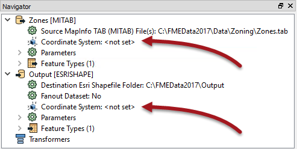

# Coordinate System Transformation #
To be located in a particular space on the Earth's surface the majority of spatial data is related to a particular coordinate system.

Some users call this location of data a "projection," but projection is just one component of a definition within space. A true definition includes *projection*, *datum*, *ellipsoid*, *units*, and sometimes a *quadrant*, which together is called a **Coordinate System**.

## Coordinate System Settings ##

Each reader and writer within FME can be assigned a coordinate system. That coordinate system is set in the Navigator window of Workbench, or in the Generate Workspace dialog.

Like the source schema, the reader coordinate system is ***"what we have"*** and the writer coordinate system is ***"what we want"***. Here the source coordinate system has been defined as UTM83-10 and the destination as BCALB-83:

Each feature processed by the reader is tagged with the coordinate system defined in its parameter.

When a feature arrives at a writer, if it is tagged with a different coordinate system to what is defined for that writer, then FME automatically reprojects the data, so that the output is in the correct location.

<!--Tip Section--> 

<table style="border-spacing: 0px">
<tr>
<td style="vertical-align:middle;background-color:darkorange;border: 2px solid darkorange">
<i class="fa fa-info-circle fa-lg fa-pull-left fa-fw" style="color:white;padding-right: 12px;vertical-align:text-top"></i>
TIP
</td>
</tr>

<tr>
<td style="border: 1px solid darkorange">

Once tagged with a coordinate system, each feature retains this throughout the translation; FME knows what coordinate system it belongs to at all times.
  This is important when carrying out geometric transformations (like calculating area) or when reading multiple datasets that belong to different coordinate systems (yes, FME will handle that).

</td>
</tr>
</table>

---

## Automatic Detection of Coordinate Systems ##
It's not always necessary to set the coordinate system parameters manually. Some data formats (for example Esri Shapefile) are capable of storing information about the coordinate system in which they are held, and FME will retrieve this information where it can.

Here, because the reader coordinate system is marked &lt;not set&gt;, FME will try to determine the coordinate system from the source dataset. If it can't, then the feature will be tagged with a coordinate system of &lt;unknown&gt;.

Because the writer coordinate system is marked &lt;not set&gt;, FME will not reproject the data. Instead FME writes the data using the same coordinate system as the feature is currently tagged with.

---

<!--Warning Section--> 

<table style="border-spacing: 0px">
<tr>
<td style="vertical-align:middle;background-color:darkorange;border: 2px solid darkorange">
<i class="fa fa-exclamation-triangle fa-lg fa-pull-left fa-fw" style="color:white;padding-right: 12px;vertical-align:text-top"></i>
WARNING
</td>
</tr>

<tr>
<td style="border: 1px solid darkorange">

FME cannot reproject data if it does not know what coordinate system a feature belongs too.
  Therefore problems can occur when a writer is set to create data in a specific coordinate system, but receives features tagged as &lt;unknown&gt;.
  In that scenario either the writer will fail with an error message, or the data will be written, but with a series of warning messages in the FME log file.
  This also occurs where the writer format has strict requirements on its coordinate system; for example KML datasets can only be written in a Latitude/Longitude series of coordinates.

</td>
</tr>
</table>