<!--Exercise Section-->

<table style="border-spacing: 0px;border-collapse: collapse;font-family:serif">
<tr>
<td width=25% style="vertical-align:middle;background-color:darkorange;border: 2px solid darkorange">
<i class="fa fa-cogs fa-lg fa-pull-left fa-fw" style="color:white;padding-right: 12px;vertical-align:text-top"></i>
Exercise 2
</td>
<td style="border: 2px solid darkorange;background-color:darkorange;color:white">
Grounds Maintenance Project - Structural Transformation
</td>
</tr>

<tr>
<td style="border: 1px solid darkorange; font-weight: bold">Data</td>
<td style="border: 1px solid darkorange">City Parks (MapInfo TAB)</td>
</tr>

<tr>
<td style="border: 1px solid darkorange; font-weight: bold">Overall Goal</td>
<td style="border: 1px solid darkorange">Calculate the size and average size of each park in the city, to use in Grounds Maintenance estimates for grass cutting, hedge trimming, etc.</td>
</tr>

<tr>
<td style="border: 1px solid darkorange; font-weight: bold">Demonstrates</td>
<td style="border: 1px solid darkorange">Structural Transformation with Transformers</td>
</tr>

<tr>
<td style="border: 1px solid darkorange; font-weight: bold">Start Workspace</td>
<td style="border: 1px solid darkorange">C:\FMEData2017\Workspaces\DesktopBasic\Transformation-Ex2-Begin.fmw</td>
</tr>

<tr>
<td style="border: 1px solid darkorange; font-weight: bold">End Workspace</td>
<td style="border: 1px solid darkorange">C:\FMEData2017\Workspaces\DesktopBasic\Transformation-Ex2-Complete.fmw C:\FMEData2017\Workspaces\DesktopBasic\Transformation-Ex2-Complete-Advanced.fmw</td>
</tr>

</table>

Let's continue your work on the grounds maintenance project.

In case you forgot, the team responsible for maintaining parks and other grassed areas needs to know the area and facilities of each park in order to plan their budget for the upcoming year. 

In this part of the project we’ll filter out dog parks from the source data (as these have a different scale of maintenance costs) and write them to the log window. We'll also handle the renamed attribute NeighborhoodName.

 **1) Start FME Workbench**
 Start FME Workbench and open the workspace from the previous exercise. Alternatively you can open
C:\FMEData2017\Workspaces\DesktopBasic\Transformation-Ex2-Complete.fmw.

 **2) Add Transformer**
 Let's first handle the source attribute NeighborhoodName, which was renamed Neighborhood on the writer but not yet connected. 

We could do this by simply drawing a connection, but it's generally better to use a transformer. There are two transformers we could use. One is called the AttributeRenamer and the other - which we shall use here - is the AttributeManager.

Therefore click on the feature connection from Reader to Writer feature type:

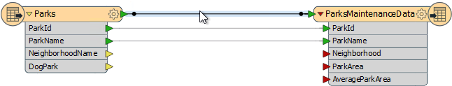

Start to type the phrase "AttributeManager". This is how we can place a transformer in the workspace. As you type, FME searches for a matching transformer. When the list is short enough for you to see the AttributeManager, select it from the dialog:

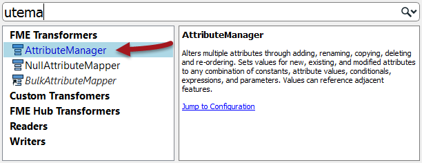

This will place an AttributeManager transformer like so:

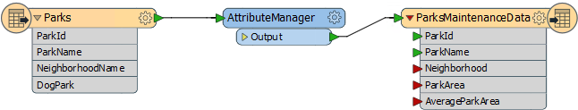

---

<!--Tip Section--> 

<table style="border-spacing: 0px">
<tr>
<td style="vertical-align:middle;background-color:darkorange;border: 2px solid darkorange">
<i class="fa fa-info-circle fa-lg fa-pull-left fa-fw" style="color:white;padding-right: 12px;vertical-align:text-top"></i>
TIP
</td>
</tr>

<tr>
<td style="border: 1px solid darkorange">

For a great tip on adding transformers to a workspace, see #5 in our list of <strong><a href="http://blog.safe.com/2014/10/fmeevangelist128/">The Top Ten FME Tips of All Time!</a></strong>

</td>
</tr>
</table>

---

 **3) Set Parameters**
 View the AttributeManager parameters in the Parameter Editor window by clicking on it in the canvas (alternatively click its cogwheel icon to open the parameters dialog). It will look like this:

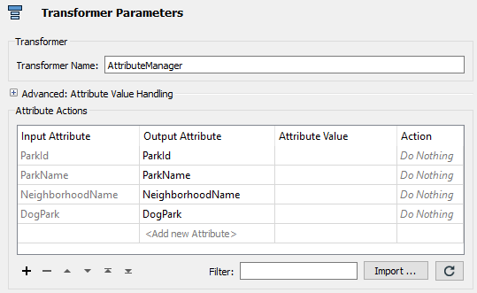

Notice that all of the attributes on the stream in which it is connected will automatically appear in the dialog. 

Where the Input Attribute field is set to NeighborhoodName, click in the Output Attribute field. Click on the button for the drop-down list and in there choose Neighborhood as the new attribute name to use.

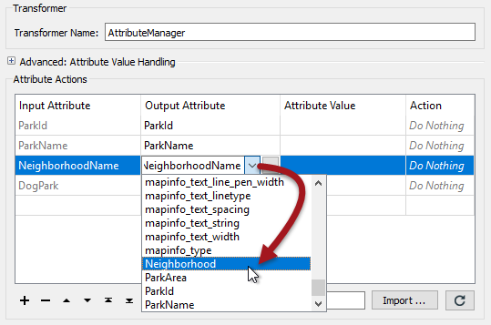

Most importantly, check that the Action field is set to Rename.

---

<!--Tip Section--> 

<table style="border-spacing: 0px">
<tr>
<td style="vertical-align:middle;background-color:darkorange;border: 2px solid darkorange">
<i class="fa fa-info-circle fa-lg fa-pull-left fa-fw" style="color:white;padding-right: 12px;vertical-align:text-top"></i>
TIP
</td>
</tr>

<tr>
<td style="border: 1px solid darkorange">

Neighborhood only appears in the list because it already exists on the Writer schema. If we had done this step before editing the Writer schema, we would have had to manually enter the new attribute name in this dialog.

</td>
</tr>
</table>

---

Click OK to close the dialog. Now in the Workbench canvas window you will see the Neighborhood attribute is flagged with a green arrow, to confirm that a value is being provided to that attribute.

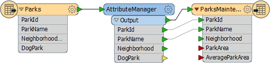

 **4) Add Transformer**
 Now we should remove dog parks from the data, because these have their own set of costs.

This can be done with a Tester transformer. Click on the connection from the AttributeManager output port to the ParksMaintenanceData feature type on the Writer.

Start typing the word Tester. When you spot the Tester transformer click on it to add one to the workspace. After tidying up the layout of the canvas, the workspace will now look like this:

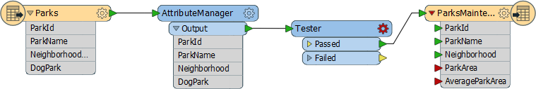

Notice that the Passed output port is the one connected by default.

 **5) Set Parameters**
 Click the parameters button on the Tester transformer to open the parameters dialog. Double click in the Left Value field and from there click the down arrow and choose Attribute Value > DogPark.

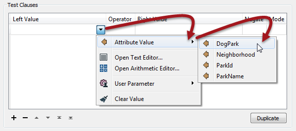

For the Right Value click into the field and type the value N. The operator field should be filled in automatically as the equals sign (=), which is what we want in this case.

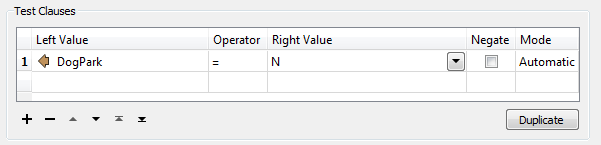

Click OK to accept the values and close the dialog.

 **6) Add Transformer**
 We are now filtering out dog parks from our data, using a test on an attribute value. The question is, what should we do with this data we have filtered out. There are many things we could do, but for now we'll simply log the information to the FME log window.

To do this, right-click on the Tester Failed port and choose the option Connect Logger:

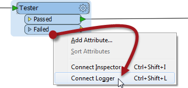

A Logger transformer will be added to the workspace. This will record all incoming features to the log window:

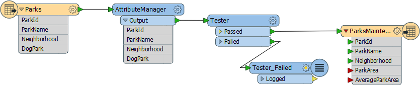

Loggers inserted by this method are named after – and reported in the log with – the output port they are connected to, here Tester_Failed.

 **7) Run Workspace**
 Save and run the workspace. It is not yet complete but running it will prove that everything is working correctly up to this point.

---

<!--Advanced Exercise Section-->

<table style="border-spacing: 0px">
<tr>
<td style="vertical-align:middle;background-color:darkorange;border: 2px solid darkorange">
<i class="fa fa-cogs fa-lg fa-pull-left fa-fw" style="color:white;padding-right: 12px;vertical-align:text-top"></i>
Advanced Exercise
</td>
</tr>

<tr>
<td style="border: 1px solid darkorange">

As an advanced task, if you have time, filter the data further to remove parks that do not have a name; i.e. their name attribute is missing or empty. Would you need to place a second Tester transformer, or could you incorporate the test into the existing one?

</td>
</tr>
</table>

---

<!--Exercise Congratulations Section--> 

<table style="border-spacing: 0px">
<tr>
<td style="vertical-align:middle;background-color:darkorange;border: 2px solid darkorange">
<i class="fa fa-thumbs-o-up fa-lg fa-pull-left fa-fw" style="color:white;padding-right: 12px;vertical-align:text-top"></i>
CONGRATULATIONS
</td>
</tr>

<tr>
<td style="border: 1px solid darkorange">

By completing this exercise you have learned how to:
 
<ul><li>Add transformers to a workspace</li>
<li>Carry out schema mapping with the AttributeManager transformer</li>
<li>Filter data using the Tester transformer</li>
<li>Record data using the Logger transformer</li></ul>

</td>
</tr>
</table>

