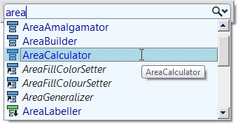
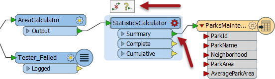
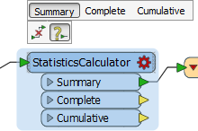
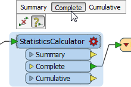
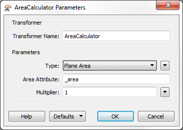
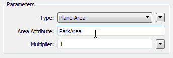
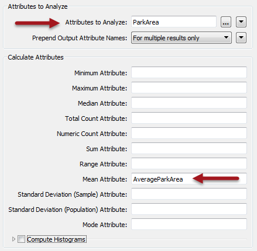
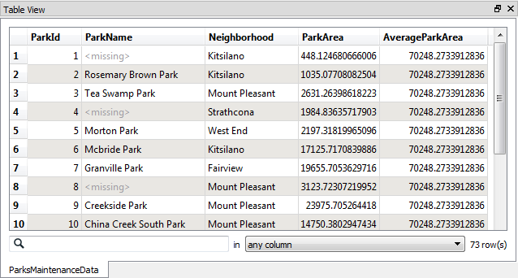

<!--Exercise Section-->
<!--NB: In GitBook world we don't give a number to exercises-->

<table style="border-spacing: 0px;border-collapse: collapse;font-family:serif">
<tr>
<td style="vertical-align:middle;background-color:darkorange;border: 2px solid darkorange">
<i class="fa fa-cogs fa-lg fa-pull-left fa-fw" style="color:white;padding-right: 12px;vertical-align:text-top"></i>
Exercise
</td>
<td style="border: 2px solid darkorange;background-color:darkorange;color:white">
Grounds Maintenance Project - Calculating Statistics
</td>
</tr>

<tr>
<td style="border: 1px solid darkorange; font-weight: bold">Data</td>
<td style="border: 1px solid darkorange">City Parks (MapInfo TAB)</td>
</tr>

<tr>
<td style="border: 1px solid darkorange; font-weight: bold">Overall Goal</td>
<td style="border: 1px solid darkorange">Calculate the size and average size of each park in the city, to use in Grounds Maintenance estimates for grass cutting, hedge trimming, etc.</td>
</tr>

<tr>
<td style="border: 1px solid darkorange; font-weight: bold">Demonstrates</td>
<td style="border: 1px solid darkorange">Content Transformation. Schema Mapping</td>
</tr>

<tr>
<td style="border: 1px solid darkorange; font-weight: bold">Start Workspace</td>
<td style="border: 1px solid darkorange">C:\FMEData2016\Workspaces\DesktopBasic\Transformation-Ex3-Begin.fmw</td>
</tr>

<tr>
<td style="border: 1px solid darkorange; font-weight: bold">End Workspace</td>
<td style="border: 1px solid darkorange">C:\FMEData2016\Workspaces\DesktopBasic\Transformation-Ex3-Complete.fmw C:\FMEData2016\Workspaces\DesktopBasic\Transformation-Ex3-Complete-Advanced.fmw</td>
</tr>

</table>

Let's continue your work on the grounds maintenance project.

In case you forgot, the team responsible for maintaining parks and other grassed areas needs to know the area and facilities of each park in order to plan their budget for the upcoming year. 

In this part of the project we’ll calculate the size and average size of each park, and ensure that information is correctly mapped to the destination schema.

 **1) Start Workbench**
 Start Workbench (if necessary) and open the workspace from Exercise 2. Alternatively you can open C:\FMEData2016\Workspaces\DesktopBasic\Transformation-Ex3-Begin.fmw

 **2) Add an AreaCalculator Transformer**
 To measure the area of each park feature, an AreaCalculator transformer must be used.

“Calculator” is the term for when FME computes new attribute values.

Click onto the connection between Tester Passed port and the Writer feature type Parks. Start typing the letters “areac”. You will see the Quick Add list of matching transformers appear beneath.

Select the transformer named AreaCalculator

 **3) Add a StatisticsCalculator Transformer**
 Using the same method, place a StatisticsCalculator transformer between the AreaCalculator:Outputport and the ParksMaintenanceData feature type.

**BUT!** Do not click anything else yet! The transformer will now look like this:

By default the Summary port has been connected, and we need the Complete port connected instead. But notice the little pop-up icons over the top. Click the right-hand icon (the one with the ? character). This pops up a further list of ports:

Click on the Summary port entry to disconnect that, and then on the Complete port entry to connect that:

---

<!--Tip Section--> 

<table style="border-spacing: 0px">
<tr>
<td style="vertical-align:middle;background-color:darkorange;border: 2px solid darkorange">
<i class="fa fa-info-circle fa-lg fa-pull-left fa-fw" style="color:white;padding-right: 12px;vertical-align:text-top"></i>
TIP
</td>
</tr>

<tr>
<td style="border: 1px solid darkorange">

These pop-up menus are a great help in schema mapping and other feature connections.

</td>
</tr>
</table>

---

The latter part of the workspace now looks like this:

 **4) Check AreaCalculator Settings**
 A yellow icon indicates the AreaCalculator has parameters that need to be checked.

Open the AreaCalculator transformer Parameters dialog.

The default settings cause the calculated value to be placed into an attribute called _area. However, the ParksMaintenanceData schema requires an attribute called ParkArea, so change this parameter to create the correct attribute.

Notice that the attribute on the Writer feature type is now flagged as connected.

 **5) Check StatisticsCalculator Settings**
 A red icon indicates the StatisticsCalculator has parameters that need to be defined.

Open the StatisticsCalculator transformer's Parameters dialog.

The attribute to analyze is the one containing the calculated area; so select ParkArea.

Examine what the default setting is for an attribute name for average (mean) park size. Currently it doesn't match the ParksMaintenanceData schema, which requires an attribute named AverageParkArea.

Change the attribute from _mean to AverageParkArea. For Best Practice reasons, delete/unset any StatisticsCalculator output attributes that aren't required (for example _range and _stdev).

Finally, click OK to accept the changes.

 **6) Run the Workspace**
 Run the workspace.

Inspect the result of the translation using the FME Data Inspector.

Inspect the Table View window to discover the area of each park and the average area of all parks.

 **7) Save the Workspace**
 Save the workspace – it will be completed in further examples.

---

<!--Advanced Exercise Section-->

<table style="border-spacing: 0px">
<tr>
<td style="vertical-align:middle;background-color:darkorange;border: 2px solid darkorange">
<i class="fa fa-cogs fa-lg fa-pull-left fa-fw" style="color:white;padding-right: 12px;vertical-align:text-top"></i>
Advanced Exercise
</td>
</tr>

<tr>
<td style="border: 1px solid darkorange">

Notice that the numbers in the Table View show the results have been calculated to 12 decimal places. This is in excess of the precision that you require. As an advanced task - if you have time - use the AttributeRounder transformer to reduce the values to just 2 decimal places.

</td>
</tr>
</table>

---

<!--Exercise Congratulations Section--> 

<table style="border-spacing: 0px">
<tr>
<td style="vertical-align:middle;background-color:darkorange;border: 2px solid darkorange">
<i class="fa fa-thumbs-o-up fa-lg fa-pull-left fa-fw" style="color:white;padding-right: 12px;vertical-align:text-top"></i>
CONGRATULATIONS
</td>
</tr>

<tr>
<td style="border: 1px solid darkorange">

By completing this exercise you have learned how to:
 
<ul><li>Carry out content transformation with transformers (AreaCalculator, StatisticsCalculator)</li>
<li>Manage transformer connections using pop-up buttons</li>
<li>Use transformer parameters to create attributes that match the Writer schema</li></ul> 

</td>
</tr>
</table>

