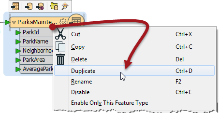
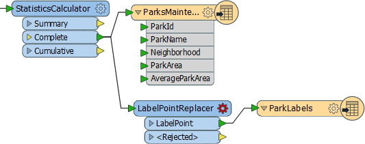
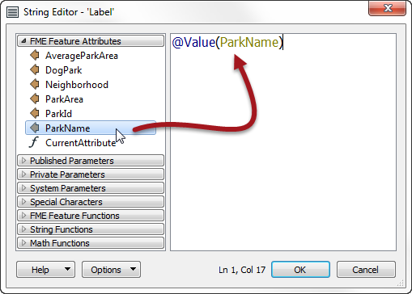
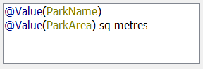
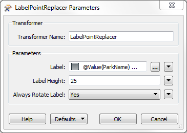
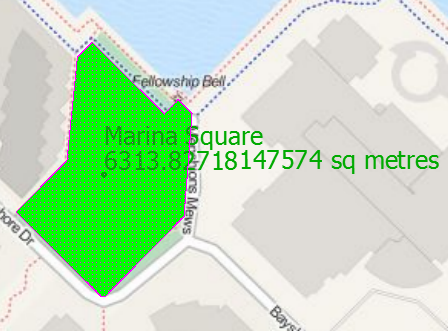
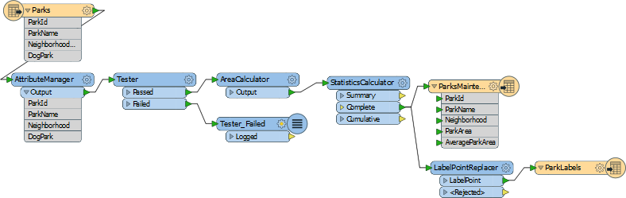

<!--Exercise Section-->
<!--NB: In GitBook world we don't give a number to exercises-->

<table style="border-spacing: 0px;border-collapse: collapse;font-family:serif">
<tr>
<td width=25% style="vertical-align:middle;background-color:darkorange;border: 2px solid darkorange">
<i class="fa fa-cogs fa-lg fa-pull-left fa-fw" style="color:white;padding-right: 12px;vertical-align:text-top"></i>
Exercise
</td>
<td style="border: 2px solid darkorange;background-color:darkorange;color:white">
Grounds Maintenance Project - Labelling Features
</td>
</tr>

<tr>
<td style="border: 1px solid darkorange; font-weight: bold">Data</td>
<td style="border: 1px solid darkorange">City Parks (MapInfo TAB)</td>
</tr>

<tr>
<td style="border: 1px solid darkorange; font-weight: bold">Overall Goal</td>
<td style="border: 1px solid darkorange">Calculate the size and average size of each park in the city, to use in Grounds Maintenance estimates for grass cutting, hedge trimming, etc.</td>
</tr>

<tr>
<td style="border: 1px solid darkorange; font-weight: bold">Demonstrates</td>
<td style="border: 1px solid darkorange">Content transformation with parallel transformers</td>
</tr>

<tr>
<td style="border: 1px solid darkorange; font-weight: bold">Start Workspace</td>
<td style="border: 1px solid darkorange">C:\FMEData2016\Workspaces\DesktopBasic\Transformation-Ex4-Begin.fmw</td>
</tr>

<tr>
<td style="border: 1px solid darkorange; font-weight: bold">End Workspace</td>
<td style="border: 1px solid darkorange">C:\FMEData2016\Workspaces\DesktopBasic\Transformation-Ex4-Complete.fmw C:\FMEData2016\Workspaces\DesktopBasic\Transformation-Ex4-Complete-Advanced.fmw</td>
</tr>

</table>

Let's continue your work on the grounds maintenance project.

In this part of the project we’ll create a label for each park and write it to a new output layer. This is best done using a parallel stream of data.

 **1) Start Workbench**
 Start Workbench (if necessary) and open the workspace from Exercise 3. Alternatively you can open C:\FMEData2016\Workspaces\DesktopBasic\Transformation-Ex4-Begin.fmw

The previous exercise measured park areas with the AreaCalculator. Now we are asked to add this information as labels to the output dataset.

This can be achieved using the LabelPointReplacer transformer.

 **2) Create New Writer Feature Type**
 Right-click the Writer feature type and choose the option Duplicate. This creates a new feature type (layer) in the output dataset.

Now clean up this feature type's schema. Open the Feature Type properties dialog. Rename the new type to ParkLabels. In the User Attributes tab delete all of the existing user attributes.

 **3) Place a LabelPointReplacer Transformer**
 Click onto a blank area of canvas. Type "LabelPointReplacer" to add a transformer of this type.

Connect it to the Complete port of the StatisticsCalculator by dragging a second connection from there to the new transformer.

Make a new connection from the LabelPointReplacer to the new feature type.

 **4) Check Transformer Parameters**
 Open the parameters dialog for the LabelPointReplacer transformer.

Click the browse button to the right of the label field to open an advanced text editor. We want the label to include the park name and area, with a notation for the units too.

So, firstly double click ParkName in the list of attributes to the left:

Now press the Enter/Return key to insert a new line.

Next double-click the ParkArea attribute to add that.

Finally type " sq metres" after the ParkArea attribute (including a &lt;space&gt; character before the "sq" part):

Click OK to close this dialog.

Now click in the Label Height field and type 25 (that’s 25 working units, which in this case is metres).

The “Always Rotate Label” parameter can be left to its default value.

---

<!--Tip Section--> 

<table style="border-spacing: 0px">
<tr>
<td style="vertical-align:middle;background-color:darkorange;border: 2px solid darkorange">
<i class="fa fa-info-circle fa-lg fa-pull-left fa-fw" style="color:white;padding-right: 12px;vertical-align:text-top"></i>
TIP
</td>
</tr>

<tr>
<td style="border: 1px solid darkorange">

Many parameter fields (like Label Height) can be set either as a constant value (by typing it in) or set to an attribute by using “Set to Attribute Value.
  If in doubt, a tooltip is often provided to point the way.

</td>
</tr>
</table>

---

 **5) Run the Translation**
 Run the translation and inspect the output.

Notice that the output is in two layers in two files. Use the FME Data Inspector to open both output files in the same view.

 Tiles Courtesy of <a href="http://www.mapquest.com/">MapQuest</a>

 **6) Save the Workspace**
 Save the workspace – it will be completed in further examples.

---

<!--Advanced Exercise Section-->

<table style="border-spacing: 0px">
<tr>
<td style="vertical-align:middle;background-color:darkorange;border: 2px solid darkorange">
<i class="fa fa-cogs fa-lg fa-pull-left fa-fw" style="color:white;padding-right: 12px;vertical-align:text-top"></i>
Advanced Exercise
</td>
</tr>

<tr>
<td style="border: 1px solid darkorange">

Now you know how to create a new feature type (layer) in the output, how to test data, and how to use parallel streams, why not try this task:
  Identify which parks are smaller than average and which parks are larger than average, and write them out to different feature types.

</td>
</tr>
</table>

---

<!--Exercise Congratulations Section--> 

<table style="border-spacing: 0px">
<tr>
<td style="vertical-align:middle;background-color:darkorange;border: 2px solid darkorange">
<i class="fa fa-thumbs-o-up fa-lg fa-pull-left fa-fw" style="color:white;padding-right: 12px;vertical-align:text-top"></i>
CONGRATULATIONS
</td>
</tr>

<tr>
<td style="border: 1px solid darkorange">

By completing this exercise you have learned how to:
 
<ul><li>Create a new Writer feature type</li>
<li>Use multiple streams of transformers in a single workspace</li>
<li>Use FME's built-in string editor dialog</li></ul>

</td>
</tr>
</table>

