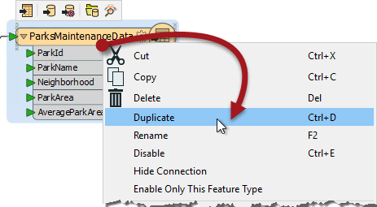
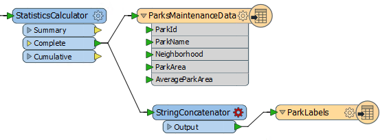
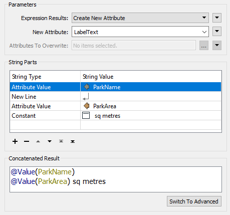
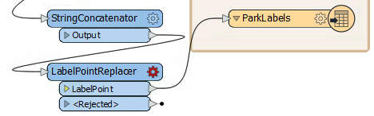
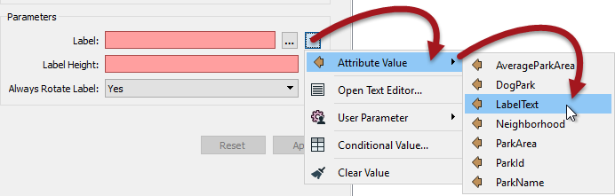
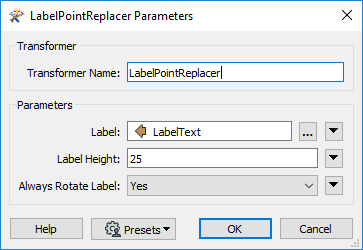
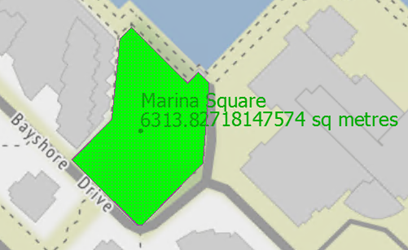
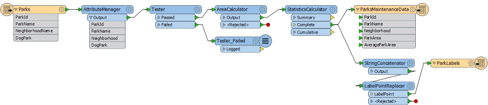

<!--Exercise Section-->

<table style="border-spacing: 0px;border-collapse: collapse;font-family:serif">
<tr>
<td width=25% style="vertical-align:middle;background-color:darkorange;border: 2px solid darkorange">
<i class="fa fa-cogs fa-lg fa-pull-left fa-fw" style="color:white;padding-right: 12px;vertical-align:text-top"></i>
Exercise 4
</td>
<td style="border: 2px solid darkorange;background-color:darkorange;color:white">
Grounds Maintenance Project - Labelling Features
</td>
</tr>

<tr>
<td style="border: 1px solid darkorange; font-weight: bold">Data</td>
<td style="border: 1px solid darkorange">City Parks (MapInfo TAB)</td>
</tr>

<tr>
<td style="border: 1px solid darkorange; font-weight: bold">Overall Goal</td>
<td style="border: 1px solid darkorange">Calculate the size and average size of each park in the city, to use in Grounds Maintenance estimates for grass cutting, hedge trimming, etc.</td>
</tr>

<tr>
<td style="border: 1px solid darkorange; font-weight: bold">Demonstrates</td>
<td style="border: 1px solid darkorange">Content transformation with parallel transformers</td>
</tr>

<tr>
<td style="border: 1px solid darkorange; font-weight: bold">Start Workspace</td>
<td style="border: 1px solid darkorange">C:\FMEData2018\Workspaces\DesktopBasic\Transformation-Ex4-Begin.fmw</td>
</tr>

<tr>
<td style="border: 1px solid darkorange; font-weight: bold">End Workspace</td>
<td style="border: 1px solid darkorange">C:\FMEData2018\Workspaces\DesktopBasic\Transformation-Ex4-Complete.fmw C:\FMEData2018\Workspaces\DesktopBasic\Transformation-Ex4-Complete-Advanced.fmw</td>
</tr>

</table>

Let's continue your work on the grounds maintenance project.

In this part of the project we’ll create a label for each park and write it to a new output layer. This is best done using a parallel stream of data.

 **1) Start Workbench**
 Start Workbench (if necessary) and open the workspace from Exercise 3. Alternatively you can open C:\FMEData2018\Workspaces\DesktopBasic\Transformation-Ex4-Begin.fmw

The previous exercise measured park areas with the AreaCalculator. Now we are asked to add this information as labels to the output dataset.

This can be achieved using the LabelPointReplacer transformer.

 **2) Create New Writer Feature Type**
 Because we want to write label features to a separate layer (table) in the output, we need to create another feature type object on the canvas. There is more about this in a later chapter, but for now right-click the writer feature type and choose the option Duplicate. This creates a new feature type (layer) in the output dataset.

Now clean up this feature type's schema. View the feature type's dialog and rename the new type to ParkLabels. In the User Attributes tab delete all of the existing user attributes.

 **3) Place a StringConcatenator Transformer**
 Click onto a blank area of canvas. Type "StringConcatenator" to add a transformer of this type.

Connect it to the Complete port of the StatisticsCalculator by dragging a second connection from there to the new transformer.

Make a new connection from the StringConcatenator to the new feature type.

 **4) Check Transformer Parameters**
 View the parameters for the StringConcatenator transformer. There are both basic and advanced dialogs, and the basic one looks like this:

Enter *LabelText* as the name for the new attribute to create.

In the String Parts section, set the following four parts:

<table>
<th>String Type</th><th>String Value</th>
<tr><td>Attribute Value</td><td>ParkName</td></tr>
<tr><td>New Line</td><td></td></tr>
<tr><td>Attribute Value</td><td>ParkArea</td></tr>
<tr><td>Constant</td><td> sq metres</td></tr>
</table>

Be sure to include a space character in the constant before "sq metres".

<!--Tip Section--> 

<table style="border-spacing: 0px">
<tr>
<td style="vertical-align:middle;background-color:darkorange;border: 2px solid darkorange">
<i class="fa fa-info-circle fa-lg fa-pull-left fa-fw" style="color:white;padding-right: 12px;vertical-align:text-top"></i>
TIP
</td>
</tr>

<tr>
<td style="border: 1px solid darkorange">

You may find it quicker to switch to the Advanced editor dialog and enter the content directly:
 @Value(ParkName)
 @Value(ParkArea) sq metres

</td>
</tr>
</table>

---

 **5) Place a LabelPointReplacer Transformer**
 Click onto the connection between StringConcatenator:Output and the ParkLabels feature type. Type "LabelPointReplacer" to add a transformer of this type.

The new transformer will be added and automatically connected between those two objects.

 **6) Check LabelPointReplacer Parameters**
 Inspect the LabelPointReplacer parameters. 

Firstly click the dropdown arrow to the right of the Label parameter:

Select Attribute Value &gt; LabelText to select the label previously defined in the StringConcatenator.

Now click in the Label Height field and type 25 (that’s 25 working units, which in this case is metres).

The “Always Rotate Label” parameter can be left to its default value.

---

<!--Tip Section--> 

<table style="border-spacing: 0px">
<tr>
<td style="vertical-align:middle;background-color:darkorange;border: 2px solid darkorange">
<i class="fa fa-info-circle fa-lg fa-pull-left fa-fw" style="color:white;padding-right: 12px;vertical-align:text-top"></i>
TIP
</td>
</tr>

<tr>
<td style="border: 1px solid darkorange">

Many parameter fields (like Label Height) can be set either as a constant value (by typing it in) or set to an attribute by clicking the drop down arrow and selecting Attribute Value.
  And - as you'll see shortly - it's also possible to construct a parameter value directly inside the transformer settings

</td>
</tr>
</table>

---

 **7) Run the Translation**
 Add another bookmark if you wish, run the translation, and inspect the output.

Notice that the output is in two layers in two files. Use the FME Data Inspector to open both output files in the same view.

 Map tiles by <a href="http://stamen.com">Stamen Design</a>, under <a href="http://creativecommons.org/licenses/by/3.0">CC-BY-3.0</a>. Data by <a href="http://openstreetmap.org">OpenStreetMap</a>, under <a href="http://creativecommons.org/licenses/by-sa/3.0">CC-BY-SA</a>.

Save the workspace – it will be completed in further examples.

---

<!--Advanced Exercise Section-->

<table style="border-spacing: 0px">
<tr>
<td style="vertical-align:middle;background-color:darkorange;border: 2px solid darkorange">
<i class="fa fa-cogs fa-lg fa-pull-left fa-fw" style="color:white;padding-right: 12px;vertical-align:text-top"></i>
Advanced Exercise
</td>
</tr>

<tr>
<td style="border: 1px solid darkorange">

Now you know how to create a new feature type (layer) in the output, how to test data, and how to use parallel streams, why not try this task: Identify which parks are smaller than average and which parks are larger than average, and write them out to different feature types.

</td>
</tr>
</table>

---

<!--Exercise Congratulations Section--> 

<table style="border-spacing: 0px">
<tr>
<td style="vertical-align:middle;background-color:darkorange;border: 2px solid darkorange">
<i class="fa fa-thumbs-o-up fa-lg fa-pull-left fa-fw" style="color:white;padding-right: 12px;vertical-align:text-top"></i>
CONGRATULATIONS
</td>
</tr>

<tr>
<td style="border: 1px solid darkorange">

By completing this exercise you have learned how to:
 
<ul><li>Create a new writer feature type</li>
<li>Use multiple streams of transformers in a single workspace</li>
<li>Use the StringConcatenator to construct a string for use elsewhere</li>
<li>Use an attribute as the value of a transformer's parameter</li></ul>

</td>
</tr>
</table>