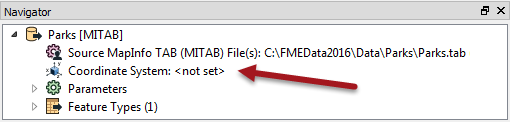
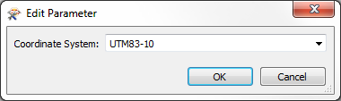
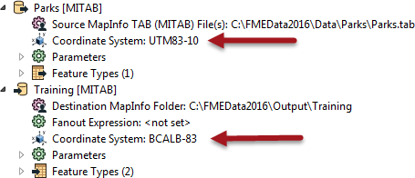
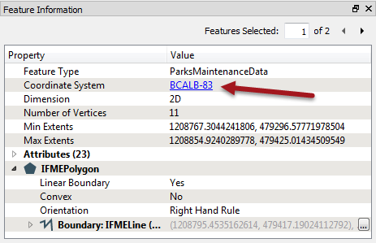

<!--Exercise Section-->
<!--NB: In GitBook world we don't give a number to exercises-->

<table style="border-spacing: 0px;border-collapse: collapse;font-family:serif">
<tr>
<td style="vertical-align:middle;background-color:darkorange;border: 2px solid darkorange">
<i class="fa fa-cogs fa-lg fa-pull-left fa-fw" style="color:white;padding-right: 12px;vertical-align:text-top"></i>
Exercise
</td>
<td style="border: 2px solid darkorange;background-color:darkorange;color:white">
Grounds Maintenance Project - Data Reprojection
</td>
</tr>

<tr>
<td style="border: 1px solid darkorange; font-weight: bold">Data</td>
<td style="border: 1px solid darkorange">City Parks (MapInfo TAB)</td>
</tr>

<tr>
<td style="border: 1px solid darkorange; font-weight: bold">Overall Goal</td>
<td style="border: 1px solid darkorange">Calculate the size and average size of each park in the city, to use in Grounds Maintenance estimates for grass cutting, hedge trimming, etc.</td>
</tr>

<tr>
<td style="border: 1px solid darkorange; font-weight: bold">Demonstrates</td>
<td style="border: 1px solid darkorange">Data reprojection</td>
</tr>

<tr>
<td style="border: 1px solid darkorange; font-weight: bold">Start Workspace</td>
<td style="border: 1px solid darkorange">C:\FMEData2016\Workspaces\DesktopBasic\Transformation-Ex6-Begin.fmw</td>
</tr>

<tr>
<td style="border: 1px solid darkorange; font-weight: bold">End Workspace</td>
<td style="border: 1px solid darkorange">C:\FMEData2016\Workspaces\DesktopBasic\Transformation-Ex6-Complete.fmw</td>
</tr>

</table>

Let's continue your work on the grounds maintenance project.

The parks team has decided that the output data should be in an Albers Equal Area projection (coordinate system = BCALB-83). They think it will take ages! We'll show them differently...

 **1) Start Workbench**
 Start Workbench (if necessary) and open the workspace from Exercise 5. Alternatively you can open C:\FMEData2016\Workspaces\DesktopBasic\Transformation-Ex6-Begin.fmw

 **2) Edit Reader Coordinate System**
 On the Navigator locate the Parks [MITAB] Reader, and expand its list of settings.

Locate the setting labelled ‘Coordinate System’. The original value should be &lt;not set&gt;:

Double-click the reader Coordinate System setting to open the Edit Parameter dialog.

Enter the coordinate system name UTM83-10 or select it from the Coordinate System Gallery by selecting "More Coordinate Systems..." from the bottom of the drop-down list.

---

<!--Tip Section--> 

<table style="border-spacing: 0px">
<tr>
<td style="vertical-align:middle;background-color:darkorange;border: 2px solid darkorange">
<i class="fa fa-info-circle fa-lg fa-pull-left fa-fw" style="color:white;padding-right: 12px;vertical-align:text-top"></i>
TIP
</td>
</tr>

<tr>
<td style="border: 1px solid darkorange">

Remember, when a Reader’s Coordinate System parameter is defined as &lt;not set&gt; FME will automatically try to determine the correct coordinate system from the dataset itself.
  When the source dataset is in a format that stores coordinate system information (as it does in this example) you can safely leave the parameter unset. So this step isn’t really necessary.
  However, you MUST set this parameter when you wish to reproject source data that does not store coordinate system information; otherwise an error will occur in the translation.

</td>
</tr>
</table>

---

 **3) Edit Destination Coordinate System**
 Now locate the coordinate system setting for the destination (writer) dataset.

Again the value should be the default value of &lt;not set&gt;.

Double-click the setting. Enter the coordinate system name BCALB-83 or select it from the Coordinate System Gallery by selecting "More Coordinate Systems..." from the bottom of the drop-down list.

 **4) Run the Workspace**
 Save and then run the workspace.

In the log file you should be able to find:

<pre>
FME Configuration: Source coordinate system set to `UTM83-10'
FME Configuration: Destination coordinate system set to `BCALB-83'
</pre>

 **5) Inspect the Output**

Open the FME Data Inspector. Choose Tools > FME Options and turn off the background map. 

If the background map is activated then the data is automatically reprojected to match, and this would not help us verify the results of the translation.

Open the newly reprojected dataset. Query a feature. The Feature Information window should report that the data is now in BCALB-83. Optionally, click on the coordinate system name in the Data Inspector; a new window will open to display all of the coordinate system parameters.

---

<!--Tip Section--> 

<table style="border-spacing: 0px">
<tr>
<td style="vertical-align:middle;background-color:darkorange;border: 2px solid darkorange">
<i class="fa fa-info-circle fa-lg fa-pull-left fa-fw" style="color:white;padding-right: 12px;vertical-align:text-top"></i>
TIP
</td>
</tr>

<tr>
<td style="border: 1px solid darkorange">

Reprojection can also take place using transformers – like the CSMapReprojector. In fact this might be considered the better method because the transformers include extra parameters for controlling the reprojection.

</td>
</tr>
</table>

---

<!--Exercise Congratulations Section--> 

<table style="border-spacing: 0px">
<tr>
<td style="vertical-align:middle;background-color:darkorange;border: 2px solid darkorange">
<i class="fa fa-thumbs-o-up fa-lg fa-pull-left fa-fw" style="color:white;padding-right: 12px;vertical-align:text-top"></i>
CONGRATULATIONS
</td>
</tr>

<tr>
<td style="border: 1px solid darkorange">

By completing this exercise you have learned how to:
 
<ul><li>Use Coordinate System parameters to reproject spatial data</li>
<li>Query features in the Data Inspector to inspect coordinate system information</li></ul>

</td>
</tr>
</table>

