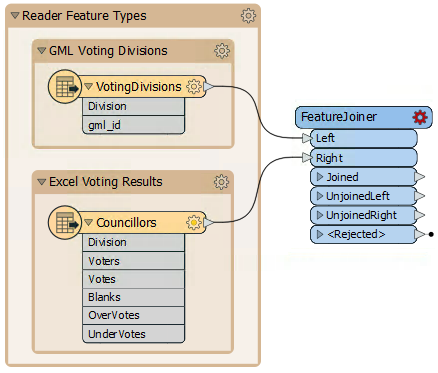
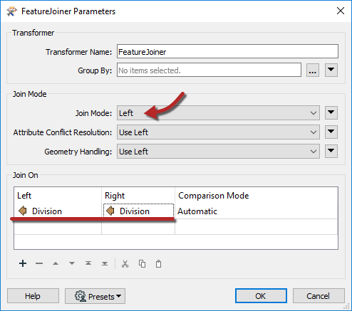
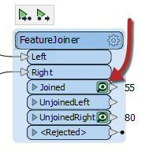
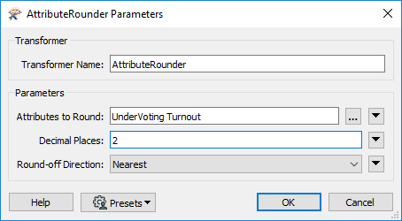
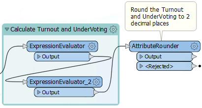
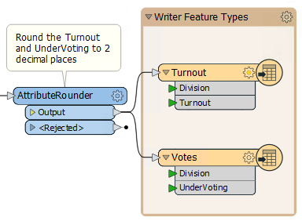
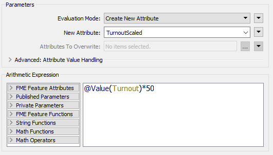
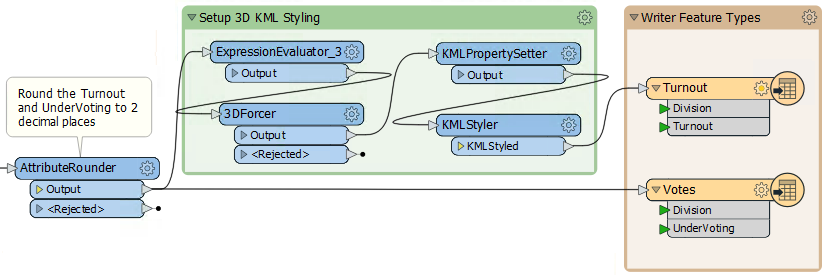
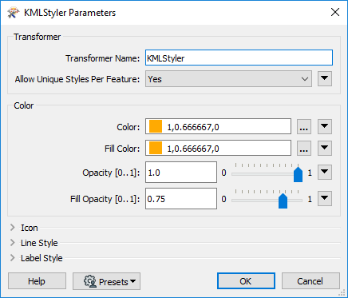
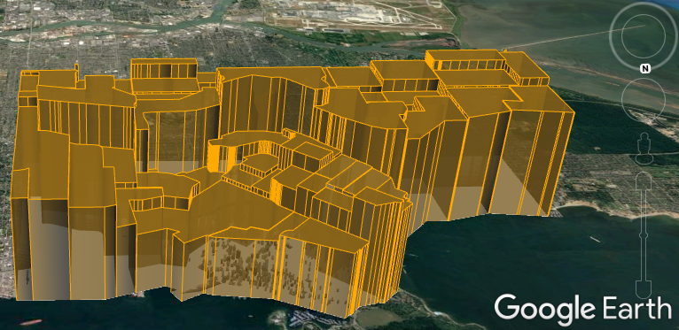

<!--Exercise Section-->

<table style="border-spacing: 0px;border-collapse: collapse;font-family:serif">
<tr>
<td width=25% style="vertical-align:middle;background-color:darkorange;border: 2px solid darkorange">
<i class="fa fa-cogs fa-lg fa-pull-left fa-fw" style="color:white;padding-right: 12px;vertical-align:text-top"></i>
Exercise 7
</td>
<td style="border: 2px solid darkorange;background-color:darkorange;color:white">
Voting Analysis Project
</td>
</tr>

<tr>
<td style="border: 1px solid darkorange; font-weight: bold">Data</td>
<td style="border: 1px solid darkorange">Election Mapping (GML) Election Statistics (Microsoft Excel)</td>
</tr>

<tr>
<td style="border: 1px solid darkorange; font-weight: bold">Overall Goal</td>
<td style="border: 1px solid darkorange">Map statistics of voting patterns</td>
</tr>

<tr>
<td style="border: 1px solid darkorange; font-weight: bold">Demonstrates</td>
<td style="border: 1px solid darkorange">Data Transformation</td>
</tr>

<tr>
<td style="border: 1px solid darkorange; font-weight: bold">Start Workspace</td>
<td style="border: 1px solid darkorange">C:\FMEData2019\Workspaces\DesktopBasic\Transformation-Ex7-Begin.fmw</td>
</tr>

<tr>
<td style="border: 1px solid darkorange; font-weight: bold">End Workspace</td>
<td style="border: 1px solid darkorange">C:\FMEData2019\Workspaces\DesktopBasic\Transformation-Ex7-Complete.fmw C:\FMEData2019\Workspaces\DesktopBasic\Transformation-Ex7-Complete-Advanced.fmw</td>
</tr>

</table>

In a break from grounds maintenance projects, the municipal Elections Officer has heard about your skills and asked for help identifying voting divisions that had a low turnout at the last election, or divisions where voters had difficulties understanding the process.

He asks for your help, and you suggest the results should be presented in Google Earth so that staff can view them without having to use a full GIS system.

 **1) View Data**
 Start FME Workbench and open the starting workspace. It already has readers and writers added to handle the data; all we need to do is carry out the transformation, but first, let's inspect the data to know what we are working with:

Click on VotingDivisions to open the popup menu and click on the View Source Data button to view the data in the Visual Preview Window. Take note of the attributes in the table view.

Repeat this step with the Councillors and take note of the attributes.

---

<!--Tip Section-->

<table style="border-spacing: 0px">
<tr>
<td style="vertical-align:middle;background-color:darkorange;border: 2px solid darkorange">
<i class="fa fa-info-circle fa-lg fa-pull-left fa-fw" style="color:white;padding-right: 12px;vertical-align:text-top"></i>
TIP
</td>
</tr>

<tr>
<td style="border: 1px solid darkorange">

If you need to view two or more reader feature types at the same time, FME Data Inspector is a useful tool as it opens each dataset in a different tab so you can flip back and forth.
  
To do this, when viewing your data in Visual Preview, click on the magnifying glass on the left-hand side to open the dataset in FME Data Inspector. Repeat with other feature types.
  

</td>
</tr>
</table>

---

Notice that both datasets have a Division attribute by which to identify each voting division (area). The Excel data is non-spatial but has a set of other voting attributes:

- **Voters**: Number of registered voters
- **Votes**: Number of voters who voted
- **Blanks**: Number of voters who left a blank or spoiled vote
- **OverVotes**: Number of voters who voted for too many candidates
- **UnderVotes**: Number of votes not cast

The OverVotes and UnderVotes attributes are an indicator of how well the voting process was understood. Each voter gets to vote for up to 10 candidates (out of 30).

OverVotes are those voters who voted for more than ten candidates. UnderVotes are the number of votes that could have been cast, but were not; for example, the voter only voted for four candidates instead of ten, giving six undervotes.

 **2) Add a FeatureJoiner Transformer**
 The first task is to join the statistical election data onto the actual features. We'll use a FeatureJoiner transformer to do this. A FeatureJoiner is a way to join or merge features. In this case, we are merging election result records onto election boundary features.

Add a FeatureJoiner transformer. Connect the VotingDivisions data to the Left port, and the Councillors (result) data to the Right port:

---

 **3) Set the FeatureJoiner Parameters**
 View the FeatureJoiner parameters. Because we want all of the voting division features we will do a Left join; therefore set the Join Mode to Left.

For both the Left and Right join fields, click in the field and choose the Division attribute from the drop-down list. This attribute is the common key by which we join our data:

 **4) View Data**
 Run the translation to create a feature cache, ignoring any warning or log message that reports Unexpected Input.

Then click on the FeatureJoiner:Joined output port to view the newly joined data in Visual Preview:

Examine the data to ensure all division polygons now include a set of attribute data copied from the Excel spreadsheet:

 **5) Add an ExpressionEvaluator Transformer**
 Now that we have the numbers we need, we can start to calculate some statistics. To do this, we'll use an ExpressionEvaluator transformer first to calculate the voter turnout percentage for each division.

Place an ExpressionEvaluator transformer after the FeatureJoiner - connect it to the FeatureJoiner:Joined output port. View the transformer's parameters. Set the New Attribute to Turnout (to match what we have on the destination schema):

In the Arithmetic Expression section, set the expression to:

<pre>
(@Value(Votes)/@Value(Voters))*100
</pre>

You don't need to type the @Value(Votes) and @Value(Voters) part in, it can be obtained by double-clicking on the attributes in the list to the left under FME Feature Attributes.

If you wish, you can run the translation again, and it will only run the ExpressionEvaluator as everything before it is already cached. Then click on the Output port to view the results in the Visual Preview window.

 **6) Add another ExpressionEvaluator Transformer**
 Using a similar technique, add a second ExpressionEvaluator to calculate the number of UnderVotes per voter and put it in an attribute that matches the output schema which will be UnderVoting. Set the expression to:

<pre>
@Value(UnderVotes)/@Value(Voters)
</pre>

***NB:*** *This isn't a percentage, like the previous calculation.*

Feel free to add a bookmark around the two ExpressionEvaluator transformers.

 **7) Add an AttributeRounder Transformer**
 It's a bit excessive to calculate our statistics to 13 decimal places or more. We should truncate these numbers a bit. To do this place an AttributeRounder transformer after the second ExpressionEvaluator.

For the parameters, under Attributes to Round select the newly created Turnout and UnderVoting attributes. Set the number of decimal places to 2:

Again, run the workspace to check the results if you wish.

 **8) Add an Annotation**
 It doesn't make sense to add a bookmark to the AttributeRounder by itself, so instead right-click the transformer and choose the option to Attach Annotation.

Doing so will add a label to the transformer. Edit the content to say something like "Round the Turnout and Undervoting to two decimal places":

---

<!--Tip Section-->

<table style="border-spacing: 0px">
<tr>
<td style="vertical-align:middle;background-color:darkorange;border: 2px solid darkorange">
<i class="fa fa-info-circle fa-lg fa-pull-left fa-fw" style="color:white;padding-right: 12px;vertical-align:text-top"></i>
TIP
</td>
</tr>

<tr>
<td style="border: 1px solid darkorange">

Annotations will be covered in more detail in Chapter 5: Best Practice, but that shouldn't stop you from creating well documented workspaces now!

</td>
</tr>
</table>

---

 **9) Connect the Schema**
 For the final step let's connect the AttributeRounder to the output schema. Simply make connections from the AttributeRounder to both writer feature types:

Run the workspace and examine the output in Google Earth to prove it has the correct attributes and is in the correct location.

---

<!--Tip Section-->

<table style="border-spacing: 0px">
<tr>
<td style="vertical-align:middle;background-color:darkorange;border: 2px solid darkorange">
<i class="fa fa-info-circle fa-lg fa-pull-left fa-fw" style="color:white;padding-right: 12px;vertical-align:text-top"></i>
TIP
</td>
</tr>

<tr>
<td style="border: 1px solid darkorange">

So this is obviously a form of parallel streams of data, but left until the last step. An alternative layout would be to split the data after the FeatureJoiner, like so:
  
  There's no difference in the output so the only consideration is which is easier to create and which will perform better. The main method used should win on both counts.

</td>
</tr>
</table>

---

<!--Advanced Exercise Section-->

<table style="border-spacing: 0px">
<tr>
<td style="vertical-align:middle;background-color:darkorange;border: 2px solid darkorange">
<i class="fa fa-cogs fa-lg fa-pull-left fa-fw" style="color:white;padding-right: 12px;vertical-align:text-top"></i>
Advanced Exercise
</td>
</tr>

<tr>
<td style="border: 1px solid darkorange">

The project is done, but the output is very plain. It would be much better to improve the look of the results and there are several ways to do this with KML.
  We could simply color the voting divisions differently according to their turnout/overvotes, but a more impressive method is to use three-dimensional blocks.
  Follow the steps below to create three-dimensional shapes in the output KML dataset...

</td>
</tr>
</table>

---

 **10) Add a Third ExpressionEvaluator Transformer**
 The height of each block should be proportional to the turnout for that division. However, for differences to be visible, the vertical scale will need some exaggeration.

Place an ExpressionEvaluator between the AttributeRounder and the Turnout feature type. Set the parameters to multiply the Turnout attribute by a value of 50. Put it into a new attribute called TurnoutScaled.

 **11) Add a 3DForcer Transformer**
 Add a 3DForcer transformer after the new ExpressionEvaluator. This will elevate the feature to the required height. In the parameters dialog set the elevation to Attribute Value > TurnoutScaled.

 **12) Add a KMLPropertySetter Transformer**
 Add a KMLPropertySetter transformer after the 3DForcer. This transformer will allow us to set up the 3D blocks in the output. Set the geometry parameters as follows:

- Altitude Mode: Absolute
- Extrude: Yes

 **13) Add a KMLStyler Transformer**
Finally, add a KMLStyler transformer. The workspace will now look like this:

Check the parameters. Select a color and fill color for the features. Increase the fill opacity to around 0.75.

Save and run the workspace. In Google Earth the output should now look like this:

These 3D blocks will show users where the voter turnout is high/low in the city.

If you wish, repeat these steps to give a 3D representation to the UnderVoting statistics.

---

<!--Exercise Congratulations Section-->

<table style="border-spacing: 0px">
<tr>
<td style="vertical-align:middle;background-color:darkorange;border: 2px solid darkorange">
<i class="fa fa-thumbs-o-up fa-lg fa-pull-left fa-fw" style="color:white;padding-right: 12px;vertical-align:text-top"></i>
CONGRATULATIONS
</td>
</tr>

<tr>
<td style="border: 1px solid darkorange">

By completing this exercise you proved you know how to:
 
<ul><li>Carry out content transformation with transformers (ExpressionEvaluator, AttributeRounder, 3DForcer)</li>
<li>Use transformer parameters to create attributes that match the writer schema</li>
<li>Use multiple streams of transformers in a single workspace</li></ul>
You also learned how to: 
<ul><li>Merge multiple streams of data using a common key (FeatureJoiner)</li>
<li>Use FME's built-in maths editor dialog</li>
<li>Use transformers to set a symbology (style) for output features</li></ul>

</td>
</tr>
</table>
