<!--Exercise Section-->

<table style="border-spacing: 0px;border-collapse: collapse;font-family:serif">
<tr>
<td width=25% style="vertical-align:middle;background-color:darkorange;border: 2px solid darkorange">
<i class="fa fa-cogs fa-lg fa-pull-left fa-fw" style="color:white;padding-right: 12px;vertical-align:text-top"></i>
Exercise 7
</td>
<td style="border: 2px solid darkorange;background-color:darkorange;color:white">
Voting Analysis Project
</td>
</tr>

<tr>
<td style="border: 1px solid darkorange; font-weight: bold">Data</td>
<td style="border: 1px solid darkorange">Election Mapping (GML) Election Statistics (Microsoft Excel)</td>
</tr>

<tr>
<td style="border: 1px solid darkorange; font-weight: bold">Overall Goal</td>
<td style="border: 1px solid darkorange">Map statistics of voting patterns</td>
</tr>

<tr>
<td style="border: 1px solid darkorange; font-weight: bold">Demonstrates</td>
<td style="border: 1px solid darkorange">Data Transformation</td>
</tr>

<tr>
<td style="border: 1px solid darkorange; font-weight: bold">Start Workspace</td>
<td style="border: 1px solid darkorange">C:\FMEData2018\Workspaces\DesktopBasic\Transformation-Ex7-Begin.fmw</td>
</tr>

<tr>
<td style="border: 1px solid darkorange; font-weight: bold">End Workspace</td>
<td style="border: 1px solid darkorange">C:\FMEData2018\Workspaces\DesktopBasic\Transformation-Ex7-Complete.fmw C:\FMEData2018\Workspaces\DesktopBasic\Transformation-Ex7-Complete-Advanced.fmw</td>
</tr>

</table>

In a break from grounds maintenance projects, the municipal Elections Officer has heard about your skills and asked for help identifying voting divisions that had a low turnout at the last election, or divisions where there were difficulties understanding the voting process.

He asks for your help and you suggest the results should be presented in Google KML format, so staff can view them without having to use a full-blown GIS system.

 **1) Inspect Data** 
 Start the FME Data Inspector and open the two datasets we will be using:

<table style="border: 0px">

<tr>
<td style="font-weight: bold">Reader Format</td>
<td style="">GML (Geography Markup Language)</td>
</tr>

<tr>
<td style="font-weight: bold">Reader Dataset</td>
<td style="">C:\FMEData2018\Data\Elections\ElectionVoting.gml</td>
</tr>

</table> 

<table style="border: 0px">

<tr>
<td style="font-weight: bold">Reader Format</td>
<td style="">Microsoft Excel</td>
</tr>

<tr>
<td style="font-weight: bold">Reader Dataset</td>
<td style="">C:\FMEData2018\Data\Elections\ElectionResults.xls</td>
</tr>

</table>

Notice that both datasets have a Division attribute by which to identify each voting division (area). The Excel data is non-spatial but has a set of other voting attributes:

- **Voters**: Number of registered voters
- **Votes**: Number of voters who voted
- **Blanks**: Number of voters who left a blank or spoiled vote
- **OverVotes**: Number of voters who voted for too many candidates
- **UnderVotes**: Number of votes not cast

The OverVotes and UnderVotes attributes are an indicator of how well the voting process was understood. Each voter gets to vote for up to 10 candidates (out of 30). 

OverVotes are those voters who voted for more than ten candidates. UnderVotes are the number of votes that could have been cast, but were not; for example, the voter only voted for four candidates instead of ten, giving six undervotes.

 **2) Start Workbench**
 Start Workbench and open the starting workspace. It already has Readers and Writers added to handle the data; all we need to do is carry out the transformation:

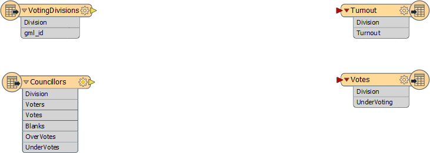

 **3) Add FeatureMerger**
 The first task is to merge the statistical election data onto the actual features. We'll use a FeatureMerger transformer to do this (more on this transformer appears later in this course).

Add a FeatureMerger transformer. Connect the VotingDivisions data to the Requestor port, and the Councillors (result) data to the Supplier.

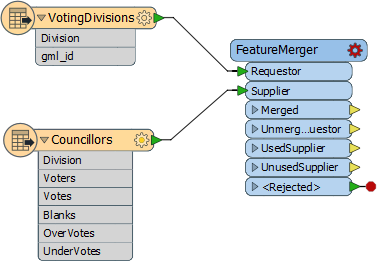

The voting division features are literally requesting information from the results features.

 **4) Set Parameters**
 View the FeatureMerger parameters. For both the Requestor and Supplier join fields, click the drop-down arrow and Attribute Value > Division. 

This is the common key by which our data is merged:

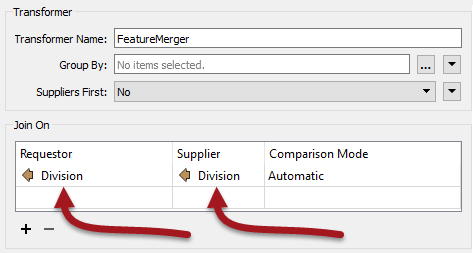

Click Apply/OK to confirm the parameters.

 **5) Add Inspector Transformer**
 Add an Inspector transformer after the FeatureMerger:Merged output port. Run the workspace.

Ignore any warning or log message that reports Unexpected Input.

Ensure that the Feature Count on that connection is the same as the number of incoming features from the VotingDivisions (note, there will be extra features from the Councillors data that is not used, because that includes divisions outside our area of interest).

Also examine the data in the FME Data Inspector to ensure all division polygons now include a set of attribute data copied from the Excel spreadsheet:

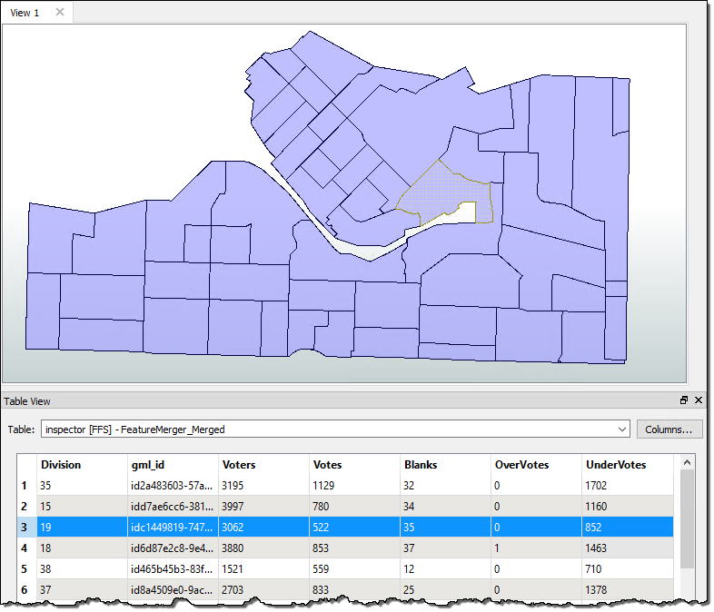

 **6) Add ExpressionEvaluator**
 Now that we have the numbers we need, we can start to calculate some statistics. To do this we'll use an ExpressionEvaluator transformer to first calculate voter turnout percentage for each division. 

Place an ExpressionEvaluator transformer after the FeatureMerger - connect it to the FeatureMerger:Merged output port. View the transformer's parameters. Set the New Attribute to Turnout (to match what we have on the destination schema):

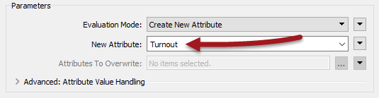

In the expression window set the expression to:

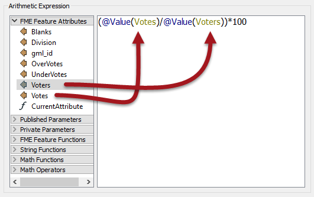

<pre>
(@Value(Votes)/@Value(Voters))*100
</pre>

You don't need to type this in - the @Value(Votes) and @Value(Voters) part can be obtained by double-clicking that attribute in the list to the left.

Click Apply/OK to confirm the parameters. If you wish, you can reconnect an Inspector and re-run the translation, to see the result.

 **7) Add ExpressionEvaluator**
 Using a similar technique, use an ExpressionEvaluator to calculate the number of UnderVotes per voter and put it in an attribute that matches the output schema. The expression will be something like:

<pre>
@Value(UnderVotes)/@Value(Voters)
</pre>

***NB:*** *This isn't a percentage, like the previous calculation.*

 **8) Add AttributeRounder**
 It's a bit excessive to calculate our statistics to 13 decimal places or more. We should truncate these numbers a bit.

Place an AttributeRounder transformer.

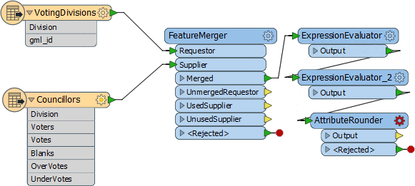

Open the parameters dialog. Under Attributes to Round select the newly created Turnout and UnderVoting attributes. Set the number of decimal places to 2:

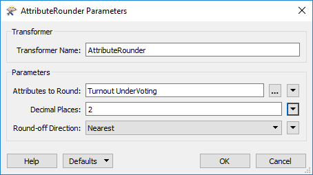

Click OK to close the dialog and, again, run the workspace to check the results if you wish.

 **9) Connect Schema**
 For the final step let's connect the AttributeRounder to the output schema. Simply make connections from the AttributeRounder to both writer feature types:

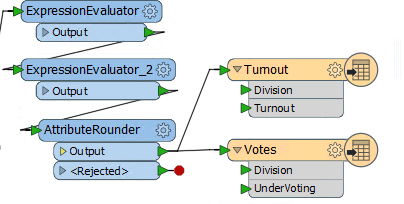

Run the workspace and examine the output in Google Earth to prove it has the correct attributes and is in the correct location.

---

<!--Advanced Exercise Section-->

<table style="border-spacing: 0px">
<tr>
<td style="vertical-align:middle;background-color:darkorange;border: 2px solid darkorange">
<i class="fa fa-cogs fa-lg fa-pull-left fa-fw" style="color:white;padding-right: 12px;vertical-align:text-top"></i>
Advanced Exercise
</td>
</tr>

<tr>
<td style="border: 1px solid darkorange">

The project is done, but the output is very plain. It would be much better to improve the look of the results and there are several ways to do this with KML.
  We could simply color the voting divisions differently according to their turnout/overvotes, but a more impressive method is to use three-dimensional blocks.
  Follow the steps below to create three-dimensional shapes in the output KML dataset...

</td>
</tr>
</table>

---

 **10) Add ExpressionEvaluator**
 The height of each block should be proportional to the turnout for that division. However, for differences to be clearly visible, the vertical scale will need some exaggeration.

Place an ExpressionEvaluator between the AttributeRounder and the Turnout feature type. Set the parameters to multiply the Turnout attribute by a value of 50. Put it into a new attribute called TurnoutScaled.

 **11) Add 3DForcer**
 Add a 3DForcer transformer after the new ExpressionEvaluator. This will elevate the feature to the required height. In the parameters dialog set the elevation to Attribute Value > TurnoutScaled.

 **12) Add KMLPropertySetter**
 Add a KMLPropertySetter transformer after the 3DForcer. This will allow us to set up the 3D blocks in the output. Set the geometry parameters as follows:

- Altitude Mode: Absolute
- Extrude: Yes

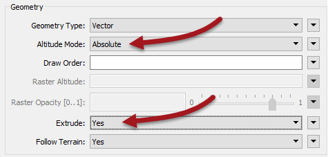

 **13) Add KMLStyler**
Finally add a KMLStyler transformer. The workspace will now look like this:

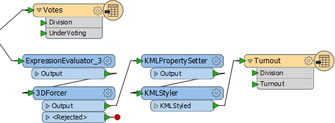

Check the parameters. Select a color and fill color for the features. Increase the fill opacity to around 0.75.

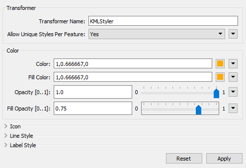

Save and run the workspace. In Google Earth the output should now look like this:

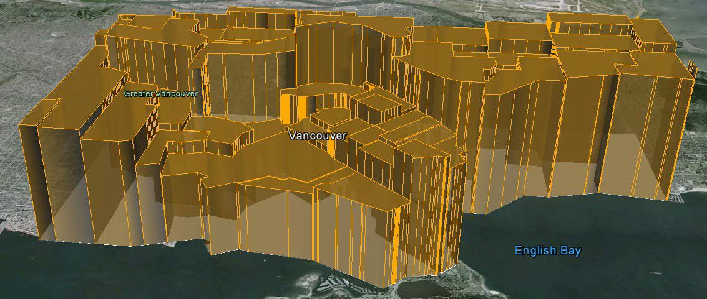

These 3D blocks will show users where the voting turnout is high/low in the city.

If you wish, repeat these steps to give a 3D representation to the UnderVoting statistics.

---

<!--Exercise Congratulations Section--> 

<table style="border-spacing: 0px">
<tr>
<td style="vertical-align:middle;background-color:darkorange;border: 2px solid darkorange">
<i class="fa fa-thumbs-o-up fa-lg fa-pull-left fa-fw" style="color:white;padding-right: 12px;vertical-align:text-top"></i>
CONGRATULATIONS
</td>
</tr>

<tr>
<td style="border: 1px solid darkorange">

By completing this exercise you proved you know how to:
 
<ul><li>Carry out content transformation with transformers (ExpressionEvaluator, AttributeRounder, 3DForcer)</li>
<li>Use transformer parameters to create attributes that match the writer schema</li>
<li>Use multiple streams of transformers in a single workspace</li></ul>
You also learned how to: 
<ul><li>Merge multiple streams of data using a common key (FeatureMerger)</li>
<li>Use FME's built-in maths editor dialog</li>
<li>Use transformers to set a symbology (style) for output features</li></ul>

</td>
</tr>
</table>

