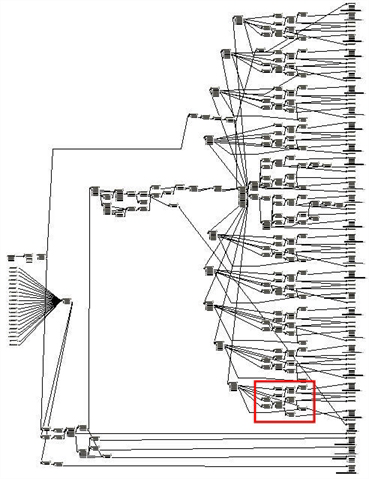
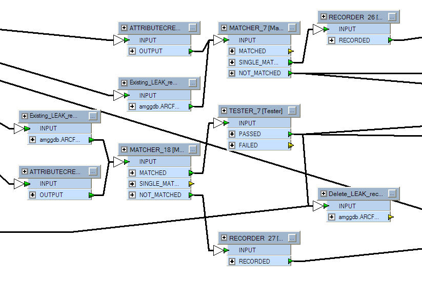

# Style #
Style is perhaps the most obvious component of FME Best Practice. You can tell at a glance when a workspace is well-styled and when it is not. But style is more than just looks; a properly designed workspace provides many benefits as it is further developed and edited in the future.

## An FME Workspace Style Guide ##
A good style of design makes it easier to navigate and understand an existing workspace. This is important when workspaces might need to be edited by other users, or when you intend to make edits yourself at a later date. 

---

<!--Person X Says Section-->

<table style="border-spacing: 0px">
<tr>
<td style="vertical-align:middle;background-color:darkorange;border: 2px solid darkorange">
<i class="fa fa-quote-left fa-lg fa-pull-left fa-fw" style="color:white;padding-right: 12px;vertical-align:text-top"></i>
Ms. Analyst says...
</td>
</tr>

<tr>
<td style="border: 1px solid darkorange">

It’s very much like a computer programmer adding comments to explain his actions. As an example, nearly 30% of FME’s codebase consists of comment lines.

</td>
</tr>
</table>

---

Specifically, a good style can help a user to…

- Distinctly define different sections or components of a workspace
- Quickly navigate to a specified section or particular transformer
- Pass a workspace on to another user for editing
- Rename workspaces and content with a more explanatory title

### Example of Poor Design ###
You need proof? Well, would you want to be given the task of editing this workspace?

Can you even tell what this section of workspace is doing?

