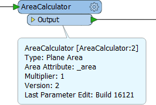
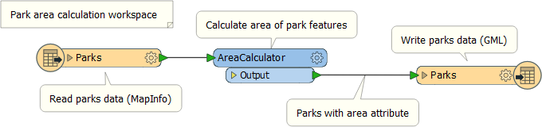
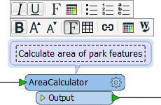
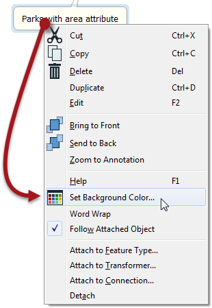

## Annotating Workspaces ##
Annotation is a key method for a clear and comprehensible design.

Annotation helps other users understand what is supposed to be happening in the translation and also helps the creator when returning to a workspace after a long interval (take it from me that this is especially important!)

There are a number of different types of annotation that can be applied to a workspace.

---

### Header Annotation ###
By default FME adds three annotations to a newly-created workspace. The annotations are basic comments that indicate the source data, the transformation, and the destination data. They can be deleted or, optionally, left ungenerated, and therefore may not appear in every workspace.

---

### Summary Annotation ###
Summary annotation is an FME-generated comment that provides information about any object within the workspace. This item can be a source or destination feature type, or a transformer.

Summary annotation is always colored blue to distinguish it from other annotation. It's always connected to the item to which it relates and cannot be detached.

The nice thing about Summary Annotation is that it automatically updates in response to changes. That makes it very useful for checking transformer parameters (or Reader/Writer schemas) at a quick glance. It's particularly useful in situations where the parameters are set through a wizard and are more awkward to check (for example, the SchemaMapper or FMEServerJobSubmitter transformers).

---

<!--Updated Section--> 

<table style="border-spacing: 0px">
<tr>
<td style="vertical-align:middle;background-color:darkorange;border: 2px solid darkorange">
<i class="fa fa-bolt fa-lg fa-pull-left fa-fw" style="color:white;padding-right: 12px;vertical-align:text-top"></i>
.1 UPDATE
</td>
</tr>

<tr>
<td style="border: 1px solid darkorange">

The AreaCalculator transformer in the above (and following) screenshots gained a &lt;Rejected&gt; port in FME2016.1

</td>
</tr>
</table>

---

<!--Person X Says Section-->

<table style="border-spacing: 0px">
<tr>
<td style="vertical-align:middle;background-color:darkorange;border: 2px solid darkorange">
<i class="fa fa-quote-left fa-lg fa-pull-left fa-fw" style="color:white;padding-right: 12px;vertical-align:text-top"></i>
Aunt Interop says...
</td>
</tr>

<tr>
<td style="border: 1px solid darkorange">

I'm Aunt Interop. I write a blog helping out users with their various FME problems.
  As I always say, size doesn't matter! You should always use Best Practice, whether it's a small workspaces or training exercise, or a large-scale project. Getting into the habit helps make your smaller projects scalable.

</td>
</tr>
</table>

---

### User Annotation ###
User annotation is a comment created by the user. It can be connected to a workspace object (transformer or feature type), can be connected to a workspace connection, or can float freely within the workspace.

To create floating user annotation, right-click the canvas and select Insert Annotation.

To create attached user annotation, right-click a workspace object and select Add Annotation.

When you place an annotation you have the opportunity to change the font style, font size, and background color; plus you can also add hyperlinks, bullet points, and tables.

---

<!--Tip Section--> 

<table style="border-spacing: 0px">
<tr>
<td style="vertical-align:middle;background-color:darkorange;border: 2px solid darkorange">
<i class="fa fa-info-circle fa-lg fa-pull-left fa-fw" style="color:white;padding-right: 12px;vertical-align:text-top"></i>
Recommendation
</td>
</tr>

<tr>
<td style="border: 1px solid darkorange">

Use summary annotation to show <strong>what</strong> actions are taking place; but use user annotation to clarify <strong>why</strong> an action is being carried out. This helps future edits and updates go more smoothly.

</td>
</tr>
</table>

---

### Annotation Options ###

Right-click an annotation object to reveal (among other things) the following options:

 

- Set Background Color change the background color of the annotation
- Word Wrap Toggle word wrapping on and off
- Follow Attached Object – make the annotation move when the attached object is moved
- Attach to Feature Type – attach to a specific feature type
- Attach to Transformer – attach to a specific transformer
- Attach to Connection – attach to a specific connection between two objects
- Detach – detach annotation from an object
