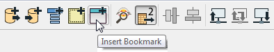
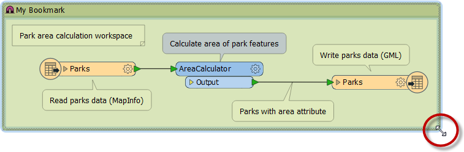
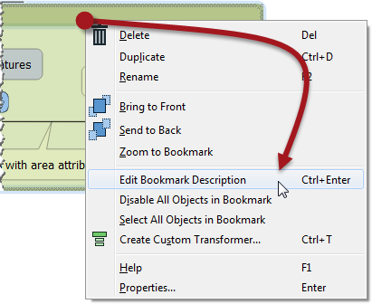
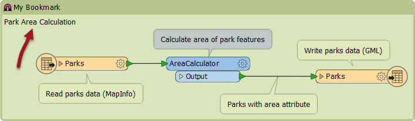
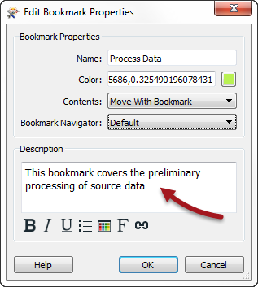

## Bookmarks ##
A bookmark, like its real-world namesake, is a means of putting a marker down for easy access.

With FME the bookmark covers an area of workspace that is usually carrying out a specific task, so a user can pick it out of a larger set of transformers and move to it with relative ease.

### Why use Bookmarks? ###
Bookmarks play an important role in a well-styled workspace for a number of reasons, including these.

- Sectioning: As a way to divide a workspace into different - clearly marked - sections
- Access: As a marker for quick access to a certain section of workspace
- Editing: As a means to move groups of transformers at a time

### Adding a Bookmark ###
To add a bookmark, click the Bookmark icon on the toolbar.

Whereas a traditional bookmark marks just a single page in a book, the FME bookmark can cover a wide area of the canvas. A single workspace can be divided into different sections by applying multiple bookmarks.

---

<!--Tip Section--> 

<table style="border-spacing: 0px">
<tr>
<td style="vertical-align:middle;background-color:darkorange;border: 2px solid darkorange">
<i class="fa fa-info-circle fa-lg fa-pull-left fa-fw" style="color:white;padding-right: 12px;vertical-align:text-top"></i>
TIP
</td>
</tr>

<tr>
<td style="border: 1px solid darkorange">

If any objects on the workspace canvas are selected when a bookmark is created, the bookmark is automatically expanded to include those items.

</td>
</tr>
</table>

---

### Resizing and Editing a Bookmark ###
To resize a bookmark simply hover over a corner or edge and then drag the cursor to change the bookmark size or shape.

Double-clicking a bookmark title allows the color and title of the bookmark to be edited.

---

<!--Tip Section--> 

<table style="border-spacing: 0px">
<tr>
<td style="vertical-align:middle;background-color:darkorange;border: 2px solid darkorange">
<i class="fa fa-info-circle fa-lg fa-pull-left fa-fw" style="color:white;padding-right: 12px;vertical-align:text-top"></i>
TIP
</td>
</tr>

<tr>
<td style="border: 1px solid darkorange">

Bookmarks are shown either as a frame around white-space or filled with color.
  Tools > FME Options on the menu bar opens a dialog with a number of sections, one of which (Workbench) has an option to have color-filled bookmarks.

</td>
</tr>
</table>

---

### Bookmark Options ###
Right-click a bookmark to show the following options:

- Delete: Delete the bookmark
- Duplicate: Create a duplicate bookmark
- Rename: Edit the bookmark title
- Edit Bookmark Description: Edit the description of the bookmark
- Select All Objects in Bookmark: All objects (transformers included) in the bookmark are selected
- Properties: Open a dialog to set bookmark name and color.

---

<!--Tip Section--> 

<table style="border-spacing: 0px">
<tr>
<td style="vertical-align:middle;background-color:darkorange;border: 2px solid darkorange">
<i class="fa fa-info-circle fa-lg fa-pull-left fa-fw" style="color:white;padding-right: 12px;vertical-align:text-top"></i>
TIP
</td>
</tr>

<tr>
<td style="border: 1px solid darkorange">

A bookmark description shows as a block of text inside the bookmark. Like annotation, it can be styled to a specific font or color.
  

</td>
</tr>
</table>

---

<!--Updated Section--> 

<table style="border-spacing: 0px">
<tr>
<td style="vertical-align:middle;background-color:darkorange;border: 2px solid darkorange">
<i class="fa fa-bolt fa-lg fa-pull-left fa-fw" style="color:white;padding-right: 12px;vertical-align:text-top"></i>
.1 UPDATE
</td>
</tr>

<tr>
<td style="border: 1px solid darkorange">

In FME2016.1 the option to set the bookmark description is available in the bookmark properties dialog, opened by double-clicking a bookmark:
  

</td>
</tr>
</table>

---

 
