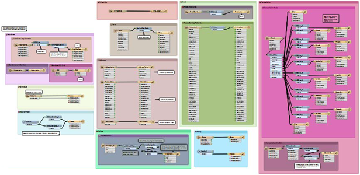
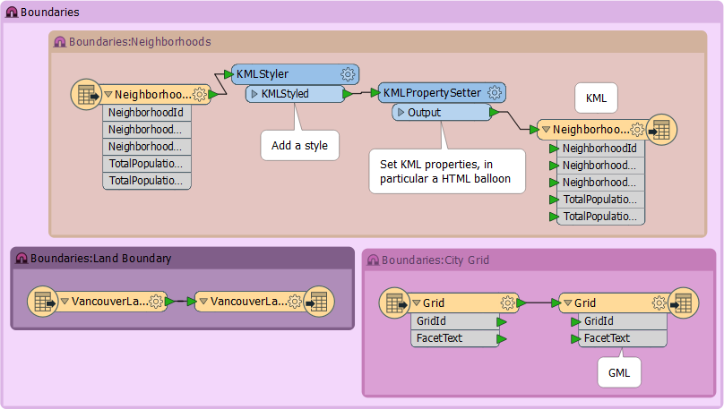

### Bookmarks for Sectioning ###
A bookmark is a great way of indicating that a particular section of a workspace is for a particular purpose. By subdividing a workspace in this way, the layout is often a lot easier to follow. 

As one user has put it, bookmarks are like paragraphs for your workspace!

The above workspace illustrates nicely how to mark up different sections of a workspace using Bookmarks.

---

<!--Person X Says Section-->

<table style="border-spacing: 0px">
<tr>
<td style="vertical-align:middle;background-color:darkorange;border: 2px solid darkorange">
<i class="fa fa-quote-left fa-lg fa-pull-left fa-fw" style="color:white;padding-right: 12px;vertical-align:text-top"></i>
Mr E. Dict (Attorney of FME Law) says...
</td>
</tr>

<tr>
<td style="border: 1px solid darkorange">

In my considered opinion, it's perfectly legal to nest bookmarks. Nesting means to place one bookmark inside another. In this manner each ‘section' of a workspace can be divided into subsections.
  

</td>
</tr>
</table>

---
