## General Style Suggestions ##
These items are general suggestions for what the style of an FME workspace should look like.

### Connection Styles ###

Shortest
Manhattan
Curved

### Transformer Layout ###
The layout of transformers – and, in particular, a consistent method of positioning – can really make the difference between a poorly-designed workspace and one that is visually attractive and efficient. Objects that are lined up nicely demonstrate a care and attention to detail that is the hallmark of a well-designed workspace.

Layout methods vary from user to user. Some users like to line up transformers so that all connections are horizontal lines:

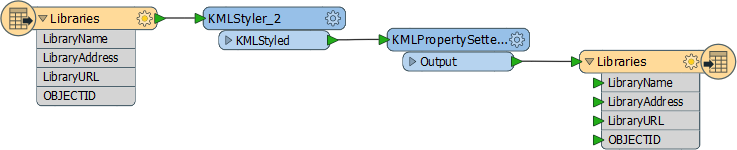

Others prefer the tops of objects to be aligned, with angled connections:

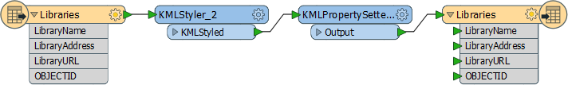

Some prefer to align transformers vertically:

Given all of the different transformers, and the need to have multiple streams of data interact with each other, most users end up with a hybrid approach:

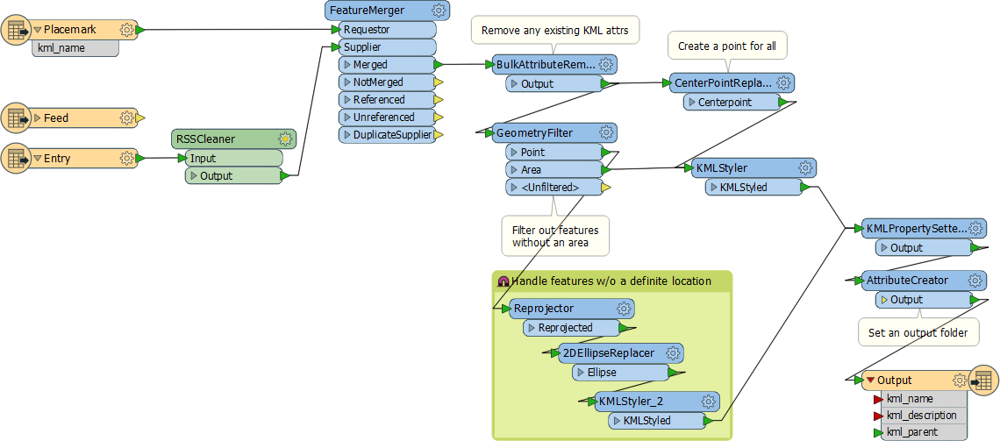

---

<!--Tip Section--> 

<table style="border-spacing: 0px">
<tr>
<td style="vertical-align:middle;background-color:darkorange;border: 2px solid darkorange">
<i class="fa fa-info-circle fa-lg fa-pull-left fa-fw" style="color:white;padding-right: 12px;vertical-align:text-top"></i>
Recommendation
</td>
</tr>

<tr>
<td style="border: 1px solid darkorange">

Be sure to use a thoughtful transformer layout at all times; transformers dropped onto the canvas at random locations demonstrate a sloppy and thoughtless approach to workspace authoring.

</td>
</tr>
</table>

---

Some users add extra vertices to create square corners to each connection. We call this "Manhattan Style".

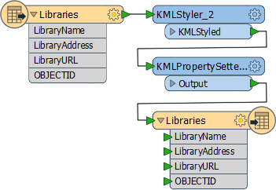

---

<!--Tip Section--> 

<table style="border-spacing: 0px">
<tr>
<td style="vertical-align:middle;background-color:darkorange;border: 2px solid darkorange">
<i class="fa fa-info-circle fa-lg fa-pull-left fa-fw" style="color:white;padding-right: 12px;vertical-align:text-top"></i>
Recommendation
</td>
</tr>

<tr>
<td style="border: 1px solid darkorange">

Manhattan-style connections should be avoided while FME doesn't have a formal way of creating them (it may do soon). Currently, creating this layout is time-consuming and the behaviour unpredictable when one of the attached objects is moved to a different position.

</td>
</tr>
</table>

---

### Grid and Guides ###
Grids and Guides are a tool to help align workspace objects in a neat and tidy way. This functionality is accessed through View > Grid and Guides on the Workbench menubar.

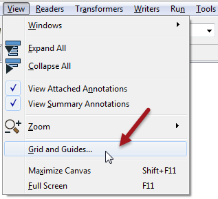

**Show Grid** causes a grid of lines to be displayed on the Workbench canvas. Snap to Grid causes all objects - such as the summary annotation highlighted - to snap onto the intersection of grid lines when moved. In this way objects can be more easily lined up.

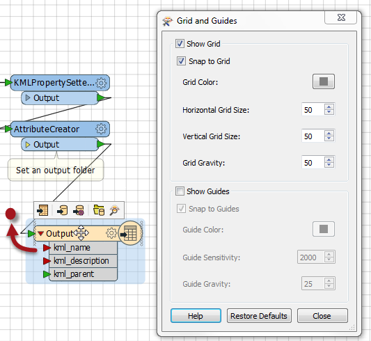

**Show Guides** causes guidelines to be displayed on the Workbench canvas whenever an object is moved, and lines up approximately to another canvas object. Snap to Guides allows an object to be snapped onto a highlighted guideline.

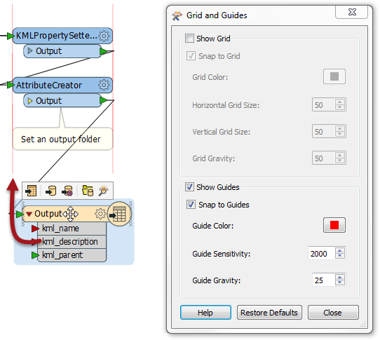

These two tools make it very simple for workspace objects to be aligned in a pleasing style.

---

### Non-Overlapping Connections ###
Does it really need to be said that overlapping lines are not good for workspace clarity?

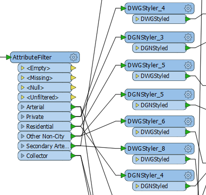

Far better to arrange your workspace objects to avoid overlaps:

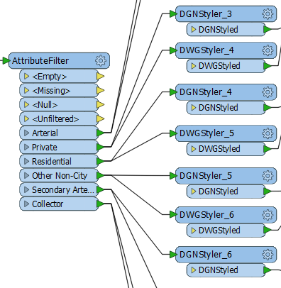

---

<!--Updated Section--> 

<table style="border-spacing: 0px">
<tr>
<td style="vertical-align:middle;background-color:darkorange;border: 2px solid darkorange">
<i class="fa fa-bolt fa-lg fa-pull-left fa-fw" style="color:white;padding-right: 12px;vertical-align:text-top"></i>
.1 UPDATE
</td>
</tr>

<tr>
<td style="border: 1px solid darkorange">

FME2016.1 introduces the ability to reorder output ports on transformers. Simply right-click a port and choose to move it up or down. This makes it easier to detangle overlapping connections without having to move objects around on the canvas. For more details see <a href="https://blog.safe.com/2016/04/fmeevangelist149">this blog post</a>.

</td>
</tr>
</table>

---

### Renamed Transformers ###
Did you notice that the Properties dialog for each transformer contains a field where the transformer may be renamed to a more meaningful title?

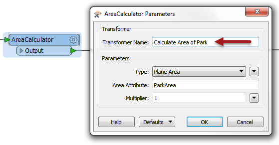

This is particularly useful where there are tens (or hundreds) of the same type of transformer, as it can help identify which transformer carries out which action.

---

<!--Tip Section--> 

<table style="border-spacing: 0px">
<tr>
<td style="vertical-align:middle;background-color:darkorange;border: 2px solid darkorange">
<i class="fa fa-info-circle fa-lg fa-pull-left fa-fw" style="color:white;padding-right: 12px;vertical-align:text-top"></i>
Tip
</td>
</tr>

<tr>
<td style="border: 1px solid darkorange">

Renaming transformers helps identify them both on the canvas and in the navigator window.
  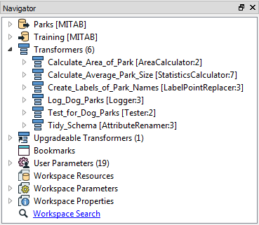
  Users who wish to keep the original name on the canvas often use annotation instead. The default content of a new annotation is the name of the transformer, which is a good starting point for editing.

</td>
</tr>
</table>

---

### Workspace Properties ###

Look in the Navigator window and you will find a number of settings called Workspace Properties. 

Workspace Properties are basically metadata fields that are useful in investigating the workspace's history. Like other style elements, they have no effect on the translation, but they are useful for ensuring a workspace is properly documented.

---

<!--Updated Section--> 

<table style="border-spacing: 0px">
<tr>
<td style="vertical-align:middle;background-color:darkorange;border: 2px solid darkorange">
<i class="fa fa-bolt fa-lg fa-pull-left fa-fw" style="color:white;padding-right: 12px;vertical-align:text-top"></i>
.1 UPDATE
</td>
</tr>

<tr>
<td style="border: 1px solid darkorange">

FME2016.1 introduces a new transformer called "Junction":
  
  This transformer is a small, node-like object, that carries out no function on the data, but is instead used to tidy connections within a workspace - as in the above screenshot. This makes it an excellent tool for best practice.
  As with any other transformer, a junction can be connected to an Inspector or Logger, and it can have annotation objects attached to it. It also works with both Quick Add and Drag/Connect functionality.

</td>
</tr>
</table>

---

<!--Updated Section--> 

<table style="border-spacing: 0px">
<tr>
<td style="vertical-align:middle;background-color:darkorange;border: 2px solid darkorange">
<i class="fa fa-bolt fa-lg fa-pull-left fa-fw" style="color:white;padding-right: 12px;vertical-align:text-top"></i>
.1 UPDATE
</td>
</tr>

<tr>
<td style="border: 1px solid darkorange">

FME2016.1 also introduces the ability to hide connections in a workspace. This is especially useful to avoid overlapping connections. To do so, right-click a connection and choose the option to Hide:
  
  This causes the connection to be hidden on the canvas, with each end represented by an icon like so:
  
  The other available option is "Create Tunnel". This creates a hidden connection with the addition of a junction transformer at each end:
  
  A tunnel makes a hidden connection slightly more obvious, plus allows for annotation at each end.
  To return a connection back to view, simply right-click an object to which it is connected and choose Show Connection(s). For more information on Tunnels and Junctions see <strong><a href="http://blog.safe.com/2016/05/fmeevangelist150/">this blog post</a></strong>.

</td>
</tr>
</table>

---
