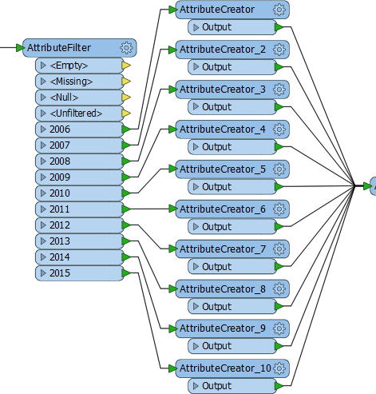
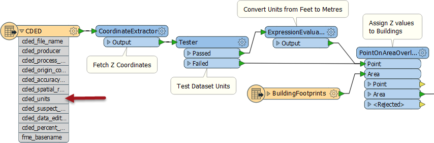
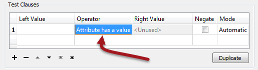

## Transformer Methodology ##

With FME's huge number of transformers it's very difficult to say exactly which transformers to use and when. However, it's much easier to identify when something is wrong, with design weaknesses that may lead to future difficulties.

### Duplicated Transformers ###
If a workspace duplicates the same transformer again and again – maybe creating multiple streams to do so – then it is probable that the workspace has been designed very inefficiently.

The multiple attribute transformers here indicate there is a problem.

Here a single AttributeValueMapper transformer could be used to replace all of the above transformers (both AttributeFilter and AttributeCreators).

### Error Trapping ###
Error trapping is a way to design a workspace such that unexpected data does not cause the workspace to fail. Basically you try to foresee the sort of data problems that might arise and build in methods to handle them.

Error trapping can be as simple as adding a test or filter transformer to weed out bad features, or it can be more complex and include ways to process data in different ways depending on different circumstances.

Here a user is reading a surface model and assigning Z values to building footprints. The important part is that they are testing what units the dataset is in (cded_units = meters|feet) and converting where the units are not what they want:

This workspace can be depended on to produce the correct results, no matter whether the source data is in metres or feet.

---

<!--New Section--> 

<table style="border-spacing: 0px">
<tr>
<td style="vertical-align:middle;background-color:darkorange;border: 2px solid darkorange">
<i class="fa fa-bolt fa-lg fa-pull-left fa-fw" style="color:white;padding-right: 12px;vertical-align:text-top"></i>
NEW
</td>
</tr>

<tr>
<td style="border: 1px solid darkorange">

The Tester transformer in FME2016 has a new operator for testing whether an attribute has a value:
  
  This will be very useful for error trapping, to test whether an attribute has a value before trying to use it as the source for a parameter.

</td>
</tr>
</table>

---

### Complexity ###
A workspace does not need to be complex to be a good project; it can carry out a complex process in a simple way. 

These are clues that there might be a problem:

- **Low Level Complexity**: When a workspace author uses FME functions and factories inside a workspace
- **Excess Scripting**: When a workspace contains more scripting (in Python or Tcl) than it does FME transformers
- **Connection Density**: When workspace connections are so dense they form a moiré pattern!
- **Multiple workspaces**: This workspace calls that one, which calls this one, which runs Python to call that one...

The connections in this workspace are so dense they could form a black hole! If your workspace looks like this, it might be time to look at how it can be improved:

---

<!--Person X Says Section-->

<table style="border-spacing: 0px">
<tr>
<td style="vertical-align:middle;background-color:darkorange;border: 2px solid darkorange">
<i class="fa fa-quote-left fa-lg fa-pull-left fa-fw" style="color:white;padding-right: 12px;vertical-align:text-top"></i>
Firefighter Mapp says...
</td>
</tr>

<tr>
<td style="border: 1px solid darkorange">

It's better to be safe than sorry. You don't want to get burned by bad designs. If you're unsure about a workspace, consult <a href="https://knowledge.safe.com/questions/index.html">other FME users</a>, or contact the <a href="http://www.safe.com/support">Safe Software support team</a> for advice.
  Also, be sure to check out this blog post on <a href="https://blog.safe.com/2015/06/fmeevangelist136/">FME and Code Smells.</a>
</td>
</tr>
</table>

