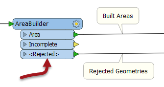

## Interpreting the Log Window ##
It can't be emphasized enough that the log window is THE most important place to look for information when a translation does not complete as expected - or to be sure that a translation has completed as expected.

Here are some suggestions for interpreting what you see in the log window.

---

### Check for Errors ###
If an ERROR occurs, it is likely that the translation will be halted. There will be a lot of red text and some terminating statements such as:

> Program Terminating
> 
> Translation FAILED.

There may be several ERROR messages, so scroll back up the log window to try and identify the first of these, which is likely to be the root cause of the problem. For example:

> ERROR |Error connecting to PostgreSQL database(host='postgis.train.safe.com', port='5432', dbname='fmedata', user='fmedata', password='***'): 'FATAL:  password authentication failed for user "fmedata"
FATAL:  password authentication failed for user "fmedata"

...is an obvious problem with authenticating a database connection.

---

### Check for Warnings ###
Even when a translation succeeds, it's important to check the log for the following comment:

> Translation was SUCCESSFUL with X warning(s)

If there are any warnings (i.e. if X > 0) then use the search option to look for the word WARN. Any warning messages might have important consequences for the quality of the output data.

---

<!--Tip Section--> 

<table style="border-spacing: 0px">
<tr>
<td style="vertical-align:middle;background-color:darkorange;border: 2px solid darkorange">
<i class="fa fa-info-circle fa-lg fa-pull-left fa-fw" style="color:white;padding-right: 12px;vertical-align:text-top"></i>
TIP
</td>
</tr>

<tr>
<td style="border: 1px solid darkorange">

More and more FME transformers favour a &lt;Rejected&gt; port, rather than dropping the feature and logging it.  
  
  This allows the workspace author to deal with bad features immediately, rather than having to handle them after the workspace has finished.

</td>
</tr>
</table>

---

### Check Timestamps ###
Timestamps in the log have this format:

<table>
<tr><th>Absolute Date</th><th>Absolute Time</th><th>Total FME Time</th><th>FME Time for this Step</th></tr>
<tr><td>2015-11-11</td><td>13:27:07</td><td>0.2</td><td>0.1</td>
</table>

The time taken for the process being logged is the "Time for this Step". Often this is rounded down to 0.0. The Total FME Time is, literally, the amount of time that FME has been actively processing.

Sometimes, this total appears at odds with the absolute date/time:

<table>
<tr><th>Absolute Date</th><th>Absolute Time</th><th>Total FME Time</th><th>FME Time for this Step</th></tr>
<tr><td>2015-11-11</td><td>13:27:07</td><td>0.2</td><td>0.1</td>
<tr><td>2015-11-11</td><td>13:29:30</td><td>68.4</td><td>68.3</td>
</table>

Here the step took 68.3 seconds, but the difference between the two absolute times is 123 seconds! 

The absolute start and end times can differ from FME processing time because non-FME processes, such as a database query, add to the absolute time taken without adding to the FME processing time.

Therefore the log can provide an indication of the efficiency of external processes; for example, database reading. A slow database read would imply database indexing needs to be improved.

---

### Sequence ###
The FME engine is set up to process features as efficiently as possible. In most cases that is not a single process that takes place in the same order as the transformers appear on the Workbench canvas. 

Because of that, it's unlikely the log window will show features processing in the order you would expect. Don't be confused if the order of actions in the log file doesn't match the layout of the workspace.
