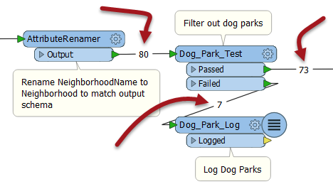
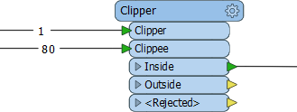
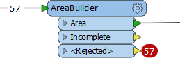
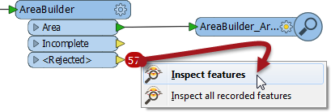

## Feature Counts ##
A workspace Feature Count refers to the numbers shown on each connection once a translation is complete:

When a log file shows a translation that ended in an error or where the number of output features was not what was expected, then the Feature Count values shown on each connection can help to diagnose where the error occurred.

For example, if all your features entered a transformer, but none emerged, then you can be fairly confident that the transformer is the cause of the problem.

Here, for example, 80 features enter the Clipper transformer (to be clipped against a single boundary) but none emerge.

Here the user will want to inspect the data as it enters the transformer as it's possible that Clipper and Clippees don't occupy the same coordinate system, hence one does not fall inside the other.

---

### Rejected Features ###

Many transformers now include a <Rejected\> port to output incorrect features. To help in debugging, rejected features are automatically counted on a <Rejected> port, even if there is no Logger or other transformer attached:

Additionally, the rejected features are also saved as a temporary dataset, so right-clicking (or double-clicking) allows the user to inspect them in the Data Inspector, whether or not the features were expected.

---

### Single Feature Counts ###
Sometimes a workspace fails (usually with an ERROR) and only a single feature has emerged from a transformer:

In such a case it is likely to be the *following* transformer (here the Chopper) that is the cause of the problem. This part of the log proves it:

ERROR |MAX_VERTICES clause must be specified for 'ChoppingFactory' definition, and must have a value of 1 or greater</red>

Although 100 features enter the StatisticsCalculator and only 1 emerges, that transformer is not the source of the error. The error is triggered when the first feature exits the StatisticsCalculator and reaches the Chopper. The Chopper basically failed before the other 99 features had the chance to even reach it!

<!--Tip Section--> 

<table style="border-spacing: 0px">
<tr>
<td style="vertical-align:middle;background-color:darkorange;border: 2px solid darkorange">
<i class="fa fa-info-circle fa-lg fa-pull-left fa-fw" style="color:white;padding-right: 12px;vertical-align:text-top"></i>
TIP
</td>
</tr>

<tr>
<td style="border: 1px solid darkorange">

Again, the addition of &lt;Rejected&gt; ports on transformers means this scenario is becoming more and more rare.

</td>
</tr>
</table>

---

