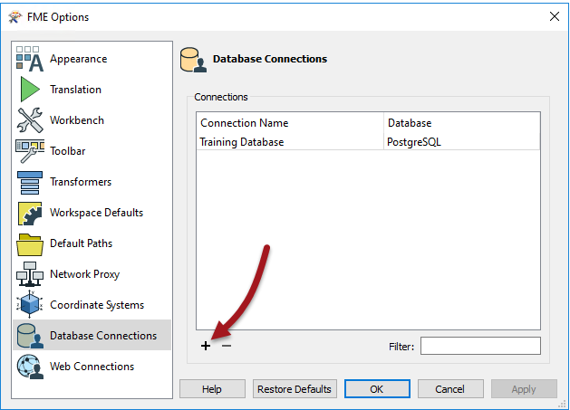

## Format Best Practices ##

Format best practices involve setting up Readers and Writers both quickly and without cluttering the canvas.

### Minimizing Feature Type Objects ###

A schema definition may contain many, many Feature Types. If these are all chosen for translation then the workspace can become extremely unwieldy and poorly laid out.

Here a user has 80 feature types, only a handful of which are being used:

Remember, when creating a workspace you'll be prompted which feature types to add to the translation. Don't add feature types you don't need, as it will cause cluttering of the canvas.

---

<!--Tip Section--> 

<table style="border-spacing: 0px">
<tr>
<td style="vertical-align:middle;background-color:darkorange;border: 2px solid darkorange">
<i class="fa fa-info-circle fa-lg fa-pull-left fa-fw" style="color:white;padding-right: 12px;vertical-align:text-top"></i>
TIP
</td>
</tr>

<tr>
<td style="border: 1px solid darkorange">

An excess of attributes can also cause workspace clutter. Don't forget you can remove attributes on the Reader feature type and make the workspace clearer and tidier than if the entire set of attributes was still exposed.

</td>
</tr>
</table>

---

### Database Connections ###

Database formats are an example of a repeating pattern, where the same connection and authentication parameters need to be entered whenever a database Reader or Writer is added, or a connection is required inside a transformer.

To simplify this process, use a tool called Database Connections.

Database Connections are a pre-defined set of connection and authentication parameters, stored under a single name. Once created, all FME Readers and Writers (and transformers) will accept a connection name in lieu of the actual parameters.

#### Creating a Database Connection ####

To create a Database Connection first select Tools > FME Options from the menubar and then click on the Database Connections icon. A new connection is created by clicking the + button:

A new connection is defined by selecting the database type, entering connection parameters, and giving the connection a name:

Now, whenever a workspace involves a database-related Reader/Writer, it's possible to simply use this connection instead of re-entering all the usual parameters:

The benefit here is not only efficient workspace authoring, there is also a security benefit. If you embed the connection parameters (i.e. enter them for each Reader/Writer) then they are stored inside the workspace file. This could be a security risk if you send the workspace to someone. But FME Database Connections are stored securely on your system, outside of the workspace, and can never be accessed by someone else.

<!--Tip Section--> 

<table style="border-spacing: 0px">
<tr>
<td style="vertical-align:middle;background-color:darkorange;border: 2px solid darkorange">
<i class="fa fa-info-circle fa-lg fa-pull-left fa-fw" style="color:white;padding-right: 12px;vertical-align:text-top"></i>
TIP
</td>
</tr>

<tr>
<td style="border: 1px solid darkorange">

Database connections are also listed in the Navigator window once they are used:
  
  Right-clicking a connection here also displays a context-menu with the ability to edit, test, or embed that connection; and to show where in the workspace it is used.

</td>
</tr>
</table>
