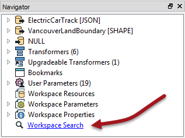
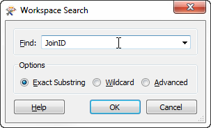
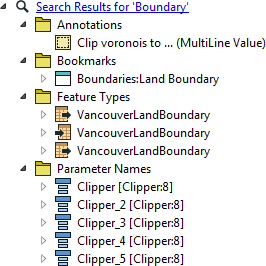

## Workspace Searching ##
FME Workbench includes a search tool for locating objects in a workspace according to a set of search text. This is an obviously useful tool for debugging by looking up items mentioned in the log window. 

The workspace search function is accessed through a hyperlink at the foot of the Navigator window:

Clicking this link opens up a text dialog in which to enter search terms. The results of the search include any attribute names, feature types, transformers, parameter names, and parameter values that include the search term entered.

Searching is particularly useful in large workspaces, and when the same component is used throughout the workspace. For example, in the above screenshot, maybe JoinID causes a problem in the Writer, but is actually defined (incorrectly) by a transformer much earlier in the workspace.

---

<!--Person X Says Section-->

<table style="border-spacing: 0px">
<tr>
<td style="vertical-align:middle;background-color:darkorange;border: 2px solid darkorange">
<i class="fa fa-quote-left fa-lg fa-pull-left fa-fw" style="color:white;padding-right: 12px;vertical-align:text-top"></i>
Chef Bimm says...
</td>
</tr>

<tr>
<td style="border: 1px solid darkorange">

What I especially like about the search tool is that it returns bookmarks and annotations too. Delicious!
  

</td>
</tr>
</table>

