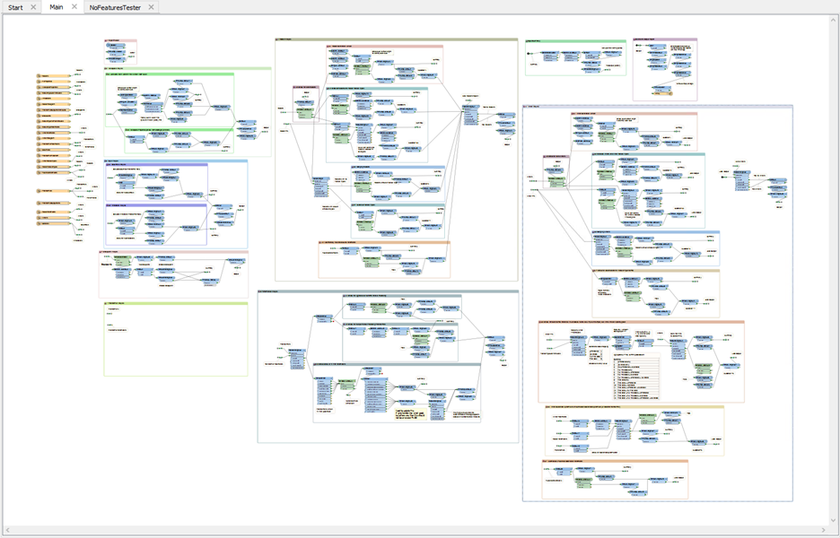

# Debugging #
Even skilled FME users seldom produce correct results with the first version of a new workspace.

In the event of an error message or unexpected output, a user must 'debug' the workspace to find what error has been introduced into the workflow definition. And when the workspace is very large, like this:

...it's very important to be aware of the debugging techniques available in FME.

## Debugging Order ##

It's important to use the various debugging steps in the correct order. For example, it's not particularly useful to check the output for problems (and edit your workspace to track them down) when a warning message in the log window already highlights and explains the issue.

Generally you would first look for signs of problems and then attempt to track down the issues that caused them. Therefore a logical order would be:

- Set the log file parameters before running the translation
- Run the translation. Examine the log for warnings and errors
- Inspect the output datasets, if the translation wrote any
- Check feature counts in the Workbench canvas to locate where problems occurred
- Check reader, writer, or transformer parameters at the point of failure
- Test the workspace by adding Inspector transformers to view data at different points
- If necessary, run the workspace in feature debug mode

However, sometimes problems in the output are not highlighted by errors or warnings in the log - for example those caused by misuse of parameters or incorrect connections. Therefore you might have to revisit the log and/or feature counts after inspecting the output. 