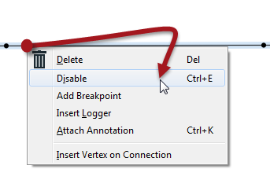
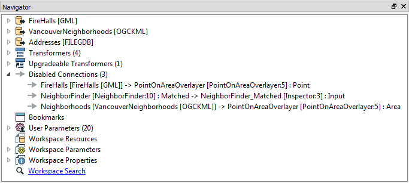
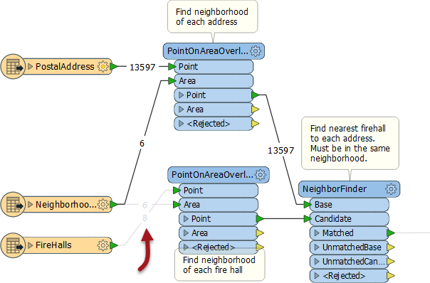

## Testing Isolated Sections ##
Testing and debugging a large workspace is easier when it's possible to isolate sections and test them separately. 

The ability to isolate specific sections is done by disabling connections. This renders a connection inoperative in much the same way as if it had been deleted, and no features will pass through.

A connection is disabled by right-clicking it and choosing the option to Disable (or selecting it and using the shortcut Ctrl+E):

Disabled connections are listed in the Navigator window:

Here the user has chosen to disable connections so that they can test the first PointOnAreaOverlayer transformer without the second one running as well: 

This speeds up the translation so that testing of the required section runs quicker.

---

<!--Tip Section--> 

<table style="border-spacing: 0px">
<tr>
<td style="vertical-align:middle;background-color:darkorange;border: 2px solid darkorange">
<i class="fa fa-info-circle fa-lg fa-pull-left fa-fw" style="color:white;padding-right: 12px;vertical-align:text-top"></i>
TIP
</td>
</tr>

<tr>
<td style="border: 1px solid darkorange">

An alternative to testing isolated sections is to run a workspace with the run option Run with Full Inspection turned on.
  However, be aware that:
<ul><li>Such an approach will take up more time and system resources</li>
<li>You will need to disable all Writers to avoid writing data</li>
<li>SQL and Python transformers may contain statements that will still change data (this is something you should be careful of anyway)</li></ul>

</td>
</tr>
</table>

---

<!--Person X Says Section-->

<table style="border-spacing: 0px">
<tr>
<td style="vertical-align:middle;background-color:darkorange;border: 2px solid darkorange">
<i class="fa fa-quote-left fa-lg fa-pull-left fa-fw" style="color:white;padding-right: 12px;vertical-align:text-top"></i>
Miss Vector says...
</td>
</tr>

<tr>
<td style="border: 1px solid darkorange">

Of course, it's much easier to disable certain parts of a workspace when you've properly divided it up into sections with bookmarks. Anyway, here's a question for you:
  It's possible to disable other objects besides connections. Can you pick out which of these objects (there may be more than one) can be disabled in Workbench?
  <a href="http://52.73.3.37/fmedatastreaming/Manual/QAResponseDotZero.fmw?chapter=3&question=3&answer=1&DestDataset_TEXTLINE=C%3A%5CFMEOutput%5CQAResponse.html">1. Transformers
 <a href="http://52.73.3.37/fmedatastreaming/Manual/QAResponseDotZero.fmw?chapter=3&question=3&answer=2&DestDataset_TEXTLINE=C%3A%5CFMEOutput%5CQAResponse.html">2. Feature Types
 <a href="http://52.73.3.37/fmedatastreaming/Manual/QAResponseDotZero.fmw?chapter=3&question=3&answer=3&DestDataset_TEXTLINE=C%3A%5CFMEOutput%5CQAResponse.html">3. Annotation
 <a href="http://52.73.3.37/fmedatastreaming/Manual/QAResponseDotZero.fmw?chapter=3&question=3&answer=4&DestDataset_TEXTLINE=C%3A%5CFMEOutput%5CQAResponse.html">4. Bookmarks

</td>
</tr>
</table>