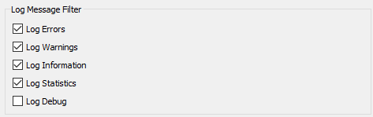
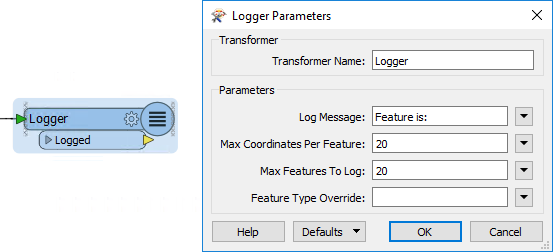

## Logging ##
When you run a workspace FME writes to both the FME Workbench log window and a log file. 

These logs contain a record of all stages and processes within a translation. The contents may appear complex, but such information is vital for interpreting a workspace's actions.

---

<!--Person X Says Section-->

<table style="border-spacing: 0px">
<tr>
<td style="vertical-align:middle;background-color:darkorange;border: 2px solid darkorange">
<i class="fa fa-quote-left fa-lg fa-pull-left fa-fw" style="color:white;padding-right: 12px;vertical-align:text-top"></i>
Sister Intuitive says...
</td>
</tr>

<tr>
<td style="border: 1px solid darkorange">

Why are logging parameters the first part of debugging? Because if you don't know where the log file is - or  haven't set it up correctly <strong>before</strong> running the workspace - it will not be helpful in debugging any issues that arise!

</td>
</tr>
</table>

---

### Log File Loction ###

The log file is (by default) written to the same folder as the workspace with the name *&lt;workspace name&gt;.log*. However, it can also be set using a parameter in the Navigator window in Workbench.

---

### Message Types ###

There are a number of different message types that show in the log window including:

**Error**: An error, denoted in the log by the term **ERROR**, indicates that a problem has caused FME to terminate processing. For example, FME is unable to write the output dataset because of incorrect user permissions.

**Warning**: A warning, denoted by the term **WARN**, indicates a processing problem. The problem is sufficiently minor to allow FME to complete the translation, but the output may be adversely affected and should be checked. For example, FME is unable to write features because their geometry is incompatible with the Writer format. The features will be dropped from the translation and a warning issued in the log.

**Information**: Information messages, denoted by the term **INFORM**, indicate a piece of information that may help a user determine whether their translation has been processed correctly. For example, FME sometimes log confirmation of a particular dataset parameter, such as coordinate system.

**Statistics**: Statistics messages, denoted by the term **STATS**, provide information on various numbers relating to the translation; for example the number of features read from a source dataset, and the time taken to do so.

---

<!--Person X Says Section-->

<table style="border-spacing: 0px">
<tr>
<td style="vertical-align:middle;background-color:darkorange;border: 2px solid darkorange">
<i class="fa fa-quote-left fa-lg fa-pull-left fa-fw" style="color:white;padding-right: 12px;vertical-align:text-top"></i>
Sister Intuitive says...
</td>
</tr>

<tr>
<td style="border: 1px solid darkorange">

You can search for different types of messages by clicking in the log window and pressing Ctrl+F to open a search dialog.

</td>
</tr>
</table>

---

### Log Options ###
Workbench has the ability to filter different message types from the log window. This is done using Tools > FME Options > Translation.

Turning off STATS and INFORM log messages helps to highlight WARN and ERROR messages in the log so there is less chance of missing them; though it does feel strange to watch a translation take place without the log window scrolling past as usual! 

The **Log Debug** option forces FME to show additional messages (of any of the usual types) that depict what is going on at a lower level in the FME engine. This option can be helpful when trying to debug a workspace problem, and particularly useful for logging information about HTTP connections. 

---

<!--Warning Section--> 

<table style="border-spacing: 0px">
<tr>
<td style="vertical-align:middle;background-color:darkorange;border: 2px solid darkorange">
<i class="fa fa-exclamation-triangle fa-lg fa-pull-left fa-fw" style="color:white;padding-right: 12px;vertical-align:text-top"></i>
WARNING
</td>
</tr>

<tr>
<td style="border: 1px solid darkorange">

Logging debug messages is <strong>NOT</strong> a good idea unless you already have a problem you are trying to track down. That's because it includes errors and warnings that are part of the natural process of a workspace.
  For example, this message looks bad, but it is really a common debug message in successful translations:
 ERROR |BADNEWS: File C:\apps\FME\metafile\MULTI_WRITER.fmf could not be opened (tabrdr.cpp:1037)

</td>
</tr>
</table>

---

### Log Timings ###
Besides log message types, there are other useful options under Tools > FME Options > Translation.

One of these options is the ability to turn log timestamp information on or off.

Log timestamps indicate the absolute date and time for each step of the translation process. They also show the time taken by FME to process the previous stage and the cumulative time taken to reach that point in the translation.

---

<!--Person X Says Section-->

<table style="border-spacing: 0px">
<tr>
<td style="vertical-align:middle;background-color:darkorange;border: 2px solid darkorange">
<i class="fa fa-quote-left fa-lg fa-pull-left fa-fw" style="color:white;padding-right: 12px;vertical-align:text-top"></i>
Mr. Statistics-Calculator says...
</td>
</tr>

<tr>
<td style="border: 1px solid darkorange">

What kind of statistician would I be if I didn't like numbers? Even so, I recommend you to turn on log timings (they are not turned on by default) and keep them turned on. They do add to the amount of content in the window, but 97.8% of users find them incredibly useful when trying to debug a poorly-performing translation.

</td>
</tr>
</table>

---

### Logger Transformer ###
Besides FME writing information to the log window, the user can force information about a feature to be logged using the Logger transformer.

This transformer is extremely useful for debugging purposes, and has a number of parameters:

The 'Log Message:' parameter is especially important. When a feature is logged, the message entered into that parameter appears with the feature in the log window. Setting a unique message helps you locate logged features with the log search function.

---

### Spatial Log File ###

Besides writing the log to a text file (&lt;workspace name&gt;.log) FME also writes a spatial log. This is a dataset of features that have been mentioned in the log - either because of a warning from FME or by use of the Logger transformer.

The log is an FFS (FME Feature Store) format dataset. It can be opened within the FME Data Inspector to inspect the features and identify the problems that caused them to be rejected. 

This is a much easier process than trying to locate the same feature within the full source dataset.
