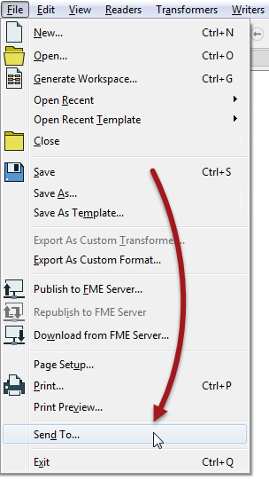
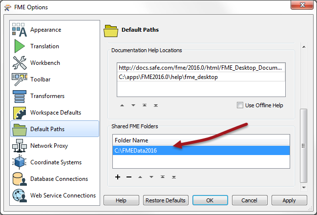

## Sharing Resources ##
Re-using components, and sharing them with fellow FME users, is vital in creating consistent designs among a large group of employees. It also improves efficiency – because a translation author will not have to create every workspace from the beginning – and reliability, because any change to a shared resource is passed on through any workspaces that make use of it.

Resources that may be shared include workspaces, custom transformers, custom formats, custom coordinate systems, and templates.

### Shared Files ###

The most basic method of sharing is simply giving someone else your workspace file. A function exists on the File menu in Workbench to do just that:

### Shared Resource Folders ###

A more advanced method of sharing is through a Shared Resource Folder. FME is able to identify resources stored in these folders, and use them directly within a translation.

A shared resource folder can be used by just one person, or many.

Using a shared folder is as simple as defining it using Tools > FME Options > Default Paths.

By specifying a location in this option, FME automatically searches for and uses any shared resources that are stored in this folder.

Resources that can be shared in this way include custom coordinate systems, custom transformers, custom FME themes, and workspace template files.

---

<!--Tip Section--> 

<table style="border-spacing: 0px">
<tr>
<td style="vertical-align:middle;background-color:darkorange;border: 2px solid darkorange">
<i class="fa fa-info-circle fa-lg fa-pull-left fa-fw" style="color:white;padding-right: 12px;vertical-align:text-top"></i>
TIP
</td>
</tr>

<tr>
<td style="border: 1px solid darkorange">

Use a shared folder on your network as a shared resource folder when you have several FME authors who all need access to the same resources, or just as a location to store your own files.
  &LT;user&GT;/&LT;documents&GT;/&LT;FME&GT; is a shared resource folder created and used by default, without having to define it within the options dialog.

</td>
</tr>
</table>

