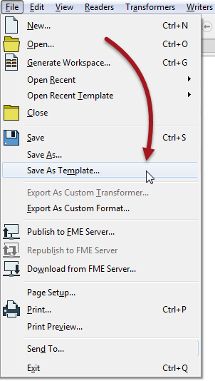

## Templates ##
***FME Templates*** are a particularly useful form of shared resource. Like similarly-named items in other software, FME templates are a means of creating a workspace with/from a predesigned format and structure.

The closest analogy is to think of templates as a blueprint design.

They have their own extension (*.fmwt) and their own storage folder (&lt;user&gt;/FME/Templates).

Perhaps the most interesting thing about FME templates is that they can include source datasets within the file. This way both a workspace example, and the data required to run it, can be bundled together and provided to another user.

### What Are Templates For? ###

Templates have potentially very many uses. The most obvious ones are:

- A Complete Translation
	- Wrapping up source data and workspace inside a single file makes it a very elegant way of providing a complete set of translation files to another user.
- Pre-Defined Data
	- When a series of workspaces are all to use the same source or destination data, a template allows the author to duplicate Readers and Writers without having to recreate the workspace each time.
- Pre-Defined Transformation
	- Templates are a great way to store a set of processing tasks for re-use. The end-user can simply create a workspace from the template and add their own readers and writers.
- An Example Translation
	- A template is also a great way to share demos and examples in a way that another user can run immediately.

### Creating Templates ###

Templates are created by saving a workspace using File > Save As Template on the menubar:

---

<!--Person X Says Section-->

<table style="border-spacing: 0px">
<tr>
<td style="vertical-align:middle;background-color:darkorange;border: 2px solid darkorange">
<i class="fa fa-quote-left fa-lg fa-pull-left fa-fw" style="color:white;padding-right: 12px;vertical-align:text-top"></i>
Miss Vector says...
</td>
</tr>

<tr>
<td style="border: 1px solid darkorange">

Templates are very useful functionality. You really should be aware of how to create and use them.
  What ways can a template be opened for use in FME Workbench (there might be more than one correct answer):
  1. Open it using File > Open
 2. Open it using File > Open Recent Template
 3. Double-click the fmwt file in Windows Explorer
 4. Use Create Workspace from Template in the Getting Started part of the start tab

</td>
</tr>
</table>
