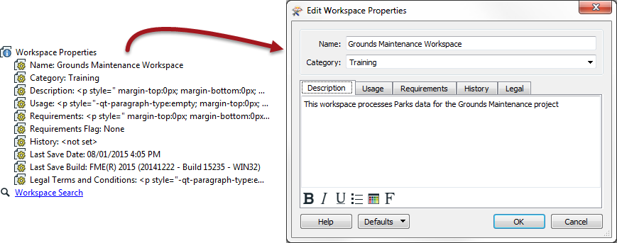

## FME Projects ##
FME is often used not just for one-off translations, but for a particular project or series of projects.

Project best practice involves suggestions more than hard and fast rules; but suggestions that are highly recommended!

### Workspace Properties ###

Look in the Navigator window and you will find a number of settings called Workspace Properties. 

Workspace Properties are basically metadata fields that are useful in investigating the workspace's history. Like other style elements, they have no effect on the translation, but they are useful for ensuring a workspace is properly documented.

---

### Folder Structure ###
Project use of FME is more efficient when a proper project structure is maintained.

For example, assuming a special disk for storing projects (P:), a simple project structure could include a project ID if you have one; for example: **P:\P2016\_999\_PROPERTY\_UPDATES**

Follow this with subfolders, such as:

-	**.\FMEworkspaces**	which could itself have subfolders such as
	-	**.\Templates** 	for templates
	-	**.\Scripts** 	for Python, SQL, or Tcl scripts
- **.\SourceData** 	for storing source dataset files
- **.\OutputData** 	for storing destination dataset files
- **.\NoteDocs&Stuff**  	project estimates, specifications, proposals, etc.
- **.\Testing** 	a folder for test data and workspaces

For a large scale FME project, set up a project structure and stick to it. Keep copies of all FME workspaces, maybe in a revision control system like Subversion or GitHub.

---

### File Naming ###
Based on past experience the Safe Professional Services team has the following recommendations for file and folder naming within an FME project:

- Use revision numbers on workspaces or folders; for example, myworkspace_rev17.fmw.
	- It's tempting to save to the same workspace all the time, but then there is no fallback position from a mistake.
- When using dates for file names or folders, use international dates such as 2015-03-21 or 20150321 so files are listed in the correct order. Do not use a date such as Mar-21-15, which will be listed alphabetically after April in Windows Explorer.
- Reduce clutter in the project's main folder by saving files inside subfolders.
- Avoid meaningless folderand filenames, such as 'fr_clnt'. From Client? Father Clint?!
- Share ideas with others. Make sure all users conform to the same conventions.

---

### Relative Paths ###
Although it isn't possible to browse for a relative path, it is possible to manually edit a path to be relative; for example, change P:\P2016-999\SourceData\myfile.dgn to .\SourceData\myfile.dgn.

The advantage of doing this is that if the original project is renamed or even moved to a new location, all of the workspaces will still function correctly without further editing.