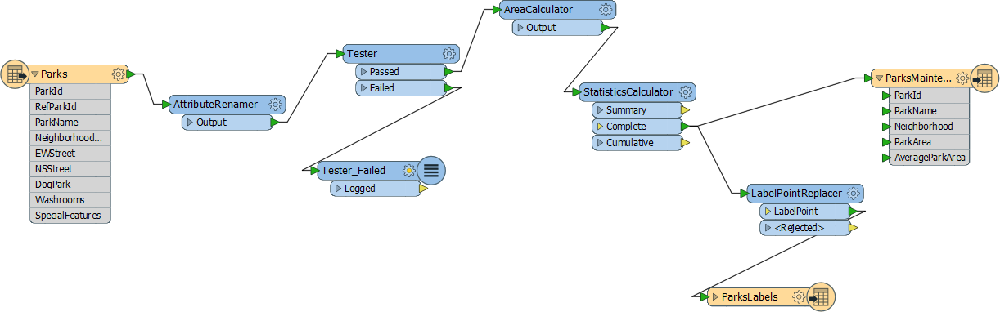
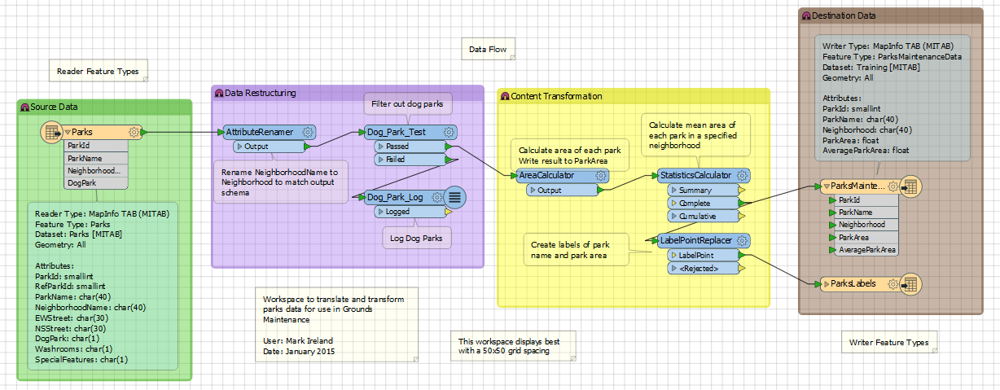

<!--Exercise Section-->
<!--NB: In GitBook world we don't give a number to exercises-->

<table style="border-spacing: 0px;border-collapse: collapse;font-family:serif">
<tr>
<td width=25% style="vertical-align:middle;background-color:darkorange;border: 2px solid darkorange">
<i class="fa fa-cogs fa-lg fa-pull-left fa-fw" style="color:white;padding-right: 12px;vertical-align:text-top"></i>
Exercise 1
</td>
<td style="border: 2px solid darkorange;background-color:darkorange;color:white">
Applying the Style Guide
</td>
</tr>

<tr>
<td style="border: 1px solid darkorange; font-weight: bold">Data</td>
<td style="border: 1px solid darkorange">City Parks (MapInfo TAB)</td>
</tr>

<tr>
<td style="border: 1px solid darkorange; font-weight: bold">Overall Goal</td>
<td style="border: 1px solid darkorange">Clean up workspace and apply concepts of style guide</td>
</tr>

<tr>
<td style="border: 1px solid darkorange; font-weight: bold">Demonstrates</td>
<td style="border: 1px solid darkorange">Style Best Practice</td>
</tr>

<tr>
<td style="border: 1px solid darkorange; font-weight: bold">Start Workspace</td>
<td style="border: 1px solid darkorange">C:\FMEData2016\Workspaces\DesktopBasic\BestPractice-Ex1-Begin.fmw</td>
</tr>

<tr>
<td style="border: 1px solid darkorange; font-weight: bold">End Workspace</td>
<td style="border: 1px solid darkorange">C:\FMEData2016\Workspaces\DesktopBasic\BestPractice-Ex1-Complete.fmw</td>
</tr>

</table>

An FME author (it might have been you) created a workspace to process data for a grounds maintenance project. The results of the workspace are fine and everyone is happy. However, the workspace was created before you knew about the FME style guide. So let's apply a little bit of styling to this project. 

 **1) Open the Workspace**
 Open the workspace for the grounds maintenance project. You may have already created it, or you can use a pre-defined version from C:\FMEData2016\Workspaces\DesktopBasic\BestPractice-Ex1-Begin.fmw

 **2) Tidy the Workspace**
 Tidy the workspace layout and setup using the FME Style Guide covered in the previous pages.

Don't forget to use annotation and bookmarks, so that future users of the workspace will be able to tell at a glance what the workspace is supposed to do. If you have FME2016.1, consider using the Junction transformer to tidy up potentially overlapping connections.

By the time you have finished, the workspace should look something like this:

---

<!--Exercise Congratulations Section--> 

<table style="border-spacing: 0px">
<tr>
<td style="vertical-align:middle;background-color:darkorange;border: 2px solid darkorange">
<i class="fa fa-thumbs-o-up fa-lg fa-pull-left fa-fw" style="color:white;padding-right: 12px;vertical-align:text-top"></i>
CONGRATULATIONS
</td>
</tr>

<tr>
<td style="border: 1px solid darkorange">

By completing this exercise you have learned how to:
 
<ul><li>Use annotations to clarify the processes taking place in a workspace</li>
<li>Use bookmarks to turn a single workspace into defined sections</li>
<li>Rename transformers to make their purpose more clear</li>
<li>Avoid poor design choices like overlapping connections</li></ul>

</td>
</tr>
</table>
