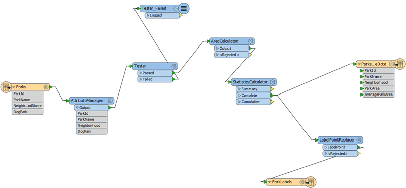
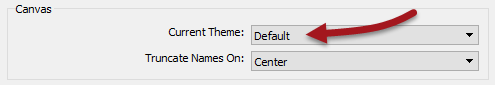
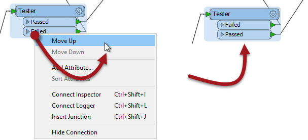
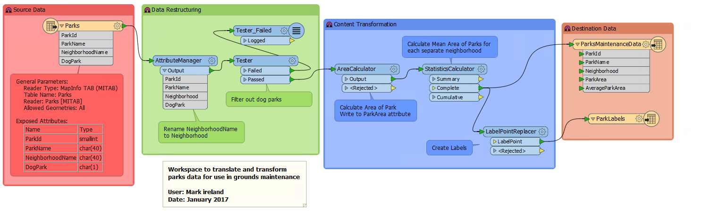

<!--Exercise Section-->

<table style="border-spacing: 0px;border-collapse: collapse;font-family:serif">
<tr>
<td width=25% style="vertical-align:middle;background-color:darkorange;border: 2px solid darkorange">
<i class="fa fa-cogs fa-lg fa-pull-left fa-fw" style="color:white;padding-right: 12px;vertical-align:text-top"></i>
Exercise 1
</td>
<td style="border: 2px solid darkorange;background-color:darkorange;color:white">
Applying the Style Guide
</td>
</tr>

<tr>
<td style="border: 1px solid darkorange; font-weight: bold">Data</td>
<td style="border: 1px solid darkorange">City Parks (MapInfo TAB)</td>
</tr>

<tr>
<td style="border: 1px solid darkorange; font-weight: bold">Overall Goal</td>
<td style="border: 1px solid darkorange">Clean up workspace and apply concepts of style guide</td>
</tr>

<tr>
<td style="border: 1px solid darkorange; font-weight: bold">Demonstrates</td>
<td style="border: 1px solid darkorange">Style Best Practice</td>
</tr>

<tr>
<td style="border: 1px solid darkorange; font-weight: bold">Start Workspace</td>
<td style="border: 1px solid darkorange">C:\FMEData2017\Workspaces\DesktopBasic\BestPractice-Ex1-Begin.fmw</td>
</tr>

<tr>
<td style="border: 1px solid darkorange; font-weight: bold">End Workspace</td>
<td style="border: 1px solid darkorange">C:\FMEData2017\Workspaces\DesktopBasic\BestPractice-Ex1-Complete-Curves.fmw C:\FMEData2017\Workspaces\DesktopBasic\BestPractice-Ex1-Complete-Manhattan.fmw</td>
</tr>

</table>

>“ A good looking well-organized workspace gives the customer the feeling that you have done quality work.”

An FME author (it might have been you) created a workspace to process data for a grounds maintenance project. The results of the workspace are fine and everyone is happy. However, the workspace was created before you knew about the FME style guide. So let's apply a little bit of styling to this project. 

 **1) Open the Workspace**
 Open the workspace for the grounds maintenance project. You may have already created it, or you can use a pre-defined version from C:\FMEData2017\Workspaces\DesktopBasic\BestPractice-Ex1-Begin.fmw

 **2) Check FME Options**
 Perhaps the first thing to do is check what FME Options exist to make creating a well-styled workspace easier.

Select Tools > FME Options from the menubar. Click on the Appearance icon on the left of the FME Options dialog.

Notice how it is possible to change the font for the workspace canvas, and the log window, so - for example - you can change the workspace to look like any of these:

The important thing to remember is that these are FME options, now workspace options and changes made here will only affect YOUR installation of FME. If you save a workspace the font used is not saved and will not be applied if another user opens that workspace file on their FME installation.

Another option in this dialog allows you to change the theme used by Workbench:

A theme is a set of predefined colors for objects and dialogs within FME Workbench. 

---

<!--New Section--> 

<table style="border-spacing: 0px">
<tr>
<td style="vertical-align:middle;background-color:darkorange;border: 2px solid darkorange">
<i class="fa fa-bolt fa-lg fa-pull-left fa-fw" style="color:white;padding-right: 12px;vertical-align:text-top"></i>
NEW
</td>
</tr>

<tr>
<td style="border: 1px solid darkorange">

FME2017 introduces a theme designed to assist users with Deuteranopia (red-green color blindness):
  
  If you experience a different form of color blindness - Tritanopia or Protanopia - then let us know and we can increase the priority for implementing additional themes.

</td>
</tr>
</table>

---

Click on the Workbench icon in the FME Options dialog and you will find options for drawing bookmarks with a filled background, and options for annotation defaults:

 **3) Tidy the Workspace**
 Having experimented with some FME Options, now let's tidy the workspace layout and setup using the FME Style Guide covered in the previous pages.

Don't forget to use annotation and bookmarks, so that future users of the workspace will be able to tell at a glance what the workspace is supposed to do. Pick a suitable object layout style that matches the connection style that you will use. Also consider using the Junction transformer to tidy up potentially overlapping connections.

---

<!--Tip Section--> 

<table style="border-spacing: 0px">
<tr>
<td style="vertical-align:middle;background-color:darkorange;border: 2px solid darkorange">
<i class="fa fa-info-circle fa-lg fa-pull-left fa-fw" style="color:white;padding-right: 12px;vertical-align:text-top"></i>
TIP
</td>
</tr>

<tr>
<td style="border: 1px solid darkorange">

Overlapping connections can also be cleaned up by rearranging the order of transformer output ports:
  

</td>
</tr>
</table>

---

By the time you have finished, the workspace could look something like this:

Or even this:

Notice a subtle layout change to the LabelPointReplacer to better handle Manhattan style connections. 

---

<!--Exercise Congratulations Section--> 

<table style="border-spacing: 0px">
<tr>
<td style="vertical-align:middle;background-color:darkorange;border: 2px solid darkorange">
<i class="fa fa-thumbs-o-up fa-lg fa-pull-left fa-fw" style="color:white;padding-right: 12px;vertical-align:text-top"></i>
CONGRATULATIONS
</td>
</tr>

<tr>
<td style="border: 1px solid darkorange">

By completing this exercise you have learned how to:
 
<ul><li>Use annotations to clarify the processes taking place in a workspace</li>
<li>Use bookmarks to turn a single workspace into defined sections</li>
<li>Rename transformers to make their purpose more clear</li>
<li>Avoid poor design choices like overlapping connections</li></ul>

</td>
</tr>
</table>
