<!--Exercise Section-->
<!--NB: In GitBook world we don't give a number to exercises-->

<table style="border-spacing: 0px;border-collapse: collapse;font-family:serif">
<tr>
<td style="vertical-align:middle;background-color:darkorange;border: 2px solid darkorange">
<i class="fa fa-cogs fa-lg fa-pull-left fa-fw" style="color:white;padding-right: 12px;vertical-align:text-top"></i>
Exercise
</td>
<td style="border: 2px solid darkorange;background-color:darkorange;color:white">
Design Patterns
</td>
</tr>

<tr>
<td style="border: 1px solid darkorange; font-weight: bold">Data</td>
<td style="border: 1px solid darkorange">City Parks (MapInfo TAB)</td>
</tr>

<tr>
<td style="border: 1px solid darkorange; font-weight: bold">Overall Goal</td>
<td style="border: 1px solid darkorange">Clean up workspaces by improving the design patterns used</td>
</tr>

<tr>
<td style="border: 1px solid darkorange; font-weight: bold">Demonstrates</td>
<td style="border: 1px solid darkorange">Methodology Best Practice</td>
</tr>

<tr>
<td style="border: 1px solid darkorange; font-weight: bold">Start Workspace</td>
<td style="border: 1px solid darkorange">C:\FMEData2016\Workspaces\DesktopBasic\BestPractice-Ex2-Begin.fmw</td>
</tr>

<tr>
<td style="border: 1px solid darkorange; font-weight: bold">End Workspace</td>
<td style="border: 1px solid darkorange">C:\FMEData2016\Workspaces\DesktopBasic\BestPractice-Ex2-Complete.fmw C:\FMEData2016\Workspaces\DesktopBasic\BestPractice-Ex2-Complete-Advanced.fmw</td>
</tr>

</table>

An FME author (don't worry, it wasn't you) created a project to map roads in the downtown area. However, the author knows very little about FME and broke a lot of basic design rules. You've been asked to make some edits to the project and find that you first need to make some improvements in the methodologies used.

 **1) Open the Workspace**
 Open the workspace for the project. You can find it at C:\FMEData2016\Workspaces\DesktopBasic\BestPractice-Ex2-Begin.fmw

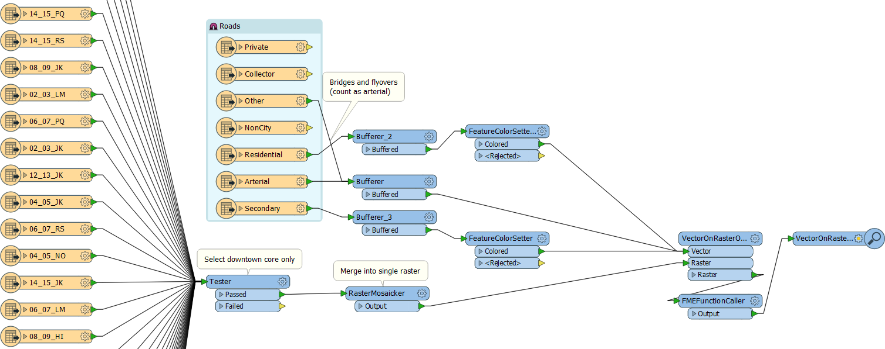

Examine what the workspace does. You'll see there are two main processing streams. In the first, a number of raster files are being read and a test carried out to filter those that are not needed. The raster data is then mosaicked together.

The second stream starts with a set of roads data. The data is buffered (to enhance its appearance), a color is set, and it is written onto the raster data backdrop (using a VectorOnRasterOverlayer transformer).

Run the workspace and examine the result. The output is fine - but the design of the workspace is not very good at all.

 **2) Remove Unwanted Feature Types**
 Looking at the raster feature types, it is obvious that much of the data being read is being filtered out by the Tester. Use summary annotation on the Tester. This will show the Tester parameters without you having to keep opening and closing the parameters dialog. 

Check which files the Tester is keeping. Remove any Reader feature types that are not part of the list. Then remove the Tester itself. 

This should reduce the size of the workspace considerably:

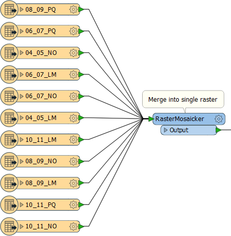

 **3) Remove Unwanted Road Feature Types**
 Looking at the road feature types, some of those are not even connected. They can be deleted immediately. 

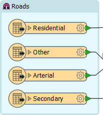

The workspace might now fit the canvas at a reasonable scale!

 **4) Trap Errors**
 One obvious oddity in the workspace is that the Secondary and Residential roads are given a color with the FeatureColorSetter transformer, but the Arterial and Other roads are not.

Perhaps the workspace author thought the existing red color was already suitable. This might be true, but there's no guarantee the source data might not change, or contain errors in color. We should ensure that these features appear red, regardless of what the source data says.

So, place a new FeatureColorSetter transformer in the workspace (or copy one of the other ones), and use it to color the Other/Arterial features in red:

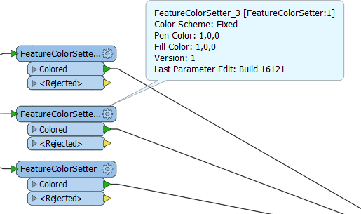

---

<!--Person X Says Section-->

<table style="border-spacing: 0px">
<tr>
<td style="vertical-align:middle;background-color:darkorange;border: 2px solid darkorange">
<i class="fa fa-quote-left fa-lg fa-pull-left fa-fw" style="color:white;padding-right: 12px;vertical-align:text-top"></i>
Police Chief Webb-Mapp says...
</td>
</tr>

<tr>
<td style="border: 1px solid darkorange">

I think this workspace is going to be fine, but in other scenarios I might be concerned about the RasterMosaicker and the VectorOnRasterOverlayer transformers. For example, how do I know that only valid raster features will reach the RasterMosaicker transformer? What might happen if a rogue vector feature reached that transformer?
  A simple GeometryFilter transformer can help me filter out features with unexpected geometry before they can cause a problem, but it is these sort of questions you need to ask in order to fully error-trap a workspace.

</td>
</tr>
</table>

---

 **5) Check FMEFunctionCaller**
 You may have noticed the FMEFunctionCaller transformer lurking towards the end of the translation. This transformer is able to make calls directly into the heart of the FME engine. However, it's not often that you would need to do such a thing.

Open the FMEFunctionCaller's parameters dialog to see what it is being used for:

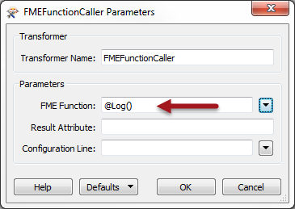

The transformer seems to be doing a very simple call to log the current feature to the log window. Besides the fact that it's probably for debugging, there's no need to use an FME function to do such a thing. The Logger transformer works just as well, and has more options available.

Replace the FMEFunctionCaller with a Logger transformer:

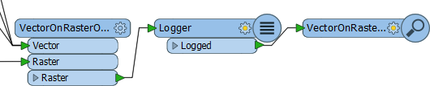

 **6) Save and Run Workspace**
 You can now save the workspace and then run it to prove the output is the same as it was before (but in a markedly improved workspace design):

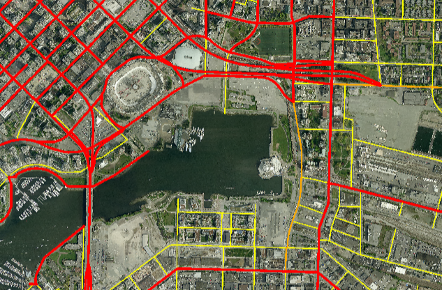 

---

<!--Person X Says Section-->

<table style="border-spacing: 0px">
<tr>
<td style="vertical-align:middle;background-color:darkorange;border: 2px solid darkorange">
<i class="fa fa-quote-left fa-lg fa-pull-left fa-fw" style="color:white;padding-right: 12px;vertical-align:text-top"></i>
Dr. Workbench says...
</td>
</tr>

<tr>
<td style="border: 1px solid darkorange">

If you get a message pop-up (or appear in the log window) about features not matching, don't worry. It isn't an error message and won't stop the workspace from functioning. You'll find out more about this message in another chapter of training.

</td>
</tr>
</table>

---

<!--Advanced Exercise Section-->

<table style="border-spacing: 0px">
<tr>
<td style="vertical-align:middle;background-color:darkorange;border: 2px solid darkorange">
<i class="fa fa-cogs fa-lg fa-pull-left fa-fw" style="color:white;padding-right: 12px;vertical-align:text-top"></i>
Advanced Exercise
</td>
</tr>

<tr>
<td style="border: 1px solid darkorange">

One other change we can make is a little more advanced. It concerns reducing the number of Bufferer transformers. If you're up for a challenge, follow these steps...

</td>
</tr>
</table>

---

 **7) Delete and Replace Bufferers**
 Check the buffer sizes being used in the Bufferers and then delete those transformers. Add an AttributeValueMapper and a single Bufferer after the FeatureColorSetters: 

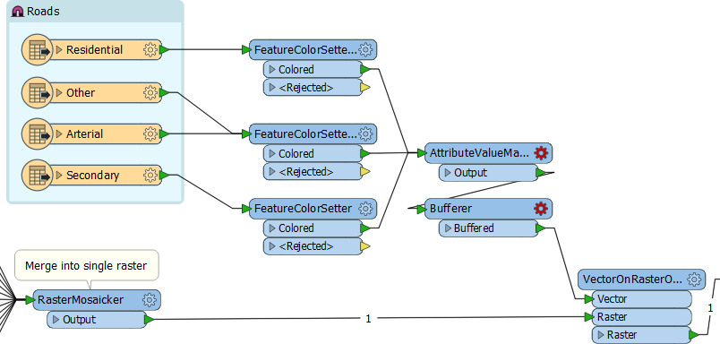 

 **8) Set AttributeValueMapper Parameters**
 Open the AttributeValueMapper parameters dialog. Set the Source Attribute to be fme_feature_type (a record of the feature type the feature belongs to) and set the Destination Attribute to be BufferAmount:

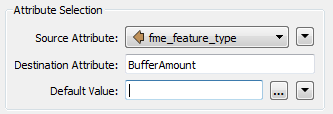

Underneath, in the Value Map settings, set the following:

Residential = 2;
Other = 5;
Arterial = 5;
Secondary = 3;

 **9) Set Bufferer Parameters**
 Now open the Bufferer parameters dialog. Set the Buffer Amount parameter to Attribute Value > BufferAmount:

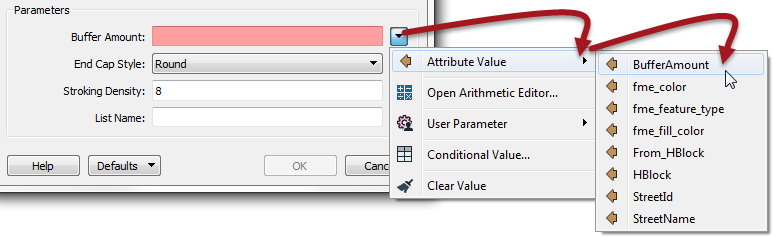

Basically, by doing this, we have reduced the number of transformers required in the workspace. In this case, we only saved a single transformer. However, if future edits required other road types to be included, we could use the same infrastructure and not need to add more transformers.

Similarly, future changes to the buffer amounts can be set through a single transformer, not a series of them. 

In all, this part of the exercise has made this workspace very scalable.

If you have time, repeat these steps to reduce the number of FeatureColorSetter transformers as well, like so:

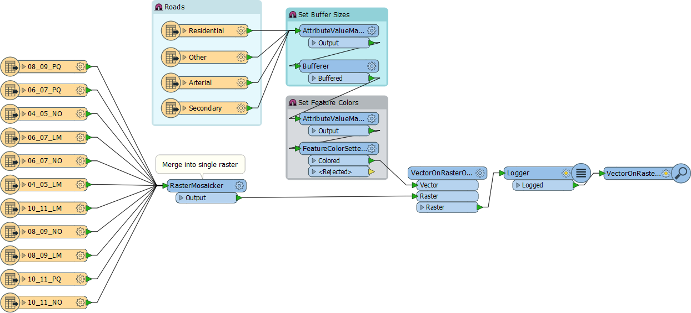
 

---

<!--Exercise Congratulations Section--> 

<table style="border-spacing: 0px">
<tr>
<td style="vertical-align:middle;background-color:darkorange;border: 2px solid darkorange">
<i class="fa fa-thumbs-o-up fa-lg fa-pull-left fa-fw" style="color:white;padding-right: 12px;vertical-align:text-top"></i>
CONGRATULATIONS
</td>
</tr>

<tr>
<td style="border: 1px solid darkorange">

By completing this exercise you have learned how to:
  <li>Remove excess feature types from a workspace
 <li>Identify where errors might occur and pre-emptively fix them
 <li>Identify and replace excessively complex transformers
 <li>(Advanced) Identify and fix repeating transformers

</td>
</tr>
</table>

