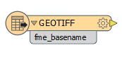
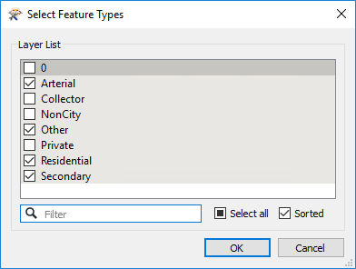
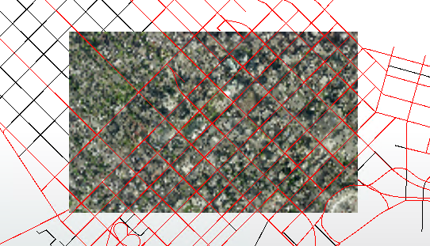
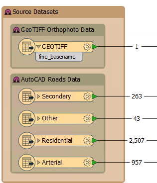
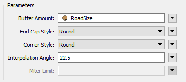
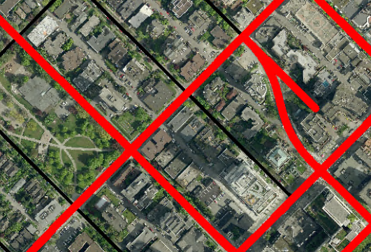
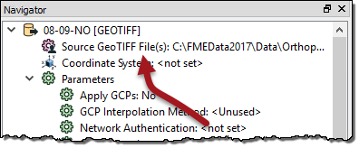
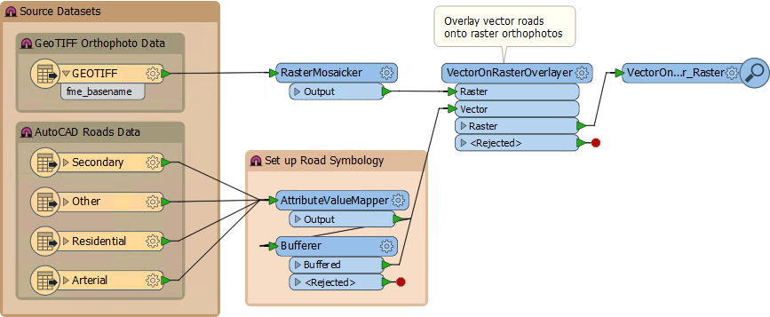
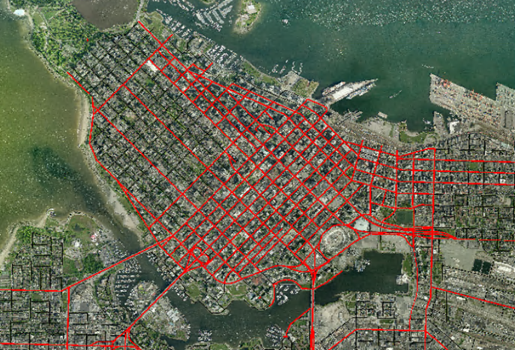

<!--Exercise Section-->

<table style="border-spacing: 0px;border-collapse: collapse;font-family:serif">
<tr>
<td width=25% style="vertical-align:middle;background-color:darkorange;border: 2px solid darkorange">
<i class="fa fa-cogs fa-lg fa-pull-left fa-fw" style="color:white;padding-right: 12px;vertical-align:text-top"></i>
Exercise 2
</td>
<td style="border: 2px solid darkorange;background-color:darkorange;color:white">
Design Patterns
</td>
</tr>

<tr>
<td style="border: 1px solid darkorange; font-weight: bold">Data</td>
<td style="border: 1px solid darkorange">Orthophoto images (GeoTIFF), Roads (AutoCAD DWG)</td>
</tr>

<tr>
<td style="border: 1px solid darkorange; font-weight: bold">Overall Goal</td>
<td style="border: 1px solid darkorange">Create a workspace to overlay road features onto raster images</td>
</tr>

<tr>
<td style="border: 1px solid darkorange; font-weight: bold">Demonstrates</td>
<td style="border: 1px solid darkorange">Methodology Best Practice</td>
</tr>

<tr>
<td style="border: 1px solid darkorange; font-weight: bold">Start Workspace</td>
<td style="border: 1px solid darkorange">None</td>
</tr>

<tr>
<td style="border: 1px solid darkorange; font-weight: bold">End Workspace</td>
<td style="border: 1px solid darkorange">C:\FMEData2017\Workspaces\DesktopBasic\BestPractice-Ex2-Complete.fmw</td>
</tr>

</table>

A mapping project in the city requires a dataset of roads laid down on a raster background. The data should cover the neighborhoods of Downtown and the West End, and the road features should only be of the types Arterial, Residential, Secondary, and Other. Each type of road feature should be depicted differently in some way, so as to make their type visually recognizable.

As the resident spatial data expert, you've been asked to create this dataset. The source data consists of a lot of files and layers, and the FME workspace will include a number of operations that might be carried out by different transformers; but luckily you've just learned all about proper methodology in FME and are looking forward to applying that knowledge on this project.

---

 **1) Make an Initial Assessment**
 Let's first consider the steps we know are needed for the project.

- You need to read a set of GeoTIFF files
	- There are a lot of files so while prototyping the workspace you may wish to cut back on the amount of data being used to test the solution.
	- The area of the project is not the entire city (just two neighborhoods) so you will have to find a way to avoid reading excess files in the final solution.
- You need to read an AutoCAD DWG file of roads
	- The project requires only four road types, so not all source data layers are required
	- Again, you will need to cut the data back to the required area
- You need to differentiate road types in some way
	- The most obvious visual difference would be colour, but size might also work. The transformer to use will differ depending on what technique you decide to use.
- You need to overlay the road features on to the raster data
	- This is not something you've had to do before, but you know there must be a transformer to do so!

 **2) Inspect Source Data**
 Use a file browser to explore the folder C:\FMEData2017\Data\Orthophotos. This is where the raster data is kept. The name of each file denotes a tilename in a grid of tiles, but Unless you know what that grid is you won't be able to select a single file that you know covers the Downtown or West End areas.

So, open all the raster tiles in the FME Data Inspector. 

---

<!--Tip Section--> 

<table style="border-spacing: 0px">
<tr>
<td style="vertical-align:middle;background-color:darkorange;border: 2px solid darkorange">
<i class="fa fa-info-circle fa-lg fa-pull-left fa-fw" style="color:white;padding-right: 12px;vertical-align:text-top"></i>
TIP
</td>
</tr>

<tr>
<td style="border: 1px solid darkorange">

Here's a free tip for you: when opening the raster data, check the parameters dialog and set Feature Type Names to come From File Name. That way you'll be able to see each file separately, not all joined together. 

</td>
</tr>
</table>

---

Pick a single raster tile that appears in the West End or Downtown areas of the city. File 08_09_NO would be a good choice, but you can use whatever file you think correct.

 **3) Add GeoTIFF Reader to Workbench**
 Start FME Workbench and begin the project by adding a reader to read the chosen GeoTIFF file. Do this by selecting Readers &gt; Add Reader from the menubar. The parameters are as follows:

<table style="border: 0px">

<tr>
<td style="font-weight: bold">Reader Format</td>
<td style="">GeoTIFF (Geo-referenced Tagged Image File Format)</td>
</tr>

<tr>
<td style="font-weight: bold">Reader Dataset</td>
<td style="">C:\FMEData2017\Data\Orthophotos\99-99-XX.tif</td>
</tr>

</table>

Your workspace will now look like this:

A simple start, but a good one.

 **4) Add AutoCAD Reader to Workbench**
 Now add a reader (Readers &gt; Add Reader) to read the roads data as follows:

<table style="border: 0px">

<tr>
<td style="font-weight: bold">Reader Format</td>
<td style="">Autodesk AutoCAD DWG/DXF</td>
</tr>

<tr>
<td style="font-weight: bold">Reader Dataset</td>
<td style="">C:\FMEData2017\Data\Transportation\CompleteRoads.dwg</td>
</tr>

</table>

You will be prompted which feature types (layers) you wish to read from the data. Choose only the required types (Arterial, Other, Residential, Secondary)

 **5) Test Workspace**
 Add an Inspector transformer to each of the source feature types. You can do that by selecting all the objects, right-clicking, and choosing Connect Inspectors. The workspace will look like this:

Now run the workspace and inspect the output.

---

<!--Person X Says Section-->

<table style="border-spacing: 0px">
<tr>
<td style="vertical-align:middle;background-color:darkorange;border: 2px solid darkorange">
<i class="fa fa-quote-left fa-lg fa-pull-left fa-fw" style="color:white;padding-right: 12px;vertical-align:text-top"></i>
Dr. Workbench says...
</td>
</tr>

<tr>
<td style="border: 1px solid darkorange">

If you get a message pop-up (or appear in the log window) about features not matching, don't worry. It isn't an error message. It's a warning that you left layers from the DWG dataset out of the workspace. If you haven't covered this message so far in the training, you'll probably cover it very shortly.

</td>
</tr>
</table>

---

Although this is an early stage, the output is still important. It shows that we are reading data correctly, that we have only the required road layers, and that we have a raster dataset that overlaps the roads. The latter point is especially important. It shows that we aren't trying to overlap two datasets in different coordinate systems. 

Additionally, by querying a road feature we can see that it is still vector data, and isn't yet being overlaid onto the raster as we need.

 **6) Add Style**
 Now that we have the first section set up, we can mark it up with a bookmark. So, add a bookmark around the reader feature type objects and give it a suitable name.

You may even create nested bookmarks to denote which object is from which reader:

 **7) Add VectorOnRasterOverlayer Transformer**
 The next logical step is to try and overlay the vector data onto the raster. So, add a VectorOnRasterOverlayer transformer to the workspace.

Arrange the feature types or transformer ports so as the avoid overlapping connections. Add an Inspector transformer:

Now run the workspace. Zoom in to the overlaid data and you will see that the road features are now imprinted into the raster data as we require:

So now that transformer is tested and proved to work as expected.

The really useful aspect is that vector data outside of the raster area was simply discarded. This means we don't need to set up a separate clip operation on the vector data; the VectorOnRasterOverlayer will clip it for us.

 **8) Add Style**
 The VectorOnRasterOverlayer is just a single transformer, so it doesn't really need a bookmark around it (not for Sectioning the workspace, and the project is not going to be big enough to bookmark a single transformer for Access or Editing purposes).

However, you should probably add an annotation to it, to denote what is going on.

 **9) Add Vector Symbology**
 Although the vector data has been overlaid correctly, we haven't yet symbolized it in such a way that each data type is distinguishable from the other.

Let's do this on the basis of size. We can create a buffer around the roads where the buffer size is dependent on the type of road:

<table>
<tr><th>Road Type</th><th>Buffer Size</th></tr>
<tr><td>Residential</td><td align=center>2</td></tr>
<tr><td>Other</td><td align=center>5</td></tr>
<tr><td>Arterial</td><td align=center>5</td></tr>
<tr><td>Secondary</td><td align=center>3</td></tr>
</table>

The *simplest* way is to put a Bufferer transformer for each road layer/type; but the simplest way is not necessarily the best. Here it would mean duplicating the Bufferer transformer multiple times.

What we'll do is set the buffer size as an attribute depending on the road type, then use that attribute in the Bufferer transformer parameters.

So, add an AttributeValueMapper transformer, followed by a Bufferer transformer. All road types should connect to the AttributeValueMapper and the Bufferer output will connect to the VectorOnRasterOverlayer:Vector input port:

 **10) Set Parameters**
 If you view the parameters for the AttributeValueMapper (either in the Parameter Editor window or the transformer's own parameters dialog) you'll see the Source Attribute parameter cannot be set because we don't have any attributes. What we need is an attribute that tells us what the original layer was, and that is an **FME attribute** called *fme&#95;feature&#95;type*.

This is a good example of having to go back and change something - in this case a reader - to help in a later operation.

So, click on one of the Road feature type objects and in the Parameter Editor window click the Format Attributes tab. Put a check mark next to the attribute *fme&#95;feature&#95;type*:

Click Apply. Now check the AttributeValueMapper parameters again. Set:

<table>
<tr><td style="font-weight: bold">Source Attribute</td><td>fme&#95;feature&#95;type</td></tr>
<tr><td style="font-weight: bold">Destination Attribute</td><td>RoadSize</td></tr>
</table>

And then in the mapping fields set:

<table>
<tr><th>Source Value</th><th>Destination Value</th></tr>
<tr><td>Residential</td><td align=center>2</td></tr>
<tr><td>Other</td><td align=center>5</td></tr>
<tr><td>Arterial</td><td align=center>5</td></tr>
<tr><td>Secondary</td><td align=center>3</td></tr>
</table>

Then click Apply/OK to apply these changes.

 **11) Set Parameters**
 Now view the Bufferer parameters. This is a lot easier. Simply set the Buffer Amount parameter to the value of the RoadSize attribute:

Again click Apply/OK to confirm the parameter changes.

 **12) Add Style**
 You know the drill! Apply some style to the workspace by adding a bookmark around the two newly added transformers!

 **13) Run Workspace**
 Save and run the workspace. You now have the results you are looking for:

 **14) Apply Full Dataset**
 So, our prototype is now complete. All we need do is apply it to all of the tiles in the two suggested neighborhoods. 

There are multiple ways of doing this, some more complex than we want to cover here (using the FeatureReader transformer, if you must know)! For this exercise, we'll do something very simple.

In the FME Data Inspector ensure you have background maps turned on. Now open all of the orthophoto images (you may still have them all open from step 2). Then add the following dataset to the same view:

<table style="border: 0px">

<tr>
<td style="font-weight: bold">Reader Format</td>
<td style="">Google KML</td>
</tr>

<tr>
<td style="font-weight: bold">Reader Dataset</td>
<td style="">C:\FMEData2017\Data\Boundaries\VancouverNeighborhoods.kml</td>
</tr>

</table>

***NB:** You need to have the background maps turned on because these datasets are in different coordinate systems and would otherwise not appear properly georeferenced.*

From this you ought to be able to identify which tiles overlap the West End and Downtown neighborhoods. Make a list of them, or you can use this list:

- 04_05_LM
- 04_05_NO
- 04_05_PQ
- 06_07_LM
- 06_07_NO
- 06_07_PQ
- 08_09_LM
- 08_09_NO
- 08_09_PQ
- 10_11_LM
- 10_11_NO
- 10_11_PQ

 **15) Set Source Datasets**
 Back in FME Workbench look in the Navigator window under the GEOTIFF reader for the parameter *Source GeoTIFF File(s)*:

Double-click the parameter and then use the browse button to select the files in the above list. Click OK to accept the changes.

 **16) Mosaic Data**
 Save and re-run the workspace. You will find it fails with an error, like so:

<pre style="color:red">VectorOnRasterOverlayer(VectorToRasterFactory): Too many raster features input.
Each group may only have a single background raster</pre>

The problem is that the VectorOnRasterOverlayer only permits one raster feature for each set of vectors. What we need to do is join together all the input tiles (mosaic them) into one feature.

So, add a RasterMosaicker transformer before the VectorOnRasterOverlayer:

This is another good example of having to go back and change something - in this case add a new transformer - to help in a later operation.

Now re-run the workspace. The result will look like this:

 **17) Test Workspace**
 Email your completed workspace to [BestPractice@safe.com](mailto:BestPractice@safe.com). In reply you will receive a report that analyzes your workspace for best practice techniques. If necessary, update the workspace to fix any errors or warnings that are included in the report.

---

<!--Exercise Congratulations Section--> 

<table style="border-spacing: 0px">
<tr>
<td style="vertical-align:middle;background-color:darkorange;border: 2px solid darkorange">
<i class="fa fa-thumbs-o-up fa-lg fa-pull-left fa-fw" style="color:white;padding-right: 12px;vertical-align:text-top"></i>
CONGRATULATIONS
</td>
</tr>

<tr>
<td style="border: 1px solid darkorange">

By completing this exercise you have learned how to:
 
<ul><li>Assess the steps required to carry out a particular project</li>
<li>Create a workspace incrementally, applying style and testing it after each increment</li>
<li>Select and use a sample set of data for prototyping a workspace</li>
<li>Handle data with excessive layers by leaving them out of the workspace</li>
<li>Overlay vector data onto raster (not the main point of the exercise, but useful to know)</li>
<li>Set up a transformer parameter by creating a mapped attribute value</li>
<li>Apply a prototype workspace to a full dataset</li>
<li>Backtrack to an earlier section of workspace to solve a problem that occurs in a later section</li></ul>

</td>
</tr>
</table>

