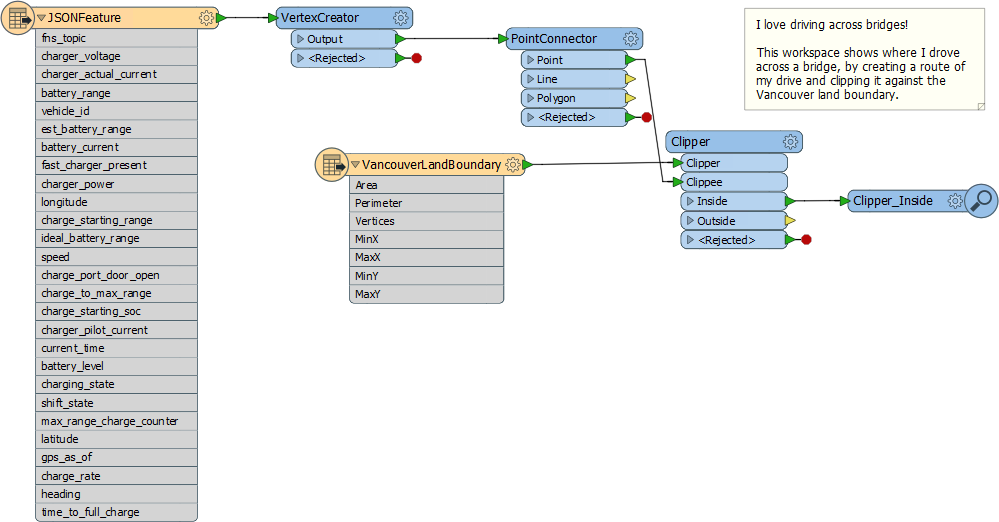
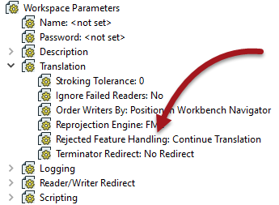

<!--Exercise Section-->

<table style="border-spacing: 0px;border-collapse: collapse;font-family:serif">
<tr>
<td width=25% style="vertical-align:middle;background-color:darkorange;border: 2px solid darkorange">
<i class="fa fa-cogs fa-lg fa-pull-left fa-fw" style="color:white;padding-right: 12px;vertical-align:text-top"></i>
Exercise 3
</td>
<td style="border: 2px solid darkorange;background-color:darkorange;color:white">
Debugging a Workspace
</td>
</tr>

<tr>
<td style="border: 1px solid darkorange; font-weight: bold">Data</td>
<td style="border: 1px solid darkorange">GPS Roads data (JSON)</td>
</tr>

<tr>
<td style="border: 1px solid darkorange; font-weight: bold">Overall Goal</td>
<td style="border: 1px solid darkorange">Fix the bugs in someone else's workspace</td>
</tr>

<tr>
<td style="border: 1px solid darkorange; font-weight: bold">Demonstrates</td>
<td style="border: 1px solid darkorange">Debugging Best Practice</td>
</tr>

<tr>
<td style="border: 1px solid darkorange; font-weight: bold">Start Workspace</td>
<td style="border: 1px solid darkorange">C:\FMEData2018\Workspaces\DesktopBasic\BestPractice-Ex3-Begin.fmw</td>
</tr>

<tr>
<td style="border: 1px solid darkorange; font-weight: bold">End Workspace</td>
<td style="border: 1px solid darkorange">C:\FMEData2018\Workspaces\DesktopBasic\BestPractice-Ex3-Complete.fmw</td>
</tr>

</table>

As President of your local FME user group, you are responsible for checking projects that are submitted for presentation at your monthly meetings. One day you receive this in an email:

---

<!--Person X Says Section-->

<table style="border-spacing: 0px">
<tr>
<td style="vertical-align:middle;background-color:darkorange;border: 2px solid darkorange">
<i class="fa fa-quote-left fa-lg fa-pull-left fa-fw" style="color:white;padding-right: 12px;vertical-align:text-top"></i>
Mr Flibble says...
</td>
</tr>

<tr>
<td style="border: 1px solid darkorange">

I love driving across bridges! This workspace takes a set of GPS points, converts them to road lines, and then shows where I drove across a bridge by clipping it against the Vancouver land boundary.

</td>
</tr>
</table>

---

Unfortunately Mr Flibble is seriously in error, and has produced a very poor workspace. Rather than turn down his presentation, let's help him debug the problems so it is worth sharing.

 **1) Set Rejected Feature Handling**
 Start FME Workbench and open the starting workspace. It looks like this:

Because we're trying to test a workspace - we're not trying to pick up on errors that occur in production - it's probably better to have the Rejected Feature Handling not terminate the translation just because a feature has been rejected. We want the workspace to continue and find what other issues might occur.

So, check the Workspace Parameters section of the Navigator window and set the Rejected Feature Handling parameter to Continue Translation:

Now the Rejected ports on transformers will lose their "stop" icon and look like this:

 
 **2) Debug Workspace**
 Run/debug the workspace to track down all the problems in it (I count five). Remember the order of debugging operations should be something like the following:

- Set the log file parameters before running the translation
- Run the translation. Examine the log for warnings and errors
- Inspect the output datasets, if the translation wrote any
- Check feature counts in the Workbench canvas to locate where problems occurred
- Check reader, writer, or transformer parameters at the point of failure
- Test the workspace by adding Inspector transformers to view data at different points
- If necessary, run the workspace in feature debug mode

Be sure to fix any problems that you find!

Once the workspace is fixed, the output should look like this in the FME Data Inspector:

---

<!--Exercise Congratulations Section--> 

<table style="border-spacing: 0px">
<tr>
<td style="vertical-align:middle;background-color:darkorange;border: 2px solid darkorange">
<i class="fa fa-thumbs-o-up fa-lg fa-pull-left fa-fw" style="color:white;padding-right: 12px;vertical-align:text-top"></i>
CONGRATULATIONS
</td>
</tr>

<tr>
<td style="border: 1px solid darkorange">

By completing this exercise you have learned how to:
 
<ul><li>Set the Rejected Feature parameter</li>
<li>Read the translation counts to locate a workspace problem</li>
<li>Used Inspector transformers to identify problems</li>
<li>Interpret a log file to ensure everything is correct</li></ul>

</td>
</tr>
</table>