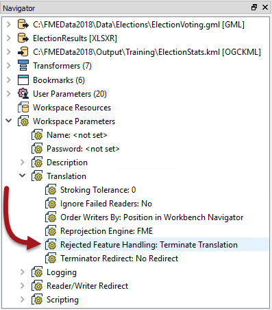
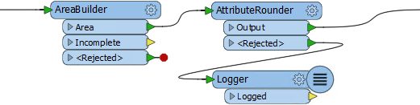
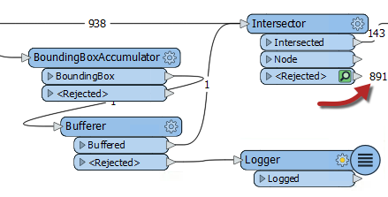

## Rejected Features ##

An important part of any workflow is handling data that fails processing; for example where a feature with no geometry is sent into a geometry based transformer like the AreaBuilder.

FME handles such failures by outputting the data through &lt;Rejected&gt; ports, which are found on many transformers: 

To give the workspace author a choice over what action to take, a parameter exists to control the action of &lt;Rejected&gt; ports.

### Rejected Feature Handling ###

The parameter to control handling of rejected features can be found in the Navigator window, under Workspace Parameters:

The two options are *Terminate Translation* and *Continue Translation*.

When the parameter is set to terminate, then a feature that exits via a &lt;Rejected&gt; port causes the translation to stop. To visually denote this, the &lt;Rejected&gt; ports have a red marker on them.

When the parameter is set to continue, then the translation will continue, regardless of how many features exit &lt;Rejected&gt; ports. In that case the red marker is removed:

In terminate mode, a rejected feature gets written to the log window with the error message:

    The below feature caused the translation to be terminated

There will also be an error message relating to the transformer:

    Intersector_<Rejected>(TeeFactory): Intersector_<Rejected>: 
	Termination Message: 'Intersector output a <Rejected> feature.

This error is useful because it tells the author which transformer experienced the failure.

### Mixed Mode ###

In terminate mode, a rejected feature will not cause the translation to terminate, provided that the &lt;Rejected&gt; port is connected to a further object:

In short, an author can create a mixed mode, where some transformers terminate on rejecting a feature (the Intersector above), but others will handle the feature another way (the Bufferer). That way the author can try to handle rejected features that are expected, but stop the translation if there are truly unexpected failures.

### Feature Counts and Inspection ###

In continue mode, features that exit a &lt;Rejected&gt; port are counted and saved for inspection:  

This occurs even if there is no Logger or other transformer attached. The number tells us how many features were rejected and the green icon can be clicked to inspect the data.