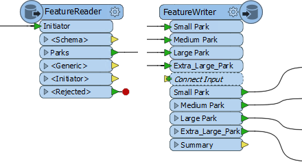
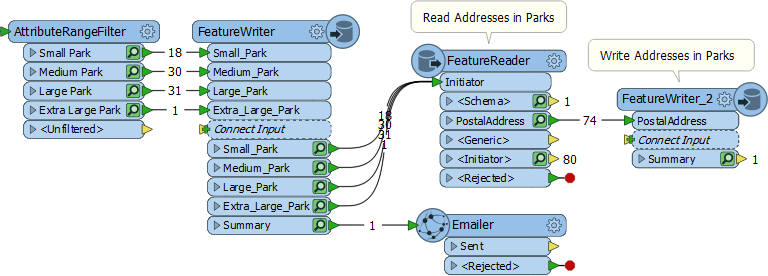

## FeatureReader and FeatureWriter ##

Besides being able to read data with a reader and writer, FME has transformers specifically designed to read and write data. These are the FeatureReader and FeatureWriter transformers.

The advantage to these transformers is that they have an input port (FeatureReader) and output ports (FeatureWriter). So where a reader is always the first action in a workspace, and a writer is always the last, a FeatureReader and FeatureWriter can read and write data at any point in a translation.

---

### FeatureReader ###

The FeatureReader is set up with parameters to read a specific dataset:

Any feature that enters the Initiator input port will cause the data to be read, like here where a Creator supplies a null feature to trigger reading:

The Creator creates a single feature that triggers the FeatureReader to read a dataset of park features. If, for some reason, the Creator created ten features, then the data would be read ten times, resulting in 800 output features!

#### Dataset from an Attribute ####

A common case with the FeatureReader is to supply the dataset to read as an attribute:

This example includes both reader and FeatureReader. The workspace reads an Excel spreadsheet containing a list of public artworks. Each artwork has an attribute that points to a JPEG file containing a photograph of the artwork. 

The FeatureReader is set up to use the attribute as the filename to read. The result is that 18 rows are read from the Excel spreadsheet, and the equivalent 18 JPEG images exit the FeatureReader.

#### Spatial Filters ####

A key parameter in the FeatureReader sets a spatial filter on the data being read:

The Initiator Contains Result filter (for example) means that features output the FeatureReader if their geometry falls inside the geometry of the initiator feature. For example here:

A dataset of parks supplies input features that trigger reading from a database address table. A spatial filter is applied so that the only addresses to emerge are ones that fall inside a park.

---

### FeatureWriter ###

The FeatureWriter is set up with parameters to write a specific dataset:

The dialog allows definition of the format and dataset to write, plus the feature types that are to be written and their attributes. In short, all of the parameters, settings, and schema definition required for a writer, appear in this single dialog.

Feature types can be manually defined within the dialog itself, or can be added automatically by connecting to the *Connect Input* input port:

Notice also that an important part of the FeatureWriter is that its exit ports can be connected to other transformers for further processing. In the above screenshot the data is sampled to provide a single feature, then messages are sent via Twitter and email. 
