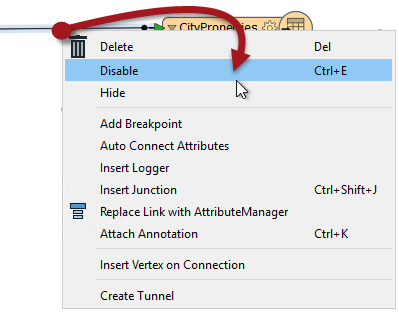
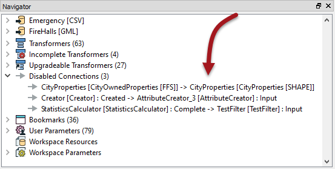

## Partial Runs ##

### Testing a Section in Isolation ###

Testing and debugging a large workspace is easier when it's possible to isolate sections and test them separately. This is done by disabling connections to the parts that do not need testing. 

---

<!--Tip Section--> 

<table style="border-spacing: 0px">
<tr>
<td style="vertical-align:middle;background-color:darkorange;border: 2px solid darkorange">
<i class="fa fa-info-circle fa-lg fa-pull-left fa-fw" style="color:white;padding-right: 12px;vertical-align:text-top"></i>
TIP
</td>
</tr>

<tr>
<td style="border: 1px solid darkorange">

This is also a useful technique for where a failure halts the translation. That's because a failure can stop a translation before data is sent through Inspector transformers to the Data Inspector!
  In these scenarios you need to stop data reaching the failure point, in order to view that data in the Data Inspector.

</td>
</tr>
</table>

---

A connection is disabled by right-clicking it and choosing the option to Disable (or selecting it and using the shortcut Ctrl+E):

A disabled connection is rendered inoperative in much the same way as if it had been deleted, and no features will pass through.

Disabled connections are listed in the Navigator window. Clicking them will move the canvas display to the location of that disabled connection.

Here the user has chosen to disable a connection so that they can test the upper part of the workspace without the lower part running as well: 

This speeds up the translation so that testing of the required section runs quicker, but also removes the possibility that the lower part would be responsible for any problems with the output.

---

<!--Person X Says Section-->

<table style="border-spacing: 0px">
<tr>
<td style="vertical-align:middle;background-color:darkorange;border: 2px solid darkorange">
<i class="fa fa-quote-left fa-lg fa-pull-left fa-fw" style="color:white;padding-right: 12px;vertical-align:text-top"></i>
Miss Vector says...
</td>
</tr>

<tr>
<td style="border: 1px solid darkorange">

For testing purposes it's much easier to disable certain parts of a workspace when you've properly divided it up into sections with bookmarks. So here's a question for you:
  It's possible to disable other objects besides connections. Can you pick out which of these objects (there may be more than one) can be disabled in Workbench?
  <a href="http://52.73.3.37/fmedatastreaming/Manual/QAResponse2017.fmw?chapter=3&question=3&answer=1&DestDataset_TEXTLINE=C%3A%5CFMEOutput%5CQAResponse.html">1. Transformers
 <a href="http://52.73.3.37/fmedatastreaming/Manual/QAResponse2017.fmw?chapter=3&question=3&answer=2&DestDataset_TEXTLINE=C%3A%5CFMEOutput%5CQAResponse.html">2. Feature Types
 <a href="http://52.73.3.37/fmedatastreaming/Manual/QAResponse2017.fmw?chapter=3&question=3&answer=3&DestDataset_TEXTLINE=C%3A%5CFMEOutput%5CQAResponse.html">3. Annotation
 <a href="http://52.73.3.37/fmedatastreaming/Manual/QAResponse2017.fmw?chapter=3&question=3&answer=4&DestDataset_TEXTLINE=C%3A%5CFMEOutput%5CQAResponse.html">4. Bookmarks

</td>
</tr>
</table>