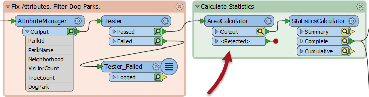
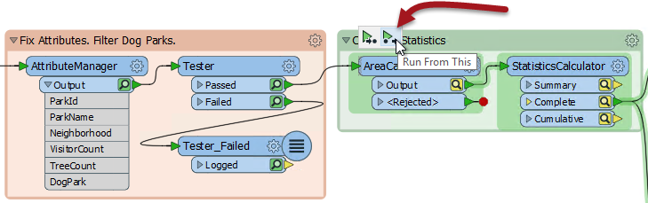

## Partial Runs ##

A partial run is when only one section of a workspace is executed. One way to do this is to disable objects in the canvas to only run certain enabled sections. Another method is to use a tool called Partial Runs, which is represented by pop-up options when a workspace is run with caching turned on.

The technique you use will depend on how large the workspace is, and how much of it you need to run. You may use one technique or the other - or you may use both!

---

### Disabled Objects ###

If designed correctly, a large workspace should be made up of small sections. Isolating a section (or part of a section) for testing is possible by disabling connections to all other components.

Here an author has disabled a single connection:

Therefore the bottom part of that section will operate as normal, and can be tested without having to also run the top half. 

A connection is disabled by right-clicking it and choosing the option to Disable (or selecting it and using the shortcut Ctrl+E):

A disabled connection is rendered inoperative in much the same way as if it had been deleted, and no features will pass through. The same disabling can be done to other canvas objects such as transformers and feature types. Even a reader/writer can be disabled through the Navigator window.

---

### Partial Runs ###

When caching is turned on, running a translation causes data to be cached at every part of the workspace. In subsequent runs, those caches can be used instead of having to re-run entire sections of workspace.

Here, for example, a workspace has been run with caching turned on:

Now the author makes a change to the AreaCalculator parameters:

Notice that the caches change color (to yellow) on the AreaCalculator and subsequent transformers. This denotes that caches are stale; their data contents no longer match what the workspace would produce.

To get the new results the author must re-run the workspace. However, they do not have to re-run the entire workspace; they can simply start the workspace at the point of change - the AreaCalculator:

*Run From This* causes the workspace to run from that point only, using data cached up until that point. Notice how hovering over the option causes all "downstream" transformers to be highlight. They are the only ones that will be run. That makes the translation quicker.

The other option is *Run To This*. The author could use that option on the writer feature type and get much the same effect:

...but notice how the second branch from the StatisticsCalculator does not get highlighted. It will not be run. That shows how you can avoid running a particular section of workspace, in much the same way as if that connection had been disabled.

---

<!--Tip Section--> 

<table style="border-spacing: 0px">
<tr>
<td style="vertical-align:middle;background-color:darkorange;border: 2px solid darkorange">
<i class="fa fa-info-circle fa-lg fa-pull-left fa-fw" style="color:white;padding-right: 12px;vertical-align:text-top"></i>
TIP
</td>
</tr>

<tr>
<td style="border: 1px solid darkorange">

A partial run is particularly useful in avoiding re-reading data from its source; especially when the data comes from a slow, remote location such as a web service.
  Also, caches can be saved with the workspace, when it is saved as a template. That means the workspace can be re-run using the caches from a previous session or even from another author!

</td>
</tr>
</table>

---

<!--Warning Section--> 

<table style="border-spacing: 0px">
<tr>
<td style="vertical-align:middle;background-color:darkorange;border: 2px solid darkorange">
<i class="fa fa-exclamation-triangle fa-lg fa-pull-left fa-fw" style="color:white;padding-right: 12px;vertical-align:text-top"></i>
WARNING
</td>
</tr>

<tr>
<td style="border: 1px solid darkorange">

Partial runs are not compatible with variables (VariableSetter/Retriever transformers).

</td>
</tr>
</table>