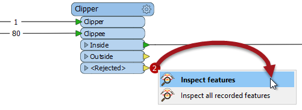

## Feature Counts ##
A workspace **Feature Count** refers to the numbers shown on each connection once a translation is complete:

When a log file shows a translation that ended in an error or where the number of output features was not what was expected, then the Feature Count values shown on each connection can help to diagnose where the error occurred.

In the above screenshot, if you were expecting 74 output features, but only got 73, then you would need to tract the feature counts to find where that missing feature went (it appears to unexpectedly fail the Tester tests).

---

### Incorrect Output ###

When the number of output features is incorrect, then there are several things to check.

If you get zero output, and the feature counts show that all features entered a transformer, but none emerged, then you can be fairly confident that the transformer is the cause of the problem.

Here, for example, 80 features enter the Clipper transformer (to be clipped against a single boundary) but none emerge.

Here the user will want to inspect the data as it enters the transformer as it's possible that Clipper and Clippees don't occupy the same coordinate system, hence one does not fall inside the other. The data is not rejected, because it is not invalid data; it merely does not pass the test expected.

Another common cause of missing features is the wrong output port being connected. For example, a user might get confused over the logic in a Tester transformer, and connect the Passed port when in fact the required data emerges from the Failed port.

Here - for example - the workspace author has set up a test for DogPark=Y, and kept the Passed features:

In reality they want to either keep the Failed features or set the test to DogPark=N.

Similarly, this user has connected the StatisticsCalculator Summary output port, when they really wanted the Complete port connected:

The red attribute connectors on the writer feature type are a good indication that something is going wrong.

---

### Rejected Features ###

Sometimes when features go missing they are being rejected by a transformer. Many transformers include a &lt;Rejected&gt; port to output these invalid features. 

To help in debugging, rejected features are automatically counted on a &lt;Rejected&gt; port, even if there is no Logger or other transformer attached:

Additionally, the rejected features are also saved as a temporary dataset, so right-clicking (or double-clicking) allows the user to inspect them in the Data Inspector, whether or not the features were expected.

---

<!--Warning Section--> 

<table style="border-spacing: 0px">
<tr>
<td style="vertical-align:middle;background-color:darkorange;border: 2px solid darkorange">
<i class="fa fa-exclamation-triangle fa-lg fa-pull-left fa-fw" style="color:white;padding-right: 12px;vertical-align:text-top"></i>
WARNING
</td>
</tr>

<tr>
<td style="border: 1px solid darkorange">

The &lt;Rejected&gt; ports on transformers carry out one of two actions; they can either record all rejected features or they can stop the translation after the first rejected feature.
 This action is controlled by a setting in the Navigator window (Workspace Parameters &gt; Translation &gt; Rejected Feature Handling). More information appears in the chapter on Translation Components.

</td>
</tr>
</table>
