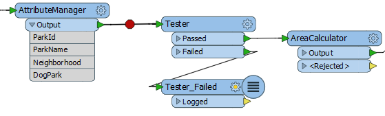
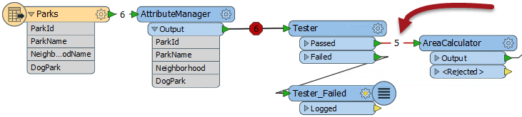

## Feature Debugging ##
Feature Debugging is a tool that allows individual features to be inspected, one-by-one, during a translation. As might be imagined, this is very useful for debugging purposes.

Feature Debugging is triggered by "breakpoints"; workspace connections that are flagged by the user as a location where features should be inspected.

Here a user wishes to inspect data after processing by the AttributeRenamer transformer. A right-click on the connection and selection of Add Breakpoint is used to set it up:

The connection is highlighted in a darker black color with a red "stop" sign, to denote its new status:

Now the workspace is run using “Run with Breakpoints”:

When the first feature arrives at the breakpoint, the translation is temporarily paused and information about the feature displayed in a Feature Inspector window.

The upper part of the window shows a graphic representation of the feature; the lower part lists properties such as Feature Type and Coordinate System; plus attribute and geometry information.

There are four buttons at the foot of the Feature Inspector window:

<table>

<tr>
<th>Button</th>
<th>Operation</th>
<th>Description</th>
</tr>

<tr>
<td></td>
<td>Step to Next Connection</td>
<td>This tool steps through the workspace one transformer at a time, showing the status of a feature as it is processed.</td>
</tr>

<tr>
<td></td>
<td>Step to Next Breakpoint</td>
<td>This tool re-starts the translation, stopping the next time a feature reaches an inspection point.</td>
</tr>

<tr>
<td></td>
<td>Continue Translation</td>
<td>This tool re-starts the translation, ignoring all further breakpoints.</td>
</tr>

<tr>
<td></td>
<td>Stop Translation</td>
<td>This tool stops the translation.</td>
</tr>

</table>

The currently active connection is highlighted red to show it is the location where the translation is currently paused.

The current connection might be different to the original breakpoint when the "Step to Next Connection" tool has been used.

---

<!--Tip Section--> 

<table style="border-spacing: 0px">
<tr>
<td style="vertical-align:middle;background-color:darkorange;border: 2px solid darkorange">
<i class="fa fa-info-circle fa-lg fa-pull-left fa-fw" style="color:white;padding-right: 12px;vertical-align:text-top"></i>
TIP
</td>
</tr>

<tr>
<td style="border: 1px solid darkorange">

Use Feature Debugging when the output from a transformation is wrong and you can't tell why, or when you suspect one particular feature is causing a problem. It's likely to help less when the problem is a crash or ERROR in the log window.

</td>
</tr>
</table>

---

<!--Person X Says Section-->

<table style="border-spacing: 0px">
<tr>
<td style="vertical-align:middle;background-color:darkorange;border: 2px solid darkorange">
<i class="fa fa-quote-left fa-lg fa-pull-left fa-fw" style="color:white;padding-right: 12px;vertical-align:text-top"></i>
Miss Vector says...
</td>
</tr>

<tr>
<td style="border: 1px solid darkorange">

Now you've learned about Feature Debugging, why not try the previous exercise again, this time using these techniques to show what happens step, by step?

</td>
</tr>
</table>