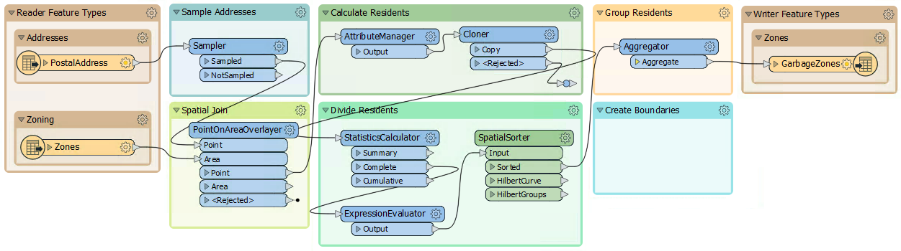
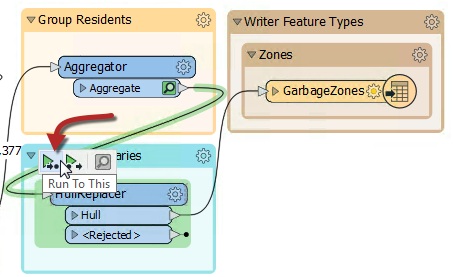
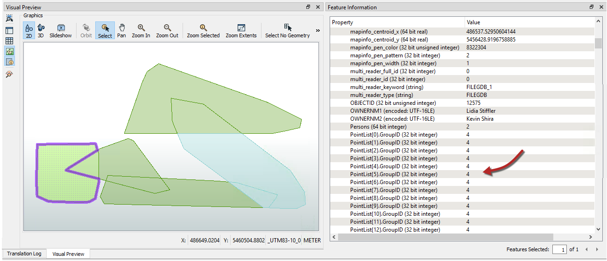
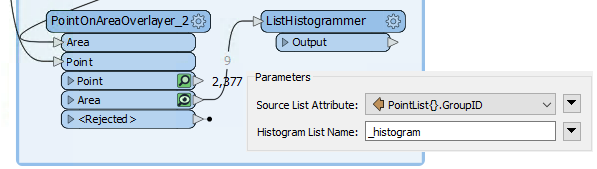
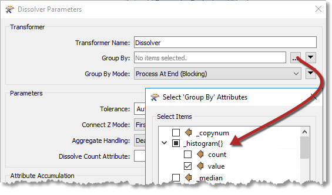
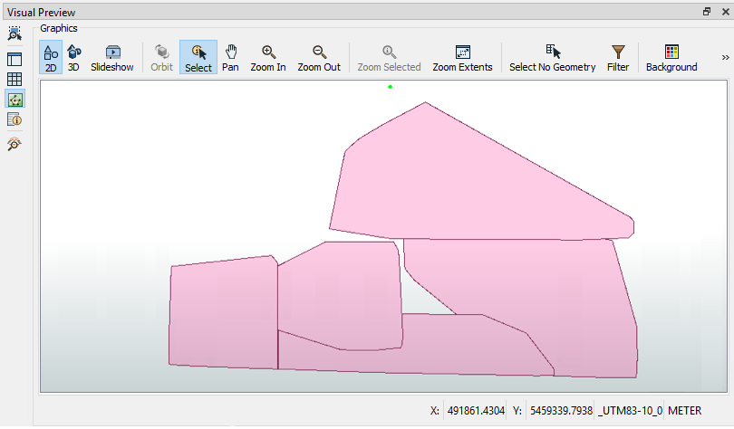

<!--Exercise Section-->

<table style="border-spacing: 0px;border-collapse: collapse;font-family:serif">
<tr>
<td width=25% style="vertical-align:middle;background-color:darkorange;border: 2px solid darkorange">
<i class="fa fa-cogs fa-lg fa-pull-left fa-fw" style="color:white;padding-right: 12px;vertical-align:text-top"></i>
Exercise 3
</td>
<td style="border: 2px solid darkorange;background-color:darkorange;color:white">
Residential Garbage Collection Zones
</td>
</tr>

<tr>
<td style="border: 1px solid darkorange; font-weight: bold">Data</td>
<td style="border: 1px solid darkorange">Addresses (Esri Geodatabase), Zones (MapInfo TAB)</td>
</tr>

<tr>
<td style="border: 1px solid darkorange; font-weight: bold">Overall Goal</td>
<td style="border: 1px solid darkorange">Create boundaries for residential garbage collection</td>
</tr>

<tr>
<td style="border: 1px solid darkorange; font-weight: bold">Demonstrates</td>
<td style="border: 1px solid darkorange">Readers and Writers</td>
</tr>

<tr>
<td style="border: 1px solid darkorange; font-weight: bold">Start Workspace</td>
<td style="border: 1px solid darkorange">C:\FMEData2019\Workspaces\DesktopBasic\Design-Ex3-Begin.fmw</td>
</tr>

<tr>
<td style="border: 1px solid darkorange; font-weight: bold">End Workspace</td>
<td style="border: 1px solid darkorange">C:\FMEData2019\Workspaces\DesktopBasic\Design-Ex3-Complete.fmw</td>
</tr>

</table>

Here we continue with a project to redefine garbage collection schedules.

In the first two exercises, we used various transformers to divide addresses into five separate groups, according to zoning type. Then we wrote the data to Geopackage.

Now the task is to replace the groups of point features with a polygon boundary.

 **1) Open Workspace**
 Open your workspace from the previous exercise.

If you gave that workspace a version number in its name, then you should make a copy of the workspace with a new version number. For example, if you saved it to GarbageCollection-v2.fmw then make a copy named GarbageCollection-v3.fmw and open that for editing.

Alternatively you can open the workspace C:\FMEData2019\Workspaces\DesktopBasic\Design-Ex3-Begin.fmw:

 **2) Run the Workspace**
 Run the workspace to finish writing out the data. You can inspect the output dataset if you desire by clicking on the GarbageZones writer feature type and then clicking on the View Written Data button in the popup menu:

 **3) Add a HullReplacer Transformer**
 Move the HullReplacer transformer from the "Transformers" bookmark into the "Create Boundaries" bookmark. Connect it between the Aggregator and writer feature type:

Notice how the HullReplacer has no cache because it is newly placed.

 **4) Re-Run the Workspace**
 Now let's re-run the workspace. But rather than re-write the output data, we can run just the new transformer we just added. Click on the HullReplacer transformer and on the icons that pop up, click Run To This:

Notice how hovering shows what parts of the workspace will be run. Since we already have features cached up to the Aggregator, only the section between the Aggregator and the HullReplacer will be run.

---

<!--Tip Section-->

<table style="border-spacing: 0px">
<tr>
<td style="vertical-align:middle;background-color:darkorange;border: 2px solid darkorange">
<i class="fa fa-info-circle fa-lg fa-pull-left fa-fw" style="color:white;padding-right: 12px;vertical-align:text-top"></i>
TIP
</td>
</tr>

<tr>
<td style="border: 1px solid darkorange">

Using the Run To This option is a good method to check your translation before writing the data out, especially if you are writing to a database or an online source.

</td>
</tr>
</table>

---

Click on the cached features on the HullReplacer:Hull output port to confirm the data. The output now includes polygons, to prove that the translation has functioned correctly:

 **5) Clean Up Overlaps**
 The problem with the output is that all of the polygons overlap to some extent. That needs to be fixed so that there are no overlaps. What's more, we should check which zone an overlap belongs to by seeing which group contains most of its addresses.

Because this is unexpected, we don't have an area of the workspace set aside yet. Add a new bookmark (or move the now-empty Transformers bookmark) and name it Clean Up Overlaps:

 **6) Add an AreaOnAreaOverlayer Transformer**
 Overlaps can be dissected using the AreaOnAreaOverlayer transformer, so add one of these to the new bookmark, connected to the HullReplacer transformer. Check the parameters and set the **Attribute Accumulation Mode** to *Drop Incoming Attributes*.

 **7) Add a PointOnAreaOverlayer Transformer**
 The overlaps are now separate features, but we do not yet know to which area they should be assigned. It should be the one with most addresses; for example, if an overlap contains 31 addresses from group one, and 52 addresses from group two, then it should be assigned to the group two polygon.

We can start on this by using a PointOnAreaOverlayer. This transformer will let us create a list of which addresses an overlap contains.

So add a PointOnAreaOverlayer transformer. The area features will be the output from the AreaOnAreaOverlayer.

The point features should be a copy of the addresses. The simplest way to get these is to make a second connection from the SpatialSorter:

Inspect the parameters. Under Attribute Accumulation, set the following parameters:

<table>
<tr><td>Merge Attributes</td><td>Yes</td></tr>
<tr><td>Generate List on Output 'Area'</td><td>Yes</td></tr>
<tr><td>'Area' List Name</td><td>PointList</td></tr>
<tr><td>Selected Attributes</td><td>GroupID</td></tr>
</table>

Doing so will create an FME list attribute. A list attribute is an attribute with multiple values. Here the list will contain a record of the point features (and their GroupID values) that fall inside a polygon.

Confirm this works correctly by running the workspace at the new PointOnAreaOverlayer. Notice how the translation pulls data from two caches; the AreaOnAreaOverlayer and SpatialSorter transformers:

Inspect the PointOnAreaOverlayer:Area output port features. Selecting a feature will show (in the Feature Information window) the list attribute and all of its values:

 **8) Add a ListHistogrammer Transformer**
 To count the most frequent GroupID for each list on an overlap's we'll use the ListHistogrammer transformer.

---

<!--Tip Section-->

<table style="border-spacing: 0px">
<tr>
<td style="vertical-align:middle;background-color:darkorange;border: 2px solid darkorange">
<i class="fa fa-info-circle fa-lg fa-pull-left fa-fw" style="color:white;padding-right: 12px;vertical-align:text-top"></i>
TIP
</td>
</tr>

<tr>
<td style="border: 1px solid darkorange">

This is not a commonly used transformer, so don't worry if you weren't aware of it, or if you are concerned about the large number of transformers available in FME. You will learn more about these transformers with practice. For now the ability to use partial runs is much more important.

</td>
</tr>
</table>

---

Place a ListHistogrammer transformer connected to the PointOnAreaOverlayer:Area output port. Inspect the parameters and select PointList{}.GroupID as the source attribute:

Re-run the workspace (from the ListHistogrammer) and inspect the results. Notice that a new list attribute is created; a list of the number of different GroupID values with the most frequent GroupID at the top of the list.  So we merely need to use that GroupID to merge areas.

 **9) Add a Dissolver Transformer**
 Finally add a Dissolver transformer to merge the features together. Connect the Dissolver to the ListHistogrammer output port:

Inspect the parameters. Under Group By select the attribute _histogram.value:

You'll be prompted for a value; this is which item in the list do we want. We want the first element because it has the most values, so this field should be set to zero (which it will be by default):

Run the workspace from the Dissolver and inspect the Dissolver:Area output port:

We now have five polygon features to represent garbage collection areas, each with approximately the same number of residents. Connect the Dissolver:Area port to the writer feature type and this workspace is nearly complete.

 **10) Remove the Sampler Transformer**
 To complete the project let's run the workspace on the full dataset, but first let's get the workspace ready for production.

Delete the Sampler transformer, ensuring that PostalAddress and the PointOnAreaOverlayer:Point input port are connected.

---

<!--Tip Section-->

<table style="border-spacing: 0px">
<tr>
<td style="vertical-align:middle;background-color:darkorange;border: 2px solid darkorange">
<i class="fa fa-info-circle fa-lg fa-pull-left fa-fw" style="color:white;padding-right: 12px;vertical-align:text-top"></i>
TIP
</td>
</tr>

<tr>
<td style="border: 1px solid darkorange">

Instead of deleting the Sampler, you can just disable it. Right-click on the Sampler and choose Disable, then connect the PostalAddress and PointOnAreaOverlayer just like the step above. This way if you need to come back and tweak something, the dataset can be sampled again easily.

</td>
</tr>
</table>

---

Before we run the translations, let's disable feature caching as the PostalAddress dataset is large. Click on the dropdown next to the Run button and click Enable Feature Cache to disable it:

Now with feature caching disabled, the Run button will run the entire workspace:

As expected, the result will look different, now that we're using the full dataset:

---

<!--Exercise Congratulations Section-->

<table style="border-spacing: 0px">
<tr>
<td style="vertical-align:middle;background-color:darkorange;border: 2px solid darkorange">
<i class="fa fa-thumbs-o-up fa-lg fa-pull-left fa-fw" style="color:white;padding-right: 12px;vertical-align:text-top"></i>
CONGRATULATIONS
</td>
</tr>

<tr>
<td style="border: 1px solid darkorange">

By completing this exercise you have learned how to:
 
<ul><li>Use the Run To Here option for testing</li>
<li>Disable Feature Caching</li>
<li>Use new transformers: HullReplacer, ListHistogrammer, Dissolver</li>
<li>Remove a transformer</li></ul>

</td>
</tr>
</table>
