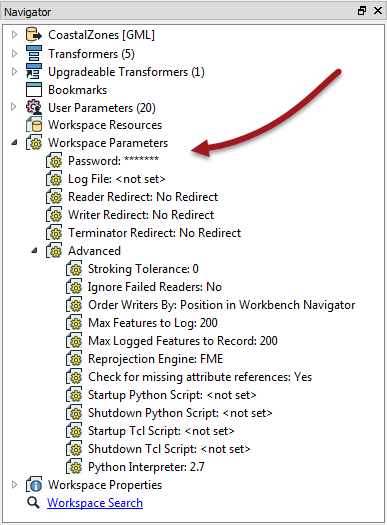
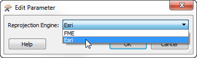
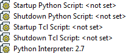
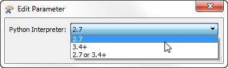

## Workspaces ##
A ***workspace*** is a file responsible for storing a translation definition.

Workspaces are the primary containers of translation components. At the top of the hierarchy they can contain any number of Readers, Writers, and feature types; or sometimes none at all!

---

### Creating a Workspace

Workspaces can be created using the commands on the File menu, or through shortcuts in the Start tab.

Creating a workspace through the Generate option is a simple way to define a translation because it includes Reader, Writer and feature type components in the setup process.

However, a workspace can also be created empty - i.e. the canvas is blank and each new component is added from scratch.

The option "Create workspace from template" allows the user to create a workspace based on a template design. That template can come from either the user-defined templates, templates installed with FME, or templates available on the FME Store.

--- 

### Controlling a Workspace ###
Workspace parameters are those that relate to a workspace as a whole, and which have an effect on how the translation is performed. They apply to the current workspace only and may change between workspaces.

Workspace parameters are shown and set in the Navigator Window.

For ease-of-use, workspace parameters are divided into two sections: basic and advanced. The most-important and most-used parameters fall under the Advanced section. 

#### Logging Parameters ####
There are three logging parameters. The *Log File* (basic) parameter specifies where the log file is written to. This is important when you want to keep that file for future reference. For example, you might (as an advanced task) create a user parameter to set the Log File location to C:\LogFileStorage\&lt;date/time&gt; so that each log file is recorded with a different file name matching the translation date/time.

The *Max Features to Log* and *Max Logged Features to Record* (advanced) parameters control how many features that are incorrect will be recorded in the log (or spatial log file). Often, just knowing that one feature was logged as a problem is enough to revisit the source data; you don't need to pad the log file by logging every single problem feature.

#### Reprojection Engine ####
Different GIS applications have slightly different algorithms for reprojecting data between different coordinate systems. To ensure that the data FME writes matches exactly to existing data, this parameter permits a user to use the reprojection engine from a different application.

A user with ArcGIS installed is choosing to use that package’s engine for reprojecting the spatial data.

#### Start-up and Shutdown Scripts ####
These parameters deliver the ability to run a Tcl or Python script. A startup script is executed when the run button is pressed, before any of the workspace is processed. A shutdown script is executed directly after the workspace has finished writing data.

Potential uses of such scripts include:

- To check a database connection before running the translation
- To move data prior to or after the translation
- To write the translation results to a custom log or send them as e-mail to an administrator
- To run scripts from other applications; for example Esri ArcObjects Python scripts

An interpreter parameter allows the user to choose which version of Python will be used to run any scripts:

If you choose "2.7 or 3.4+" then you are telling FME that your script is compatible with both versions of FME and that it doesn't matter which one FME uses.