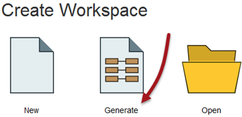
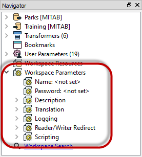
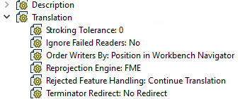
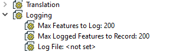
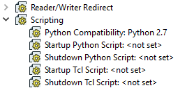

## Workspaces ##
A ***workspace*** is a file responsible for storing a translation definition.

Workspaces are the primary containers of translation components. At the top of the hierarchy they can contain any number of Readers, Writers, and feature types; or sometimes none at all!

---

### Creating a Workspace

Workspaces can be created using the commands on the File menu, or through shortcuts in the Start tab.

Creating a workspace through the Generate option is a simple way to define a translation because it includes Reader, Writer and feature type components in the setup process.

However, a workspace can also be created empty - i.e. the canvas is blank and each new component is added from scratch. The "New" option on the Start tab will allow you to do that.

Using File > New on the menubar opens up a dialog in which a new workspace can be generated or an empty one created. However, it also has the option to create a workspace from a template. That template can come from either local, user-defined templates, or templates available on the FME Hub.

--- 

### Controlling a Workspace ###
Workspace parameters are those that relate to a workspace as a whole, and which have an effect on how the translation is performed. It is very important to remember that workspace parameters apply only to the current workspace. They are not global FME options and so may differ between workspaces.

Workspace parameters are shown and set in the Navigator Window.

For ease-of-use, workspace parameters are divided into several sections. The most important ones are Translation, Logging, and Scripting.

<!--New Section--> 

<table style="border-spacing: 0px">
<tr>
<td style="vertical-align:middle;background-color:darkorange;border: 2px solid darkorange">
<i class="fa fa-bolt fa-lg fa-pull-left fa-fw" style="color:white;padding-right: 12px;vertical-align:text-top"></i>
NEW
</td>
</tr>

<tr>
<td style="border: 1px solid darkorange">

This arrangement of parameters in FME 2017 is changed from 2016, which was only divided into basic and advanced, and had the Description fields under "Workspace Properties".

</td>
</tr>
</table>

--- 

#### Translation Parameters ####
Translation parameters provide the ability to set values that are applied during a translation.

For example, Reprojection Engine allows the author to choose a different engine for reprojecting data between coordinate systems. This can help ensure the data FME writes matches exactly existing data from another application.

Rejected Feature Handling defines what happens when a feature is output through a &lt;Rejected&gt; port on a transformer. Either the translation can continue, or the translation can be halted. 

#### Logging Parameters ####
There are three logging parameters:

The *Max Features to Log* and *Max Logged Features to Record* parameters control how many features that are incorrect will be recorded in the log (or spatial log file). Often, just knowing that one feature was logged as a problem is enough to revisit the source data; you don't need to pad the log file by logging every single problem feature.

The *Log File* parameter specifies where the log file is written to. This is important when you want to keep that file for future reference. For example, you might (as an advanced task) create a user parameter to set the Log File location to C:\LogFileStorage\&lt;date/time&gt; so that each log file is recorded with a different file name matching the translation date/time.

#### Scripting Parameters ####
Scripting parameters deliver the ability to run a Tcl or Python script. There are parameters in which to enter a script and also a parameter that defines script compatibility:

A startup script is executed when a workspace is executed, before any of the workspace canvas instructions are carried out. A shutdown script is executed directly after the workspace has finished, usually once it is done writing data.

Potential uses of such scripts include:

- To check a database connection before running the translation
- To move data prior to or after the translation
- To write the translation results to a custom log or send them as e-mail to an administrator
- To run scripts from other applications; for example Esri ArcObjects Python scripts

The Python compatibility parameter allows the user to choose which version of Python will be used to run any scripts. A specific version can be chosen but if you choose the option "2.7 or 3.4+" then you are instructing FME that your script is compatible with both versions of Python and that it doesn't matter which one FME uses.