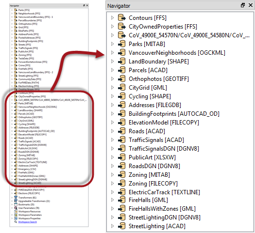
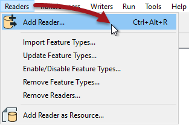
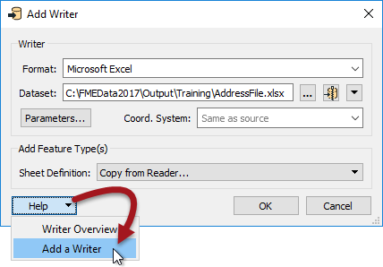
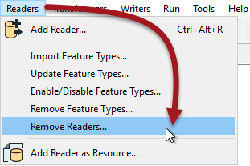
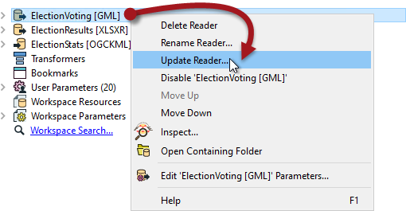

## Readers ##

A **reader** is the FME term for the component in a translation that reads a source dataset. A reader reads a single format of data, so to read multiple formats requires multiple readers. However, each reader can read any number of datasets in its format.

By default, the Generate Workspace dialog creates workspace with a single reader (and a single writer). However, this does not mean the workspace is forever limited to this. Additional readers can be added to a workspace at any time, any number of formats can be used, and there does not need to be an equal number of readers and writers.

For example, the Navigator window shows this workspace contains 50+ readers (and writers) of all data types and formats!

---

<!--Person X Says Section-->

<table style="border-spacing: 0px">
<tr>
<td style="vertical-align:middle;background-color:darkorange;border: 2px solid darkorange">
<i class="fa fa-quote-left fa-lg fa-pull-left fa-fw" style="color:white;padding-right: 12px;vertical-align:text-top"></i>
Ms. Analyst says...
</td>
</tr>

<tr>
<td style="border: 1px solid darkorange">

It's important to note that readers and writers don’t appear as objects on the Workbench canvas. Their feature types (layers) do, but readers and writers don't.
  Instead they are represented by entries in the Navigator window, as in the above screenshot.

</td>
</tr>
</table>

---

### Adding a Reader ###
Adding a reader to a workspace is a common requirement. There are several reasons:

- The Generate Workspace dialog only adds a single reader
- Each reader handles only one format of data
- Different datasets (of the same format) may require reading with different parameters

Therefore the need to read multiple formats of data – such as Smallworld, DXF, and Geodatabase – requires multiple readers.

Additional readers are added to a translation using the Quick Add menu:

...Or by selecting Readers>Add Reader from the menubar.

---

<!--New Section--> 

<table style="border-spacing: 0px">
<tr>
<td style="vertical-align:middle;background-color:darkorange;border: 2px solid darkorange">
<i class="fa fa-bolt fa-lg fa-pull-left fa-fw" style="color:white;padding-right: 12px;vertical-align:text-top"></i>
NEW
</td>
</tr>

<tr>
<td style="border: 1px solid darkorange">

The ability to add a reader using Quick Add is new for FME 2017

</td>
</tr>
</table>

---

Adding a reader has this effect on the hierarchy diagram:

---

<!--Updated Section--> 

<table style="border-spacing: 0px">
<tr>
<td style="vertical-align:middle;background-color:darkorange;border: 2px solid darkorange">
<i class="fa fa-bolt fa-lg fa-pull-left fa-fw" style="color:white;padding-right: 12px;vertical-align:text-top"></i>
.1 UPDATE
</td>
</tr>

<tr>
<td style="border: 1px solid darkorange">

In FME2017.1 the Add reader/writer dialogs have Help options for both the format and the act of adding the reader/writer:
  

</td>
</tr>
</table>

---

### Removing a Reader ###
Not only can you add a new reader, you can remove an existing one; for example when you have an old reader whose input you no longer need. Tools exist to remove a reader from a workspace, both on the menubar and in context menus in the Navigator window.

Removing a reader obviously has the reverse effect on the hierarchy diagram!

---

<!--Updated Section--> 

<table style="border-spacing: 0px">
<tr>
<td style="vertical-align:middle;background-color:darkorange;border: 2px solid darkorange">
<i class="fa fa-bolt fa-lg fa-pull-left fa-fw" style="color:white;padding-right: 12px;vertical-align:text-top"></i>
.1 UPDATE
</td>
</tr>
<tr>
<td style="border: 1px solid darkorange">

FME2017.1 introduces a tool to <strong>update</strong> a reader in Workbench:
  
  Updating is a way to bring a reader's behaviour up to date with the current FME version. Obviously it only applies when the workspace was previously created/edited in an older version of FME. Such an update can improve performance or allow the use of new control parameters.

</td>
</tr>
</table>