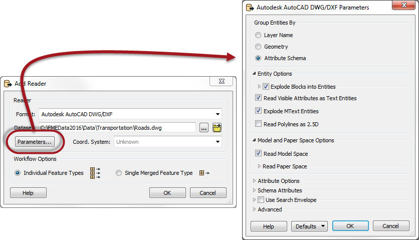
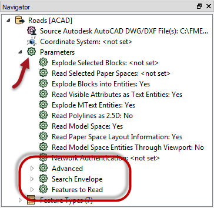
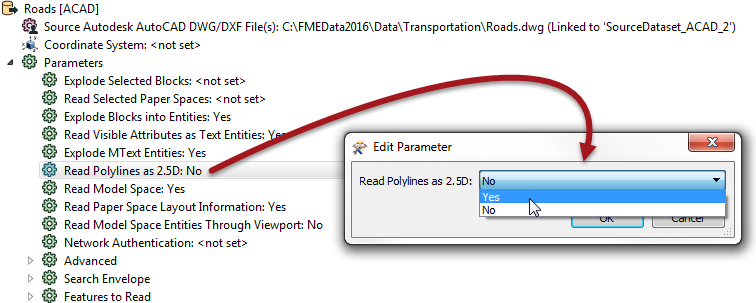

## Controlling Readers ##
Readers are controlled with Reader parameters.

Because parameters refer to specific components and characteristics of the related format, Readers of different formats have a different set of control parameters.

### Reader Parameters ###
Reader parameters can be located - and set - in one of two locations.

Firstly, these parameters can be found in a dialog when a new workspace is being generated, or a new Reader added:

Secondly, after the workspace is generated/Reader is added, parameters are shown and set in the Navigator Window.

For ease-of-use, basic parameters are listed first, then the remainder are divided into a number of sections: Advanced, Search Envelope, and Features to Read.

In general, basic parameters are the ones used most often; advanced parameters a little less so. Search Envelope parameters relate to the geographic area of data to be read, and Features to Read parameters give control over how many features will be read and from which layers.

To edit a parameter, double-click it. A dialog opens up where the parameter’s value may be set.

---

<!--Person X Says Section-->

<table style="border-spacing: 0px">
<tr>
<td style="vertical-align:middle;background-color:darkorange;border: 2px solid darkorange">
<i class="fa fa-quote-left fa-lg fa-pull-left fa-fw" style="color:white;padding-right: 12px;vertical-align:text-top"></i>
Doctor Workbench says...
</td>
</tr>

<tr>
<td style="border: 1px solid darkorange">

Some Reader parameters are ONLY accessible through the Parameters button when you initially create a workspace or add the Reader to an existing workspace. That’s because they affect how the schema is read and therefore how the workspace is constructed.
  It’s like preparing a patient for surgery. Once the workspace (patient) is created (prepped) those parameters aren’t available because you’re past the point where they would have any effect.
  Of course, sometimes you get such a parameter wrong, in which case you simply recreate the workspace. Or find yourself a new patient!

</td>
</tr>
</table>

---

