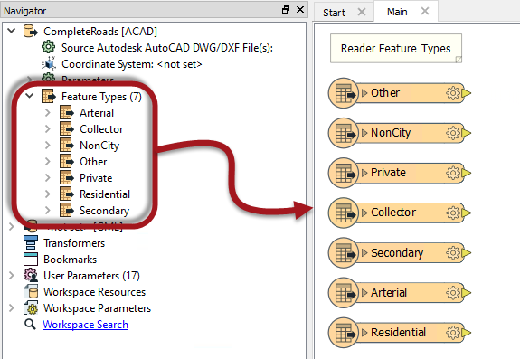
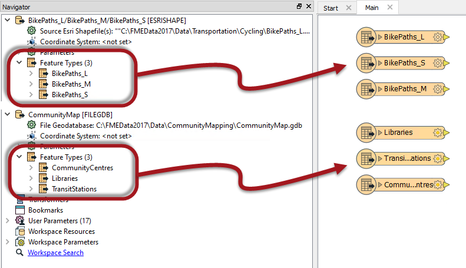
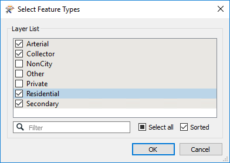
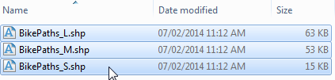
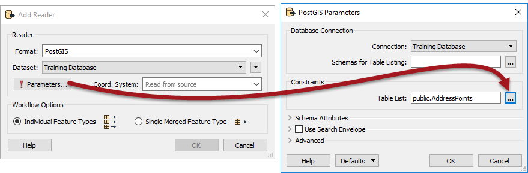
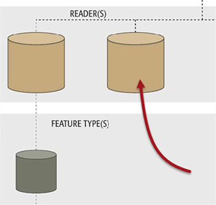

## Reader Feature Types ##

As per the hierarchy diagram, each Reader in FME can have a number of feature types. Feature types define the layers being read from a source dataset and the attributes that those layers possess. They are represented as objects on the workspace canvas and also listed in the Navigator window. 

In this workspace, a Reader is reading a source dataset of roads, with a different layer for each road type. Notice the Reader in the Navigator window and how it has a list of feature types; then notice that each of these feature types is also depicted on the canvas:

In this workspace there are two Readers (one Esri Shapefile, one File Geodatabase). Each Reader has three different feature types.

Notice - and this is where is can be confusing - there is no visible connection between the Reader and its feature types. The connection is there, just not in a visible form.

---

<!--Tip Section--> 

<table style="border-spacing: 0px">
<tr>
<td style="vertical-align:middle;background-color:darkorange;border: 2px solid darkorange">
<i class="fa fa-info-circle fa-lg fa-pull-left fa-fw" style="color:white;padding-right: 12px;vertical-align:text-top"></i>
TIP
</td>
</tr>

<tr>
<td style="border: 1px solid darkorange">

Clicking on a feature type in the Navigator will highlight it on the canvas - and vice versa

</td>
</tr>
</table>

---

### Adding Reader Feature Types ###
Adding a new Reader is the point at which most feature types are added to the translation.

For a file dataset (like AutoCAD) FME scans the source dataset(s) and prompts you which feature types to add to the canvas. If a feature type is selected, then it will appear in the workspace and data on that layer will be read. If it is not selected then the feature type will not appear in the workspace and the data is discarded.

For a folder dataset (like Esri Shapefile) the user should just select the files that represent the feature types:

For a database (like PostGIS) the user should click the parameters button and use the Tables to Read parameter:

Note that it’s not necessary to select all feature types that exist in a dataset. If you don’t want to read a particular layer of data, don’t select it. This way the feature types that you need to be read are all represented on the canvas, and feature types you don’t need are not.

---

### Removing Feature Types ###
Feature types can be deleted by selecting them on the canvas and pressing the delete key. They can also be deleted using the remove feature types tool on the menubar:

A user might delete a feature type if there is a source dataset layer that they no longer wish to read.

Whenever all feature types are deleted from a Reader then FME will prompt the user to decide whether to remove the Reader component as well.

It makes sense to remove the Reader because if there are no feature types you wish to keep, why would you still wish to read the dataset at all? So Yes is the most common choice here.

If you answer No, then the feature types are all removed, but the Reader is left in the translation. We call this a "dangling” Reader because it has no children in the hierarchy.

---

<!--Person X Says Section-->

<table style="border-spacing: 0px">
<tr>
<td style="vertical-align:middle;background-color:darkorange;border: 2px solid darkorange">
<i class="fa fa-quote-left fa-lg fa-pull-left fa-fw" style="color:white;padding-right: 12px;vertical-align:text-top"></i>
Chef Bimm says...
</td>
</tr>

<tr>
<td style="border: 1px solid darkorange">

A dangling Reader isn’t that useful, and the workspace should definitely not be run in this condition!
 Performance suffers because - in some cases - all the source data is still being read, yet discarded immediately.
  It's like ordering food in a restaurant for a friend who you know is not coming: a waste of time and resources!

</td>
</tr>
</table>

