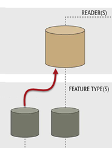
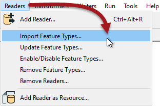

### Importing Reader Feature Types ###
A further tool under the Reader menu is labelled Import Feature Types.

Importing feature types is like when you add a new Reader; you pick the format and source dataset and FME gives you a list of feature types to add. However... instead of creating a new Reader, the feature types are added to a Reader that already exists.

One reason to import feature types is to read extra feature types from a dataset. Maybe the original author chose not to read those feature types when they added the Reader, or maybe the dataset was edited to give it extra layers.  

The way to do this is to use the menu tool Readers > Import Feature Types:

For example, the user has created a workspace with a Reader that reads a dataset called 'Transportation'. The only feature type chosen at the time of creation was a layer called 'Roads'. If the workspace now needs to read a second layer from the dataset (say 'Railway') the import tool can be used to add it to the existing Reader.

---

<!--Person X Says Section-->

<table style="border-spacing: 0px">
<tr>
<td style="vertical-align:middle;background-color:darkorange;border: 2px solid darkorange">
<i class="fa fa-quote-left fa-lg fa-pull-left fa-fw" style="color:white;padding-right: 12px;vertical-align:text-top"></i>
Firefighter Mapp says...
</td>
</tr>

<tr>
<td style="border: 1px solid darkorange">

There's no tool to add a Reader feature type in a manual way. That's because Reader feature types are supposed to represent what already exists in a source dataset - and it's easier to just import a definition from one of them. 

</td>
</tr>
</table>
