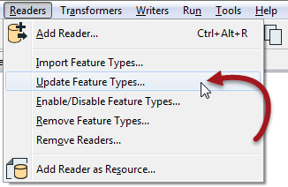

### Updating Reader Feature Types ###
A final tool for Reader feature types allows you to update them:

When you have created a workspace and more tables are added, then the Import tool is the one to use. However, when the schema of an existing table has changed, then the update tool is the one to use.

For example, I have a source feature type with this attribute schema:

The database administrator decides that the three PostBox attributes are no longer required and removes them from the database table. To fix my FME workspace to match, I would use the Update Feature Types tool. 

---

<!--Person X Says Section-->

<table style="border-spacing: 0px">
<tr>
<td colspan="2" style="vertical-align:middle;background-color:darkorange;border: 2px solid darkorange">
<i class="fa fa-quote-left fa-lg fa-pull-left fa-fw" style="color:white;padding-right: 12px;vertical-align:text-top"></i>
Miss Vector says...
</td>
</tr>

<tr>
<td colspan="2" style="border: 1px solid darkorange">

Let's see if you can figure out which tool should be used in which scenario? Here are four scenarios and four tools or settings. Connect the scenario to the correct tool/setting.

</td>
</tr>
<tr><td width="50%" style="font-weight: bold; border: 1px solid darkorange">Scenario</td><td style="font-weight: bold; border: 1px solid darkorange">Tool</td></tr>
<tr><td style="border: 1px solid darkorange"><a href="http://52.73.3.37/fmedatastreaming/Manual/QAResponseDotZero.fmw?chapter=4&question=2&answer=1&DestDataset_TEXTLINE=C%3A%5CFMEOutput%5CQAResponse.html">Source filename changes</a></td><td style="border: 1px solid darkorange">Add Reader</td></tr>
<tr><td style="border: 1px solid darkorange"><a href="http://52.73.3.37/fmedatastreaming/Manual/QAResponseDotZero.fmw?chapter=4&question=2&answer=2&DestDataset_TEXTLINE=C%3A%5CFMEOutput%5CQAResponse.html">Attribute type changes in database</a></td><td style="border: 1px solid darkorange">Import Feature Type</td></tr>
<tr><td style="border: 1px solid darkorange"><a href="http://52.73.3.37/fmedatastreaming/Manual/QAResponseDotZero.fmw?chapter=4&question=2&answer=3&DestDataset_TEXTLINE=C%3A%5CFMEOutput%5CQAResponse.html">Additional database table needs reading</a></td><td style="border: 1px solid darkorange">Update Feature Type</td></tr>
<tr><td style="border: 1px solid darkorange"><a href="http://52.73.3.37/fmedatastreaming/Manual/QAResponseDotZero.fmw?chapter=4&question=2&answer=4&DestDataset_TEXTLINE=C%3A%5CFMEOutput%5CQAResponse.html">New file dataset needs reading</a></td><td style="border: 1px solid darkorange">Source Dataset Parameter</td></tr>
</table>
