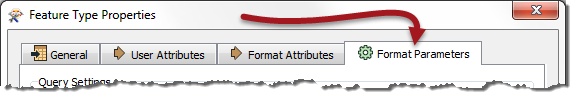
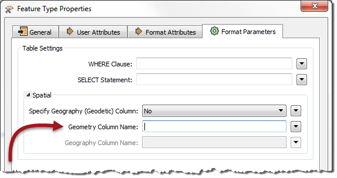
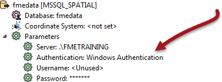

## Reader Feature Type Parameters ##
Just like Readers, feature types have their own set of parameters that control how that feature type (layer/table) is being read. These parameters appear under the Format Parameters tab in the Feature Type Properties dialog:

The important thing is that these parameters only apply to a single feature type, whereas a Reader parameter would apply to all feature types.

For example, when reading a SQL Server database there is a feature type parameter that defines the name of the geometry column to read:

This is a Feature Type parameter because each table might have a different geometry column name, therefore each feature type needs a way to define it. If, for example, four tables were being read, the user could set a different geometry column name for each.

Conversely, there is no password parameter at the feature type level because authentication applies to the entire database, not the individual tables. Authentication parameters are at the Reader level in the Navigator window:

---

<!--Tip Section--> 

<table style="border-spacing: 0px">
<tr>
<td style="vertical-align:middle;background-color:darkorange;border: 2px solid darkorange">
<i class="fa fa-info-circle fa-lg fa-pull-left fa-fw" style="color:white;padding-right: 12px;vertical-align:text-top"></i>
TIP
</td>
</tr>

<tr>
<td style="border: 1px solid darkorange">

Not all feature types need a set of parameters, so the Format Parameters tab is not always present.

</td>
</tr>
</table>