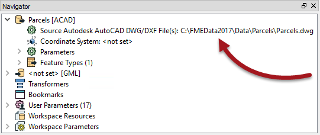
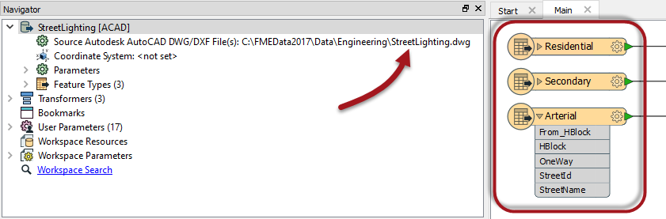

# Managing Datasets and Feature Types#

We've already seen that when you add a reader to a workspace its feature type schemas are greyed out. That's to stop edits being made and ensure that the schema correctly matches the source data. 

However, there is another way in which the reader schema can become out of sync with the source datasets it claims to represent.

## Changing Source Dataset Parameter ##

As we have seen, each reader in a workspace contains a source dataset parameter:

Using this parameter to select a different source dataset is another way for workspace schemas to become out of sync with the data.

For example, here an AutoCAD DWG reader was added for a roads dataset, containing layers and attributes for Residential, Secondary, and Arterial roads: 

However, notice that the user has changed the source dataset parameter to read a dataset of street lighting. That dataset has different feature types and attributes to the roads data. Hence the workspace schema is not correct for the data being read.   

This is a bigger issue than just leaving out a required feature type, and has severe consequences for the translation.

## Consequences ##

It’s important to remember that the original dataset establishes the basis for the reader schema definition, and that problems can arise if subsequent datasets do not conform to this original schema.

- If the feature types being read do not match one in the workspace, they are automatically discarded; i.e. reader feature types defined in the workspace act as a type of filter through which incoming data must pass.
- If the attributes being read do not match those defined in the workspace, they can be dropped or - at best - will be invisible to the workspace.

When incoming feature types do not find a match they are called "unexpected", and so the filter is called the ***Unexpected Input Remover***.