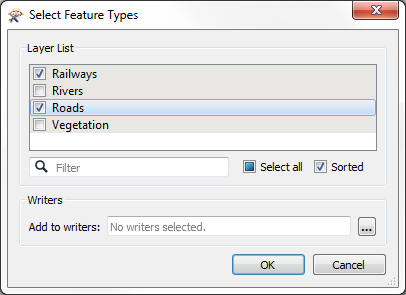
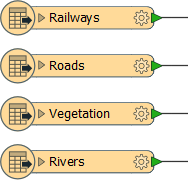
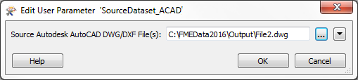

# Managing Datasets and Feature Types#

We've already seen that when you add a Reader to a workspace its feature type schemas are greyed out. That's the ensure that no edits are made and that the schema matches the source data. 

However, there are other ways in which the Reader schemas can become out of sync with the source datasets they claim to represent.

## Limiting Source Data ##

In some - maybe most - workspaces, the user does not need or want to read the entire source dataset. 

For example, an AutoCAD DWG dataset includes layers for *Roads*, *Railways*, *Rivers*, and *Vegetation*. If my project only requires transportation layers (i.e. *Roads* and *Railways*) I don't need to read any data from the other layers (*Rivers* and *Vegetation*).

When a Reader is added, the user is given the choice of which feature types to add to the workspace, and does not need to include all of them. This is how they can choose not to read all of the data:

What this means is that the workspace schema is now a little out of sync with the source data, as it doesn't have the same set of feature types. 

---

## Changing Source Dataset Parameter ##

As we have seen, each Reader in a workspace contains a source dataset parameter. This is set at the time of creation, but it can be edited at a later time. Selecting a different source dataset is another way for workspace schemas to become out of sync with the data.

For example, an AutoCAD DWG dataset (file1.dwg) includes layers for *Roads*, *Railways*, *Rivers*, and *Vegetation*, all of which are added as feature types:

However, the user then changes the source dataset parameter to read a different dataset (file2.dwg):

If that dataset contains layers for *Airports*, *Sports Facilities*, *Shops*, and *Natural Features*, then the workspace schema will be very much different to the source data being read.  

---

## Consequences ##

It’s important to remember that the original dataset establishes the basis for the Reader schema definition, and that problems arise if subsequent datasets do not conform to this original schema.

In this scenario data whose feature type does not match one in the workspace is automatically discarded; i.e. Reader feature types defined in the workspace act as a type of filter through which incoming data must pass.

The incoming feature types are unexpected, and so the filter is called the Unexpected Input Remover.