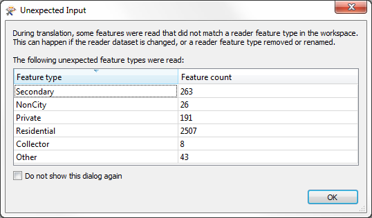

## The Unexpected Input Remover ##
Every time FME reads a dataset, it checks the feature types inside that dataset to ensure that they are all defined within the workspace schema. If there are feature types that exist in the dataset, but do not exist in the workspace, then features are classed as unknown and filtered out by a function called the Unexpected Input Remover.

The actions of the Unexpected Input Remover are reported in the Log file:

> STATS |Router and Unexpected Input Remover(RoutingFactory): Tested 3995 input feature(s), wrote 3995 output feature(s): 957 matched merge filters, 957 were routed to output, 3038 could not be routed

...and also through a dialog that opens at the end of a translation:

Notice how each feature type mentioned is listed along with a count of the affected features. Also notice the checkbox that allows this report to be turned off in future translations.

---

<!--Person X Says Section-->

<table style="border-spacing: 0px">
<tr>
<td style="vertical-align:middle;background-color:darkorange;border: 2px solid darkorange">
<i class="fa fa-quote-left fa-lg fa-pull-left fa-fw" style="color:white;padding-right: 12px;vertical-align:text-top"></i>
Dr Workbench says...
</td>
</tr>

<tr>
<td style="border: 1px solid darkorange">

It's important to consider that the feature types in a workspace might be <strong>deliberately</strong> different to those in the source dataset.
  For example, a user may have purposely left a feature type out of a workspace when it was generated, or may have decided a feature type was no longer required and so deleted it. In that scenario, the Unexpected Input dialog may still pop up, but can be safely ignored as the user deliberately requires this behaviour.
  Therefore this dialog is considered a reminder rather than an error, and is not always an indication something has gone wrong.

</td>
</tr>
</table>

---

### Unexpected Input and Dataset Type ###

Unexpected input is reported only for file datasets; databases do not cause the same problems. That's because a user is unlikely to want to read every single table in the database; it's not unexpected for them to miss some out. 

However, when a file dataset has a Reader feature type missing, then it's more likely to be a problem and the unexpected input warning is issued.

Also, remember that there are two different types of file dataset: *file-based* and *folder-based*. 

For file-based datasets, if there is a layer in the file that is not represented on the canvas then FME treats the layer as "unexpected" and drops it from the translation.

For folder-based datasets - where layers are stored as separate files in a folder - if there is a file selected that is not represented on the canvas, then FME treats the file as unexpected and drops it from the translation. 

This is most often a problem when a set of tiled datasets are being read, as each tile is a separate file (feature type) and needs a separate definition if it is to be allowed into the translation.

