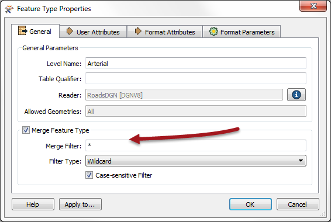

## Dealing with Source Feature Types ##
Assuming the Unexpected Input dialog does indicate a problem, there are two different methods within Workbench by which to resolve the issue:

- Add the missing feature types
 In other words, feature types are missing; so let’s add them. The **Import Feature Type** tool can be used to do this.

 

- Relax the filtering process
 In other words, allow unexpected feature types to pass through an existing one. **Merge Parameters** can be used to deliberately permit undefined feature types to pass.

---

### Import Feature Type ###
The Import Feature Type tool will take the schema definition of a selected dataset and add it to the workspace. By adding in the missing feature types to the schema, features of that type will be allowed to pass into the workspace.

Once in the workspace the data will now be read and accepted as having a matching feature type.

---

### Merge Parameters ###
Rather than adding in missing feature types to a workspace, the second option is to relax the restrictions on the feature type filtering process, purposely letting undefined feature types to pass.

The functionality is described as a merge, because features with an unknown feature type are literally merged into the input from an existing feature type.

Merge Parameters are available in each reader feature type for this purpose. The first action is to select a feature type through which to merge the data and open its Feature Type Properties dialog.

Once the Merge Feature Type option is checked a Merge Filter can be set. This is used to define exactly what incoming feature types are allowed to merge.

The filter type can be a wildcard or a regular expression.

In this example an asterisk (*) means FME should accept any unknown data into the workspace through this feature type. This filter is the default value for all Merge Feature Types.

In the workspace itself, the title of the feature type object is updated to reflect the filter being applied.

Once set, the data will now be read and - any feature types previously undefined - will be read through this feature type.

